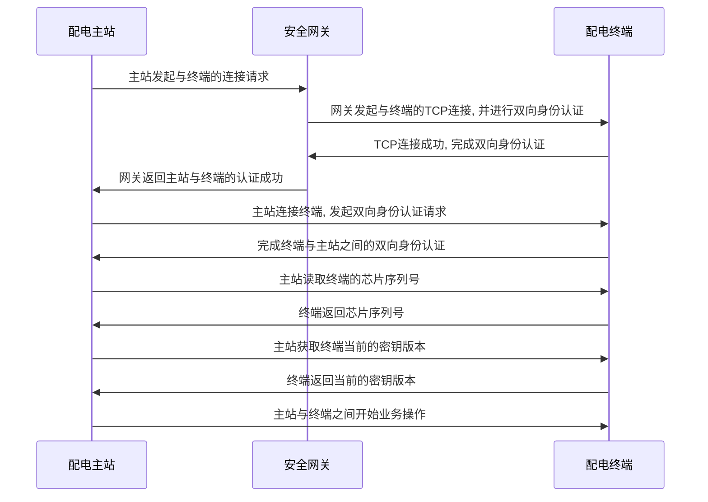
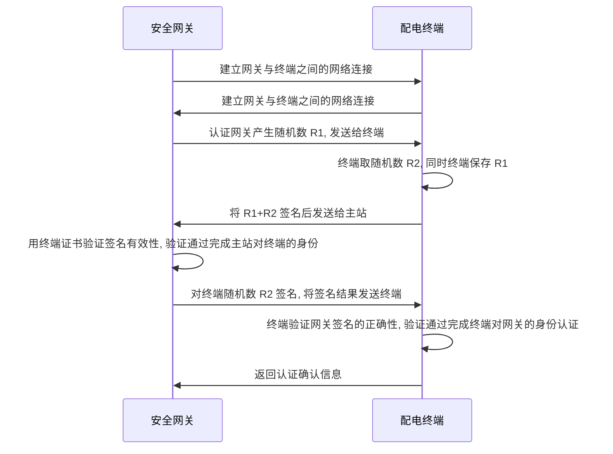
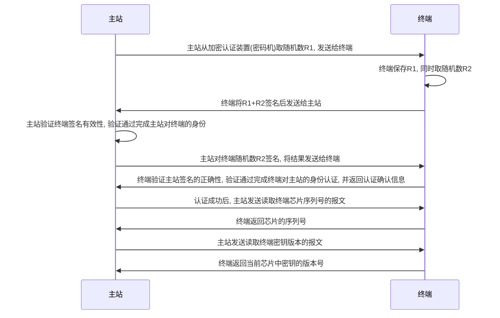
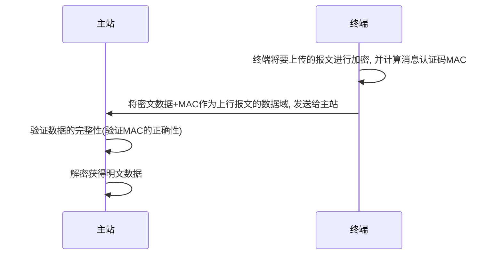
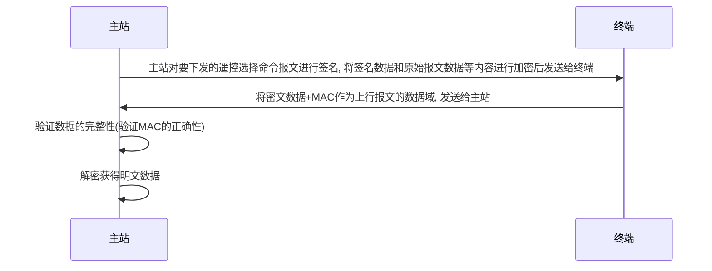
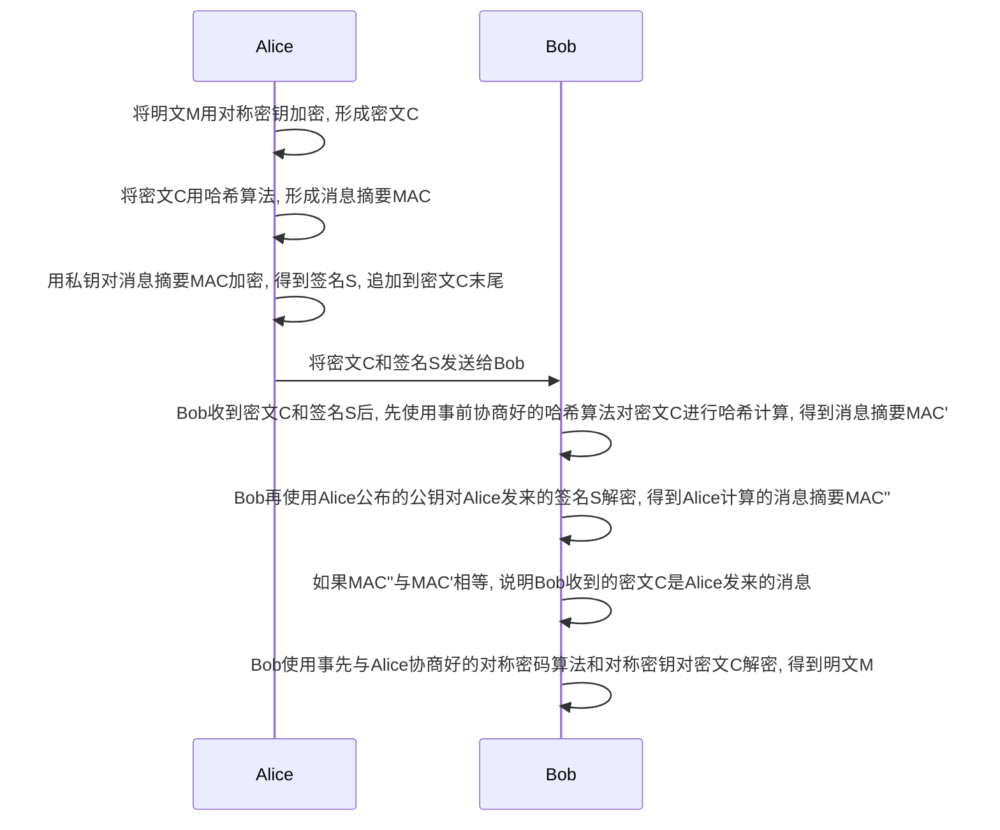
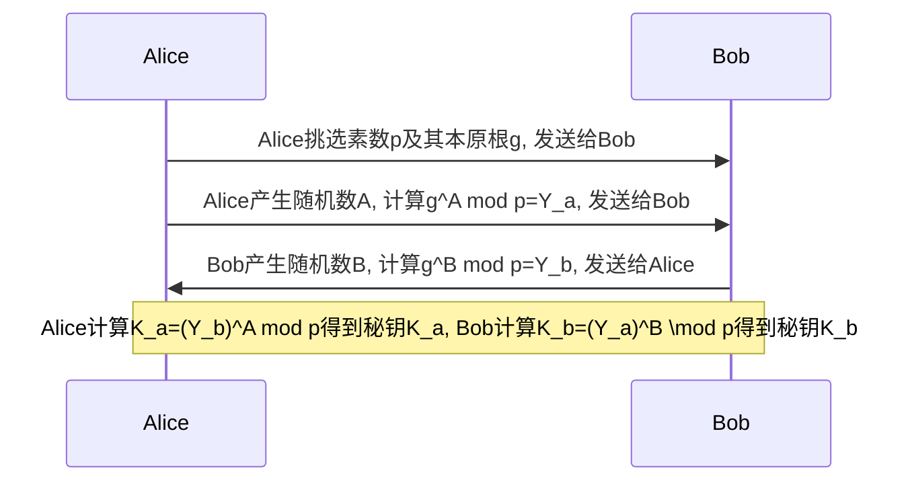
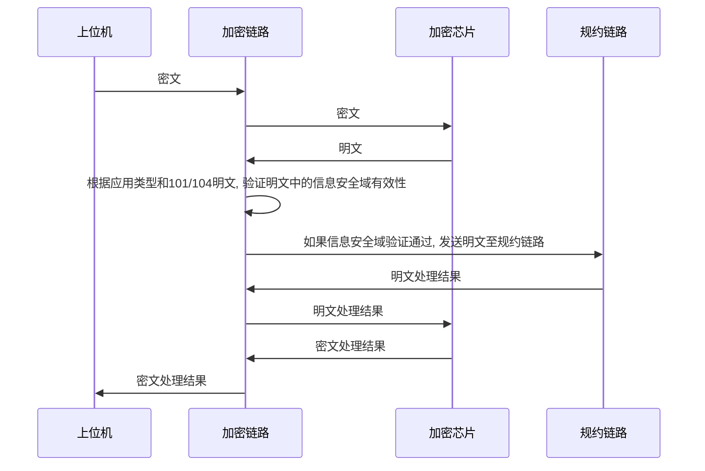
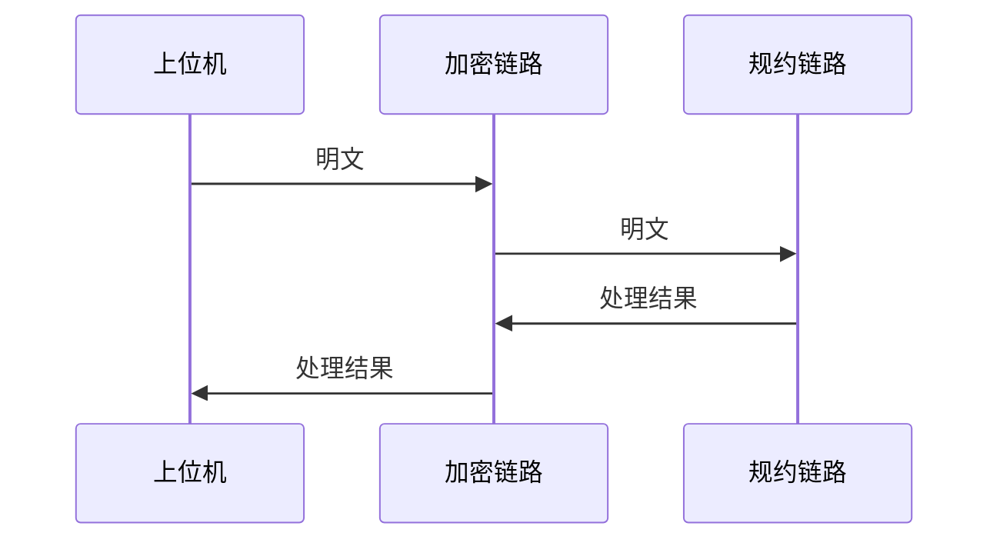
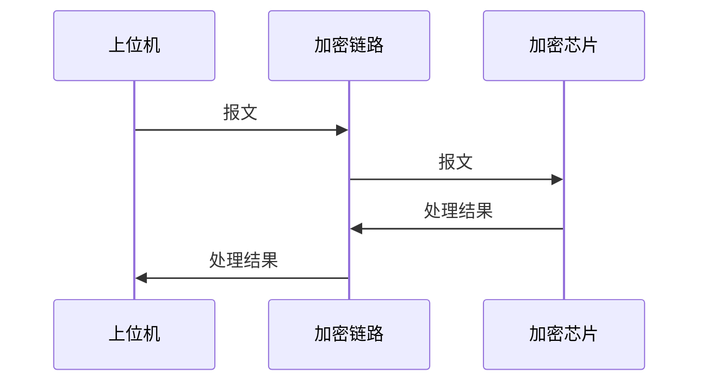

# 加密芯片相关

> 本文使用`Markdown`书写, 请使用`typora`阅读, 或者`vscode`安装`Markdown Preview`插件阅读, 或者任何一款支持`Markdown`预览的app查看即可.

[TOC]

## 标准及资料

### 《国网配电终端安全防护实施方案》

#### 终端安全实施方案



#### 终端与认证网关之间的双向身份认证



#### 基于数字证书的双向身份认证



#### 遥信遥测报文安全交互



#### 遥控报文安全交互

在双向身份认证通过之后, 主站在一个链路连接内, 随时都可以对三遥终端进行遥控操作



#### 终端证书管理

##### 终端对称密钥更新交互

终端投运前, 需要将 **测试密钥** **修改**为 **正式密钥** ; 终端返厂维修需要将 **正式密钥** **恢复**为 **测试密钥**, 密钥的状态切换通过密钥更新过程完成.

### 《国网配电终端安全报文定义》

#### 报文格式定义

<table border="1">
    <col class="col0">
    <col class="col1">
    <col class="col2">
    <col class="col3">
    <col class="col4">
    <col class="col5">
    <col class="col6">
    <col class="col7">
    <col class="col8">
    <col class="col9">
    <tbody>
        <tr>
            <td rowspan="5">起始<br/>1字节</td>
            <td rowspan="5">长度<br/>2字节</td>
            <td rowspan="5">起始<br/>1字节</td>
            <td rowspan="5">报文类型<br/>2字节</td>
            <td colspan="4">封装数据域(密文)</td>
            <td rowspan="5">校验和</td>
            <td rowspan="5">结束符</td>
        </tr>
        <tr>
            <td colspan="3">密文</td>
            <td rowspan="2">加密Mac</td>
        </tr>
        <tr>
            <td>应用类型<br/>1 字节</td>
            <td>应用<br/>数据区</td>
            <td>信息安全<br/>扩展区</td>
        </tr>
        <tr>
            <td colspan="4">封装数据域(明文)</td>
        </tr>
        <tr>
            <td>应用类型<br/>1 字节</td>
            <td>应用<br/>数据区</td>
            <td colspan="2">信息安全<br/>扩展区</td>
        </tr>
        <tr>
            <td>0xEB</td>
            <td></td>
            <td>0xEB</td>
            <td colspan="5"></td>
            <td>CS</td>
            <td>0xD7</td>
        </tr>
    </tbody>
</table>

说明:

1. `报文长度`(两字节, 高位在前)和`校验和`都是指从报文类型开始(包括报文类型)到校验和之前的数据
2. 报文类型(两字节, 高位在前): 用于定义与终端进行数据交互的对象, 并定义封装数据域的保密措施;
   1. 封装数据域为密文时, 内容包括加密密文和 MAC, 加密内容为
       “ 应用类型+应用数据区+信息安全扩展区”, 即明文的封装数据域;
   2. 封装数据域为明文时, 数据域内容依次为应用类型, 应用数据区
       和信息安全扩展区;
3. 应用类型: 是指封装数据域的类型, 当应用数据区不为空时(即包含原有 IEC101, IEC104 报文或管理报文), 应用类型为原有业务相关的应用类型(`0x00-0x07`), 另外, 类型 `0x08-0x1f` 为与原有业务相关的特殊扩展报文类型; 当应用数据区为空时(即不包含原有 IEC101, IEC104 报文或管理报文), 应用类型为信息安全扩展区相关的应用
4. 应用数据区格式: 业务报文格式为<1 字节长度+IEC101, IEC104 的原始报文>, 管理报文格式为<2 字节长度+`管理报文`>;
5. 信息安全扩展区格式: <2 字节长度+信息安全扩展信息>, 如信息安全扩展区为空, 仍增加 2 字节的长度, 内容为 00;
6. 如应用数据区为空, 信息安全扩展区不为空时, 应用数据区的长度为空(即应用类型后, 直接为信息安全扩展区的内容);
7. 计算签名时的原始报文, 不包含应用类型(1 字节), 应用数据长度(业务报文 1 字节, 管理报文 2 字节)和安全扩展区长度(2 字节)

#### 报文类型定义

高 8 位(D15~D8)全部为 0, 备用; 低 8 位定义如下:

| D7~D6                                       | D5~D4 | D3               | D2~D0                               |
|:------------------------------------------- |:-----:| ---------------- | ----------------------------------- |
| 相对终端连接对象                                    | 备用    | 是否加密             | 对称密钥标识                              |
| 00: 主站<br/>01: 现场运维工具<br/>10: 网关<br/>11: 备用 |       | 0: 不加密<br/>1: 加密 | 001: 主站<br/>010: 现场维护工具<br/>000: 终端 |

#### 封装数据域定义

##### 应用类型定义

<table border="1">
    <tbody>
      <tr >
        <td rowspan="3">应用类型编号</td>
        <td colspan="4">类型说明</td>
      </tr>
      <tr >
        <td rowspan="2">应用数据</td>
        <td colspan="3">信息安全扩展区</td>
      </tr>
      <tr >
        <td>时间</td>
        <td>随机数</td>
        <td>签名结果</td>
      </tr>
      <tr >
        <td>0x00</td>
        <td>√</td>
        <td>×</td>
        <td>×</td>
        <td>×</td>
      </tr>
      <tr >
        <td>0x01</td>
        <td>√</td>
        <td>×</td>
        <td>×</td>
        <td>√</td>
      </tr>
      <tr >
        <td>0x02</td>
        <td>√</td>
        <td>×</td>
        <td>√</td>
        <td>×</td>
      </tr>
      <tr>
        <td>0x03</td>
        <td>√</td>
        <td>×</td>
        <td>√</td>
        <td>√</td>
      </tr>
      <tr >
        <td>0x04</td>
        <td>√</td>
        <td>√</td>
        <td>×</td>
        <td>×</td>
      </tr>
      <tr >
        <td>0x05</td>
        <td>√</td>
        <td>√</td>
        <td>×</td>
        <td>√</td>
      </tr>
      <tr>
        <td>0x06</td>
        <td>√</td>
        <td>√</td>
        <td>√</td>
        <td>×</td>
      </tr>
      <tr>
        <td>0x07</td>
        <td>√</td>
        <td>√</td>
        <td>√</td>
        <td>√</td>
      </tr>
      <tr>
        <td rowspan="2">0x08</td>
        <td>×</td>
        <td>√</td>
        <td>√</td>
        <td>√</td>
      </tr>
      <tr>
        <td colspan="4">仅适用于远程升级中的升级包验证</td>
      </tr>
      <tr>
        <td rowspan="2">0x1f</td>
        <td>×</td>
        <td>×</td>
        <td>×</td>
        <td>×</td>
      </tr>
      <tr>
        <td colspan="4">业务安全处理结果返回</td>
      </tr>
      <tr>
        <td>0x09-0x1e</td>
        <td colspan="4">备用, 后续扩展</td>
      </tr>
    </tbody>
</table>

说明:

1. √: 包括,  ×: 不包括
2. 时间, 随机数和签名结果属于信息安全扩展区
3. 时间格式: `yymmddhhmmss`, 共 6 个字节, 十六进制(例如: 17 年 11 月 5 日 16 点 30 分 50 秒`110B05101E32`)
4. 签名结果格式: 签名结果(64 字节)+签名所用密钥标识(1 字节), 共 65 个字节

## 术语解释

> 以下解释大部分摘抄自<Applied.Cryptography.Protocols.Algorithms.and.Source.Code.In.C.2ed>这本书, 加上我自己的理解, 并不作为准确的定义使用和理解, 仅仅是简单的说明.

### 发送者与接收者

> Suppose a **sender** wants to send a message to a **receiver**. Moreover, this sender wants to send the
> message securely: She wants to make sure an eavesdropper cannot read the message.

假设**发送者**想把一段消息发送给**接收者**. 而且, 他/她想确保这段消息即使被**偷听者**看到, 也不知道发的内容是什么.

### 明文

发送者想要发送的**消息**(**message**)叫做**明文**(**plaintext**), 用大写**M**或者大写**P**表示

### 密文

**明文**被**加密**(见下文)过程处理后, 得到的结果叫做**密文**(**ciphertext**), 用大写**C**表示

### 加密

将**明文**处理成**密文**的过程叫做**加密**(**encryption**), 常被看作是一个函数, 用大写$E()$表示, 有$E(M) = C$

### 解密

将**密文**处理成原始的**明文**的过程叫做**解密**(**decryption**), 常被看作是一个函数, 用大写$D()$表示, 有$D(C) = M$, 也有$D(E(M)) = M$

### 密码算法

加密/解密中使用的数学方法或者处理过程, 叫做**密码算法**, 又叫**cipher**

### 密码算法的安全性

如果一个密码算法的安全性依赖于密码算法本身的保密性, 也就是说加密/解密的过程不对外公开, 仅仅对使用者可见, 那么这样的密码算法就不具备标准化和质量保证, 这种密码算法叫做**保密算法**. 使用这种密码算法的内部人士中, 必须要有懂得密码分析的专家, 她/他懂得去评估**保密算法**的安全性; 而且, 一旦有人从使用这种**保密算法**的组织中离职, 那么这个组织就必须更换一个新的**保密算法**, 确保离职的人员一旦将以前的**保密算法**泄露给外部人员后, 不会对组织造成损失.

### 密钥

现代的**密码算法**将算法公开, 而只需保证**密钥**(**Key**)的安全性即可. **密钥**(**Key**)用大写**K**表示.

**密钥**(**Key**)的可能值的范围, 叫做**密钥空间**(**keyspace**)

### 对称密码算法

**对称密码算法**中, **加密**/**解密**所使用的**密钥**(**Key**)是同一个, 即: $E_K(M)=C$, $D_K(C)=M$, 也可以表示成: $D_K(E_K(M))=C$. 现在广泛使用的**对称密码算法**有:  [Twofish](https://en.wikipedia.org/wiki/Twofish), [Serpent](https://en.wikipedia.org/wiki/Serpent_(cipher)), [AES](https://en.wikipedia.org/wiki/Advanced_Encryption_Standard) (Rijndael), [Camellia](https://en.wikipedia.org/wiki/Camellia_(cipher)), [Salsa20](https://en.wikipedia.org/wiki/Salsa20), [ChaCha20](https://en.wikipedia.org/wiki/ChaCha20), [Blowfish](https://en.wikipedia.org/wiki/Blowfish_(cipher)), [CAST5](https://en.wikipedia.org/wiki/CAST5), [Kuznyechik](https://en.wikipedia.org/wiki/Kuznyechik), [RC4](https://en.wikipedia.org/wiki/RC4), [DES](https://en.wikipedia.org/wiki/Data_Encryption_Standard), [3DES](https://en.wikipedia.org/wiki/Triple_DES), [Skipjack](https://en.wikipedia.org/wiki/Skipjack_(cipher)), [Safer](https://en.wikipedia.org/wiki/SAFER), 和 [IDEA](https://en.wikipedia.org/wiki/International_Data_Encryption_Algorithm).

### 非对称密码算法

**非对称密码算法**(也叫做**公钥密码算法**)中, **加密**与**解密**所使用的**密钥**(**Key**)不是同一个, 设**加密**密钥为**$K_1$**, **解密**密钥为**$K_2$**, 则有: $E_{K_1}(M)=C$, $D_{K_2}(C)=M$, 也可以表示成:　$D_{K_2}(E_{K_1}(M))=M$. 现在广泛使用的**对称密码算法**有: [RSA](https://en.wikipedia.org/wiki/RSA_(cryptosystem)), [Elliptic-curve cryptography](https://en.wikipedia.org/wiki/Elliptic-curve_cryptography), 更详细的介绍见[维基百科](https://en.wikipedia.org/wiki/Public-key_cryptography).

### 密钥协商

也称**密钥交换**(`key exchange`), (在身份认证的前提下)规避**偷窥**的风险. 通俗地说, 即使有攻击者在偷窥客户端与服务器的网络传输, 客户端(client)依然可以利用“密钥协商机制”与服务器端(server)协商出一个只有二者可知的用来对于应用层数据进行加密的密钥(也称“会话密钥”).

密钥交换/协商的几种类型:

- 依靠非对称加密算法: 拿到公钥的一方先生成随机的会话密钥, 然后利用公钥加密它, 再把加密结果发给对方, 对方用私钥解密; 于是双方都得到了会话密钥.
- 依靠专门的密钥交换算法: DH 算法又称**Diffie–Hellman 算法**, 它可以做到**通讯双方在完全没有对方任何预先信息的条件下通过不安全信道创建起一个密钥**, 即通讯双方事先不需要有共享的秘密. 而且, 使用该算法协商密码, 即使协商过程中被别人全程偷窥(比如**网络嗅探**), 偷窥者也无法知道最终协商得出的密钥结果. 但是此算法不支持认证, 虽然可以抵抗偷窥但是无法抵抗篡改, 却无法对抗中间人攻击. 一般此算法会配合签名算法搭配使用, 比如RSA, DSA等算法.

### 消息摘要

**message digest**, 使用**单向散列函数**将一段报文, 计算为固定长度的二进制序列. 常用的**单向散列函数**有: **MD4**, **MD5**, **SHA-1**, **SHA-256**, SHA-384, **SHA-512**等等.  **消息摘要**只能保证消息的完整性, 即该**消息摘要B**是**消息A**生成的, 而并不能验证**发送者**的任何信息.

### 消息认证码

**message authentication code**(**MAC**),

### 数字签名

数字签名过程:



### 数字证书

### CA

### RSA

### ECC

### ECDSA

### DSA

### 欧几里得算法

### 扩展欧几里得算法

### 算术基本定理

每个整数$n \ge 2$可唯一分解成素数的乘积: $n=p_1^{k_1} \times p_2^{k_2} \times \ldots \times p_r^{k_r}$, 其中$p_1,p_2, \ldots , p_r$为素数, $k_1,k_2, \ldots  ,k_r$为正整数, 且$p_1 \lt p_2 \lt \ldots \lt p_r$.

### 同余式与模算术

一般来讲, 可以将$\bmod$视为一种求余数的二元运算符, 例如$2 = 5 \bmod 3$; 也可以用来表示同余关系, 这种同余关系通常用同余式表示. 例如$2 \equiv 5 \pmod{3}$表示模$3$时, $2$与$5$同余.

同余式与普通等式有一些相似的特性:

- 如果已知: $a_1 \equiv b_1 \pmod{m}$,  且$a_2 \equiv b_2 \pmod{m}$ , 那么$a_1 \pm a_2 \equiv b_1 \pm b_2 \pmod{m}$ 和$a_1a_2 \equiv b_1b_2 \pmod{m}$
- 同时也不难得出: 如果, $a^k \equiv b\pmod{m}$, 那么, $(a^k)^j≡b^j \pmod{m}$. 特别的当$b=1$时, 如果$a^k \equiv 1 \pmod{m}$, 那么$(a^k)^j \equiv 1 \pmod{m}$. 但是, 由$ac \equiv bc \pmod{m}$不一定能得到$a \equiv b \pmod{m}$, 只有当$c$和$m$互素时(也即是$\gcd(c,m)=1$), 才能够从同余式两边消去$c$. 例如, $2 \times 25 \equiv 2 \times 20 \pmod{10}$, 但是$25\not\equiv 20 \pmod{10}$.

由同余式可以引出同余方程:
$ax \equiv c \pmod{m}$
求解上述同余方程有一个定理, 叫做同余方程定理.
(同余方程定理): 设$a,c,m$是整数, $m \ge 1$, 且设$g=gcd(a,m)$, 则

1. 如果$g$不整除$c$(记作$g\nmid c$), 那么同余方程$ax \equiv c \pmod{m}$没有解.
2. 如果$g$整除$c$(记作$g\mid c$), 那么同余方程$ax \equiv c \pmod{m}$恰好有$g$个解.
   以上同余方程的求解过程需要用到扩展欧几里德的求解方法. 实际上$ax \equiv c \pmod{m}$可以转化为线性方程$ax+m(−y)=c$.
   特别地, 当$a$和$m$互素, 即$g=gcd(a,m)=1$时, 同余方程变成: $ax \equiv c 1\pmod{m}$, $a$和$x$互为`模逆元`, 这在`RSA`公钥加密算法生成秘钥过程中有应用.

### 中国剩余定理

### 模逆元

如果两个正整数$a$和$m$互素, 那么一定可以找到整数$b$, 使得$ab−1$被$m$整除, 或者说$ab$被$m$除的余数是$1$.

$ab \equiv 1 \pmod{m}$

此时, $b$就是$a$的模逆元.

### 费马小定理

设$p$是素数, $a$是任意的正整数, 且$a$与素数$p$互素, 则

$a^{p−1} \equiv 1 \pmod{p}$

### 欧拉$\phi$函数

给定正整数$n$, 在小于等于$n$的正整数中, 与$n$互素(或称互质)的正整数个数, 定义为$\phi(n)$.

比如, 正整数$8$, 在小于等于$8$的正整数中, 与$8$互素的有$1, 3, 5, 7$, 共$4$个, 所以$\phi(8) = 4$

$\phi(n)$的计算:

1. 当$n=1$时, $\phi(1) = 1$;

2. 当$n$为素数(或称质数)时, 小于$n$的每个正整数都与$n$互素, 所以$\phi(n) = n-1$;

3. 当$n$为素数$p$的幂次方即$n=p^k, k \ge 2$时, $\phi(n) = p^k - p^{k-1}$, 这是因为在小于$n$的正整数中, 不是$p$的整数倍, 才与$n$互素. 而$p$的整数倍的正整数有$1 \times p$, $2 \times p$, $3 \times p$, $\ldots$,$p^{k-1} \times p$, 把它们去掉, 剩下的数就与$n$互素. 还可以写成$\phi(n) = p^k - p^{k-1} = p^k (1 - \frac{1}{p})$;

4. 如果$n=p_1 \times p_2$, 其中$p_1,p_2$为互素的数, 则$\phi(n) = \phi(p_1p_2)=\phi(p_1) \phi(p_2)$, 这一条的证明要用到**中国剩余定理**, 比较复杂, 以后有时间再补充;

5. 根据算数基本定理, $n=p_1^{k_1} \times p_2^{k_2} \times  \ldots \times p_r^{k_r}$, 其中$p_1,p_2, \ldots , p_r$为素数, 根据第**4**条结论,

   $\phi(n) = \phi(p_1^{k_1}) \phi(p_2^{k_2}) \ldots \phi(p^{k_r})$,

   再根据第**3**条结论,

   $\phi(n) = \phi(p_1^{k_1}) \phi(p_2^{k_2}) \ldots \phi(p^{k_r}) = p_1^{k_1}p_2^{k_2} \ldots p_r^{k_r}(1-\frac{1}{p_1})(1-\frac{1}{p_2}) \ldots (1-\frac{1}{p_r}) = n(1-\frac{1}{p_1})(1-\frac{1}{p_2}) \ldots (1-\frac{1}{p_r})$

比如$1323$, $\phi(1323) = \phi(3^3 \times 7^2) = 1323 \times (1 - \frac{1}{3})(1 -  \frac{1}{7}) = 756$

### 欧拉定理

以**欧拉**(**Leonhard Euler**)命名的定理非常之多, 本文所说的欧拉定理, 是指初等数论中的欧拉定理, 即:

如果正整数$a$和$n$互素, 则$a^{\phi(n)} \equiv 1 \pmod{n}$

欧拉定理的证明比较复杂, 以后有时间再补充

### 本原根

### 离散对数

### 模幂运算

- 定义: 设有整数`a`, `x`, `p`, 模幂`y`: $y=a^{x} \bmod p$, 即数`a`的`x`幂次方对`p`取余.

- 模的乘积: 设整数`x`, `y`, `p`, 有$(xy) \bmod p=((x \bmod p)(y \bmod p)) \mod p$, 即两数的乘积的模, 等于两数的模相乘再求模.
  
    证明:
  
    设 $x=k_xp+r_x$,  $y=k_yp+r_y$, 其中$0 \le r_x \lt p, 0 \le r_y \lt p$, 则$x \bmod p = r_x, y \bmod p = r_y$
  
    $$xy=k_xk_yp^2+k_xr_yp+k_yr_xp+r_xr_y=(k_xk_yp+k_xr_y+k_yr_x)p+r_xr_y$$
  
    也就是说, $xy$是一个整数乘以$p$再加上$r_xr_y$.
  
  - 当$0 \le r_xr_y \lt p$时, 可以直接得到要证明的结果;
  - 当$r_xr_y \ge p$时, 设$r_xr_y = k_{xy}p + r_{xy}$, 其中$0 \le r_{xy} \lt p$, 则$r_xr_y \bmod p = r_{xy}$

    $xy = (k_xk_yp+k_xr_y+k_yr_x)p+r_xr_y=(k_xk_yp+k_xr_y+k_yr_x+k_{xy})p+r_{xy}$, 即$(xy) \bmod p = r_{xy}$

    得到了要证明的结果.

- 由上述性质, 可以直接得到$x^n \bmod p = (x \bmod p)^n \bmod p$

### `Diffie-Hellman`密钥交换算法

利用上述的[模幂运算](#模幂运算)的结果, 可以描述一种密钥交换算法: `Diffie-Hellman`密钥交换算法

> 注: 以下摘抄自[Diffie-Hellman密钥协商算法](https://www.cnblogs.com/qcblog/p/9016704.html)

#### 概述

`Diffie-Hellman`密钥协商算法主要解决秘钥配送问题, 本身并非用来加密用的; 该算法其背后有对应数学理论做支撑, 简单来讲就是构造一个复杂的计算难题, 使得对该问题的求解在现实的时间内无法快速有效的求解(*computationally infeasible* )

#### 从何而来

DH密钥协商算法在1976年在Whitfield Diffie和Martin Hellman两人合著的论文New Directions in Cryptography(Section Ⅲ PUBLIC KEY CRYPTOGRAPHY)中被作为一种公开秘钥分发系统(public key distribution system)被提出来.原文的叙述过程比较简单, 但基本阐述了算法的原理以及其可行性.

在该论文中实际上提出了一些在当时很有创新性的思想.原论文重点讨论两个话题:

1. 在公网通道上如何进行安全的秘钥分派.
2. 认证(可以细分为消息认证和用户认证).

为了解决第一个问题, 原文提出两种方法: 公钥加密系统(public key cryptosystem)和秘钥分发系统(public key distribution system).对于公钥加密系统, 原文只是勾画了一种比较抽象的公钥加密系统的概念模型, 重点是加解密采用不同的秘钥, 并总结了该系统应该满足的一些特性, 相当于是一种思想实验, 并没有给出具体的算法实现途径, 但这在当时应该来说已经足够吸引人.后来RSA三人组(Ron Rivest, Adi Shamir 和 Leonard Adleman)受此启发, 经过许多轮失败的尝试后, 于第二年在论文A Method for Obtaining Digital Signatures and Public-Key Cryptosystems中提出了切实可行且很具体的公钥加密算法--RSA公钥加密算法.而对于秘钥分发系统, 就是本文的DH秘钥协商算法.

为了解决第二个问题, 原文通过单向函数(one-way function)来解决, 这就是单向认证的问题.另外作者还讨论了这些密码学问题之间的关联性以及如何相互转化.比如一个安全的密码系统(可以防御明文攻击)可以用来生成一个的单向函数, 公钥加密系统可以用来作为单向认证, 陷门密码系统可以用来生成一个公钥加密系统.数学难题的计算复杂度被当成一种保障密码学安全问题的有效工具被利用起来, 这一重要思想贯穿现代密码学的许多加密算法.

#### 算法流程及原理

假设`Alice`需要与`Bob`协商一个秘钥(秘钥本质上就是一个比特序列, 从计算的角度看就是一个大数)

1. 首先`Alice`与`Bob`共享一个素数$p$以及该素数$p$的`本原根`$g$(geneator), 当然这里有$2 \le g \le p−1$.这两个数是可以不经过加密地由一方发送到另一方, 至于谁发送给并不重要, 其结果只要保证双方都得知$p$和$g$即可
2. 然后`Alice`产生一个私有的随机数$A$, 满足$1 \le A \le p−1$, 然后计算$g^A \bmod p=Y_a$, 将结果$Y_a$通过公网发送给`Bob`; 与此同时, `Bob`也产生一个私有的随机数$B$, 满足$1 \le B \le p−1$, 计算$g^B \bmod p=Y_b$, 将结果$Y_b$通过公网发送给`Alice`
3. 此时Alice知道的信息有$p$,$g$,$A$,$Y_a$, 其中数字$A$是`Alice`私有的, 只有她自己知道, 别人不可能知道, 其他三个信息都是别人有可能知道的; `Bob`知道的信息有$p$,$g$,$B$,$Y_b$, 其中数字$B$是`Bob`私有的, 只有他自己知道, 别人不可能知道, 其他都是别人有可能知道的
4. `Alice`通过计算$K_a=(Y_b)^A \bmod p$得到秘钥$K_a$, 同理, `Bob`通过计算$K_b=(Y_a)^B \bmod p$得到秘钥$K_b$, 此时可以利用[模幂运算](#模幂运算)的结果证明, 必然满足$K_a=K_b$.因此双方经过协商后得到了相同的秘钥, 达成秘钥协商的目的



### 椭圆曲线

### 国密算法

#### SM1

#### SM2

#### SM3

#### SM4

## 加密链路程序设计

### 原有程序梳理

#### 文件结构

`iec101def.h` - 101协议相关定义;
`new104def.h` - 104协议相关定义;
`new104dl.cxx` - 104协议链路层;
`new104dl.h` - 104协议链路层;
`new104Sec.cxx` - 104协议安全层;
`new104Sec.h` - 104协议安全层;
`secapp.cxx` - 101协议安全应用;
`secapp.h` - 101协议安全应用;
`secdlink.cxx` - 101协议安全链路层;
`secdlink.h` - 101协议安全链路层;
`Sgc1161cmd.c` - 智芯1161Y通信相关;
`Sgc1161cmd.h` - 智芯1161Y通信相关;

#### 类和调用层次

- 类`New104DataLink` - 对应文件`new104Sec.cxx`104协议链路层;
- 类`New104Sec` - `new104Sec.cxx`104协议应用层;
- 类`CSecAppSev` - 101协议应用层;
- 类`CSecDLink` - 101协议链路层;
- `EbSafetySearchFrame()` - 上行接口, 解析收到的加密报文. 在`New104Sec::OnRxData()->RxData()->RxDataEnDealFun()`中被调用, 并在`new101sec::RecMISIData()->RecMISIDataDealFun()`中被调用;
- `Pack101msgtoEb()` - 101协议上行接口, 将101报文打包为加密报文. 在`CSecDLink::SendDataToMISI()->SendMISIDataDealFun()`中被调用
- `Pack104msgtoEb()` - 104协议上行接口, 将104报文打包为加密报文. 在`New104DataLink::SendToTeam()->SendToTeamEnDealFun()`中被调用

#### `SC1161Y`加密芯片指令梳理

以下命令皆省略报文头`0x55`

- 取芯片序列号:
  
  - 发送: `00 b0 99 05 00 02 00 08`
  - 接收: `90 00 00 08 + ID`, `ID`为8字节序列号

- 取芯片密钥版本
  
  - 发送: `80 1A 00 00 00 00`
  - 接收: `90 00 00 01 + KeyVersion`, `KeyVersion`为1字节密钥版本

- 取随机数
  
  - 发送: `00 84 00 08 00 00`
  - 接收: `90 00 00 08 + R`, `R`为8字节随机数

- 对**主站/网关**的随机数签名, 并获取一个新的随机数, 用于双向身份认证
  
  - 发送: `80 16 00 80 00 08 + R1`, `R1`为**主站/网关**发来的8字节随机数
  - 接收: `90 00 00 48 + R2 + Sign1`, `R2`为新的8字节随机数; `Sign1`为终端对**主站/网关**发来的随机数`R1`的64字节签名

- 验证主站/网关对终端随机数的签名结果, 用于双向身份认证
  
  - 发送: `80 18 00 + asKID + 00 40 + Sign2`, `Sign2`为上位机对`R2`的签名结果; `asKID`为上位机的签名密钥索引:
  - 接收: `90 00 00 00`, 验证签名正确; `90 86 00 00`, 验证签名错误

- 对明文加密, 且生成`MAC`
  
  - 发送: `80 26 60 01 + Lc + IVData + TsData`, `Lc`, 后续数据长度, 2字节; `IVData`, 初始向量, 16 字节, 上位机随机数`R1`+(`R1`按位取反); `TsData`, 要加密的明文
  - 接收: `90 00 + Le + enTsData + MAC`, `Le`, 后续数据长度; `enTsData`, 密文, 长度为16字节的整数倍; `MAC`, `enTsData`的`MAC`值, 4字节

- 对密文解密
  
  - 发送: `80 2C 60 01 + Lc + IVData + enTcsData + MAC`, `Lc`, 发送数据长度, 2 字节; `IVData`, 初始向量, 16 字节, 上位机随机数`R1`+(`R1`按位取反); `enTcsData`, 密文; `MAC`, `enTsData`的`MAC`值, 4字节
  - 接收: `90 00 + Le + TcsData + asKID`, `TcsData`, 解密出来的明文; `asKID`, 密钥索引

- 验证签名结果
  
  - 发送: `80 08 00 + asKID + Lc + deData + StcsData`, `asKID`, 密钥索引; `Lc`, 后续报文长度; `deData`, 明文; `StcsData`, 签名结果
  - 接收: `90 00 00 00`

- 密钥更新/恢复
  
    密钥更新头: `80 1C 00`; 密钥恢复头: `80 1C 01`
  
  - 发送: `80 1C 00 / 80 1C 01 + asKID + Lc + newKeyVersion + UpdateKeyData + Skeydata`, `newKeyVersion`, 密钥版本, 1字节; `UpdateKeyData`, 密钥数据, 5*36 字节; `Skeydata`, 签名结果, 64 字节; `asKID`, 签名密钥索引, 1字节
  - 接收: `90 00 00 00`

- 下发证书
  
  - 发送: `80 2C 60 01 + Lc + IVData + enCer`, `Lc`, 发送数据长度, 2 字节; IVData: 初始向量, 16 字节; `enCer`, 证书密文及`MAC`值
  - 接收: `90 00 + Le + CerID + Cer + Date + Scer + asKID`, `Le`, 返回数据长度, 2 字节; `CerID`, 证书 ID, `0`表示`CA`根证书, `1~4`表示主站证书, `5`表示网关证书; `Cer`, 证书明文; `Date`, 时间信息; `Scer`, 签名结果, `Cer+Date`(不包括`CerID`); `asKID`, 签名密钥标识

- 更新根/主站/网关证书
  
  - 发送: `80 22 + cerID + 00 + Lc + Cer`, 各字段意义见上文解释
  - 接收: `90 00 00 00`

- 写入终端证书
  
  - 发送: `80 24 00 00 + Lc + Cer`, 各字段意义见上文解释
  - 接收: `90 00 00 00`

- 获取终端证书
  
  - 发送: `80 30 01 00 00 00`
  - 接收: `90 00 + Le + Cer`, 各字段意义见上文解释

- 读取终端测试证书的长度
  
  - 发送: `00 B0 81 00 00 02 00 02`
  - 接收: `90 00 00 00 Len`, `Len`, 2 个字节

- 读取终端测试证书
  
  - 发送: `00 B0 81 02 00 02 + Len`
  - 接收: `90 00 00 00 + Le + Cer`, 各字段意义见上文解释

- 测试证书: 芯片出厂已安装测试的`CA`根证书, 测试主站(`1~4`)证书, 测试网关证书; 当做完密钥恢复后, 对称密钥恢复到测试态, 终端证书会被清掉; 需要将以上证书回写到芯片中

#### 重要函数梳理

- `EB`报文解析函数`EbmsgAnalysis()`

- 处理主站下发的密文函数`EnMsgBymasterHandle()`

- 处理隔离网关下发的密文函数`EnMsgByGetwayHandle()`

- 处理运维工具下发的密文函数`EnMsgByYWTool()`, 运维工具用于操作终端的密钥, 证书等敏感信息
  
  - `Sgc1161DecryptYWFileData()`解密运维工具的加密报文, 运维工具需要加密传输的报文类型有
    - 终端证书请求报文

- 密文解密处理函数`Sgc1161DecryptData()`: 负责将收到的`EB`格式的报文解密.
  
  - `SC1161Y`的发送报文格式为`0x55 CLA INS P1 P2 Len1 Len2 DATA LRC1`, 其中:
    - `0x55`为发送命令结构的命令头;
    - `CLA`是命令类别;
    - `INS`是命令类别中的指令代码;
    - `P1`, `P2`是一个完成指令代码的参考符号;
    - `Len1`, `Len2`是后续 `DATA`的长度, 不包含 `LRC1`, 由两字节表示, 高字节在前, 低字节在后;
    - `DATA`是由 `SC1161Y`来处理的数据输入;
    - `LRC1`是发送数据的校验值, 计算方法: 对 `CLA INS P1 P2 Len1 Len2 DATA` 数据, 每个字节的异或值, 再取反.
  
  - `SC1161Y`的接收报文格式为`SW1 SW2 Len1 Len2 DATA LRC2`, 其中:
    - `SW1 SW2` 是指令执行完毕后, 从设备(即`SC1161Y`加密芯片)返回的状态字;
    - `Len1 Len2` 是后续`DATA`的长度, 不包含`LRC2`, 由两字节表示;
    - `DATA`是`SC1161Y`处理数据完毕后, 返回的输出数据
    - `LRC2`是接收数据的校验值, 计算方法: 对 `SW1 SW2 Len1 Len2 DATA` 数据, 每个字节的异或值, 再取反.
    - 状态字信息表:

| SW1  | SW2  | 含义                   |
| ---- | ---- | ---------------------- |
| 90   | 00   | 成功                   |
| 6D   | 00   | INS不支持              |
| 6E   | 00   | CLA不支持              |
| 6A   | 86   | P1P2不正确             |
| 69   | 88   | 计算错误/MAC错误       |
| 69   | 8A   | 使用的证书状态不被满足 |
| 69   | 85   | 使用条件不满足         |
| 65   | 81   | 存储器故障             |
| 67   | 00   | LC长度错误             |
| 6A   | 80   | 不正确的数据域         |
| 63   | CF   | 认证失败               |
| 69   | 03   | 重复的会话验证         |
| 69   | 05   | 会话未建立             |
| 69   | 06   | 会话标识不一致         |
| 69   | 07   | 会话验证失败           |
| 90   | 82   | 加密错误               |
| 90   | 84   | 解密错误               |
| 90   | 86   | 验签错误               |
| 90   | 88   | 产生密钥对错误         |
| 90   | 8a   | 签名错误               |
| 63   | Cx   | 认证失败, 还可认证x次  |
| 90   | 00   | 成功                   |
| 6D   | 00   | INS不支持              |
| 6E   | 00   | CLA不支持              |
| 69   | 88   | 计算错误/MAC错误       |

- 输入参数`pdata`, 指向`EB`报文的`封装数据域(密文)`部分

- 输入参数`lenth`, 对应报文的`封装数据域(密文)`部分的长度

- 输入参数`dndata`, 解密得到的报文, 或者错误代码

- `struct HESendCmd_t hecmd`, 封装了与加密芯片通信时的报文头:  `CLA INS P1 P2 Len1 Len2`

- 全局变量`pHeSendBuf2`对应发送报文的`DATA`部分

- 加密芯片数据接收函数`SGCReceiveData()`, 它的错误代码:
  
  - `-1`, 即`0xFFFF`, 没有读到`0x55`头
  - `0`, 正确读取数据
  - `1`, 验证签名失败
  - `2`, 芯片报告其他错误
  - `4`, 接收数据超过接收缓冲区的长度, 或芯片返回值异常
  - `5`, 校验码或长度错误, LC 长度错误
  - `77`, 传输错误
  - `0x11`, `lrc`校验错误

- `CheckIllfgalType()`验证主站下发的报文应用类型是否合法, 根据101/104报文的`TI`和`COT`与应用类型的对应关系来验证.

- `EbEncpytDataAnaly`, 处理主站下发的密文数据, 解密并验证时间, 随机数, 签名等, 根据**应用类型**来决定验证哪些数据.

### TTU程序设计

#### 总体设计

1. 为了方便后续扩展, 将原有的`C`程序, 转为`C++`程序, 并将与加密芯片通信的模块封装为**类**`CSgc1161y`, 而将上行通信的模块封装为**类**`CEncryptPD`(PD, Power Distribution). 这样, 后续如果要增加/修改加密芯片的种类, 只需增加/修改各种加密芯片对应的类即可.

2. 抽象出下行通信的总线接口, 现在`简易TTU`程序已支持不同`SPI`通信的接口, 只需在其上加上一个加密通信层即可: 加密芯片的收/发报文的功能, 抽象为`readEnChip()`, `writeEnChip()`

3. 上行通信接口, 采用`link.dat`文件指定的端口, 由加密链路负责与上位机通信

4. 通信框图

   - 密文通信



- 明文通信



- 身份认证, 证书交互, 密钥交互等



5.加密链路线程实例化加密芯片类`pEncryClass`. 读取到上行链路的数据后, 交给`pEncryClass`处理, 如果`pEncryClass`指出要发送给规约链路处理, 则将`pEncryClass`处理得到的报文发送给规约链路, 规约链路处理完成后, 再交给`pEncryClass`处理成密文, 发送到上行通信接口; 如果`pEncryClass`指出不需要发送给规约链路, 则将处理后的报文直接发送给上行接口

#### 详细设计

##### 消除编译错误

###### 封装加密类

将C语言的加密相关函数封装为类`CEnChipSgc1161y`: 将原有的函数在类`CEnChipSgc1161y`中声明, 在`cpp`文件中实现为类的成员函数; 将原有的全局变量, 封装为类`CEnChipSgc1161y`的私有变量, 并在变量明前加`m_`, 以示为类的成员变量.

###### 替换/重写有用的函数

- `spi`初始化函数: 由于加密芯片与铁电芯片一同挂载到`SPI2`, 对`SPI2`的`时钟极性`, `时钟相位`, `时钟频率`, `数据大小端`, `数据宽度`, `CRC寄存器`的初始化, 都放在铁电的初始化函数`SPI_Fram_Init()`中即可; 而加密芯片的`片选`引脚使用`PC6`, 需要将其初始化, 并同时置高.
- 加密芯片的产品手册中的`SPI`通信过程如下
  - SSN=0: 将 `SSN`置低; `SSN`=1: 将 `SSN`置高.
  - 接口设备接收 `BUSY`状态字的最长等待时间为 **3s**
  - **禁止在数据传输中, 将`SSN`置高**
  - 接口设备发送/接收数据完成后, 建议在 **10μs** 内将 `SSN`置高
  - 发送数据、接收数据字节间延时**至少**设为 **1μs**
  - 在市电供电的情况下, 为了保证 `SC1161Y`和主站会话通道的连续性, 正常情况下不建议接口设备对 `SC1161Y`断电
  - 在 `SSN`置高后, `SC1161Y`将进入低功耗状态, 高电平保持时间**至少** **10μs**以上(见图 7), 才能置低.接口设备将 `SSN`再次置低后, 需等待 50μs以上时间(见图 8), 才能开始发送数据
  - 接口设备在发送数据时, `MISO`引脚需保持接收态, MISO引脚上的数据为无效数据, 接口设备无需做处理, 直接舍弃或不接收
  - 接口设备在接收数据时, `MOSI`引脚应始终保持低电平

```flow
st=>start: 开始
op_a=>operation: 初始化SPI接口
op_b=>operation: 设置SSN=0
op_c=>operation: 发送0x55 CLA INS P1 P2 Len1 Len2 DATA LRC1
op_d=>operation: 设置SSN=1
op_e=>operation: 设置SSN=0
op_f=>operation: 等待获取BUSY状态字
op_g=>operation: 初始化SPI接口
op_h=>operation: 接口设备读取数据SW1 SW2 Len1 Len2 DATALRC2
op_i=>operation: 设置SSN=1
cond=>condition: 状态字是否为0x55?
e=>end

st->op_a->op_b->op_c->op_d->op_e->op_f->cond(yes)->op_h->op_i->e
cond(no)->op_f
```

- `spi`读/写函数: 现有的读/写函数不满足加密芯片的延时需求, 加密芯片要求每个读/写字节之间延时`1us`; 片选信号从低电平到高电平, 至少保持`10us`后才可以进行下一次通信, 且通信完成后的下一次通信, 拉低片选信号至少保持`50us`; 当读取数据时, `MOSI`需要保持低电平, 即要发送`0`. 综上要求, 重新实现了一个函数`stm32_spi_bus_xfer_with_delay()`, 片选信号在有效后, 按照延时要求加上了延时; 在每个字节的`while(){}`循环体中加了`1us`延时; 默认发送字节由`0xFF`改为`0x00`.

##### 加密链路线程设计

###### 对于安全网关

安全网关的报文, 只涉及双向身份认证, 不涉及到具体的`101/104`业务报文, 所以交给加密模块处理即可

###### 对于运维工具

运维工具的报文, 涉及到的报文都与身份认证, 密钥管理, 证书的请求, 签名, 导入和导出证书, 加密芯片信息的读取等安全应用方面, 不涉及到具体的`101/104`业务报文, 所以交给加密模块处理即可

###### 对于主站

主站中除了安全应用方面的报文, 还要涉及到具体的`101/104`业务报文, 故处理如下

1. 对于主站下发的报文, 处理流程如下:

```flow
st=>start: 开始

op_encrybit=>operation: 获取报文类型字中的是否加密位
op_deEB=>operation: 解密报文
op_appType=>operation: 根据应用类型判断报文有效性
op_sendFrame2Protocol=>operation: 发送解密报文给101/104协议线程
op_sendError=>operation: 发送错误代码给主站
op_dealSecurity=>operation: 处理安全应用报文并发送处理结果给主站
op_judgeApp00=>operation: 根据长/短帧判断报文有效性

cond_ifEncry=>condition: 报文是否加密
cond_ifValid0=>condition: 报文是否有效
cond_ifApp00=>condition: 应用类型是否为0x00
cond_ifValid1=>condition: 报文是否有效

e=>end

st->op_encrybit->cond_ifEncry(yes)->op_deEB->op_appType->cond_ifValid0(yes)->op_sendFrame2Protocol->e
cond_ifValid0(no)->op_sendError->e
cond_ifEncry(no)->cond_ifApp00(yes)->op_judgeApp00->cond_ifValid1(yes)->op_sendFrame2Protocol->e
cond_ifApp00(no)->op_dealSecurity->e
cond_ifValid1(no,left)->op_sendError->e
```

1. 对于要发送到主站的报文, 处理起来比较简单, 直接解密报文即可, 处理流程如下:

```flow
st=>start: 开始

op_getFrame=>operation: 获取101/104报文
op_enEB=>operation: 打包成EB加密报文
op_send2master=>operation: 发送给主站

e=>end

st->op_getFrame->op_enEB->op_send2master->e
```

###### 关键变量及函数

1. 缓冲区变量
   1. `rxBuf`, 接收主站数据的环形缓冲区, 用于解密报文
   2. `txBuf`, 接收协议线程数据的环形缓冲区, 用于加密报文
   3. `tempBuf`, 临时存放数据的缓冲区, 由于环形缓冲区的第`0`个字节不一定为报文头, 所以处理起来很不方便, 故定义这个变量
2. 通信变量`s_encParas`, 用于保存上行通信接口的参数, 具体参数有:
   1. 如果上行通信接口为串口(用于101协议), 则保存`波特率`, `校验位`, `停止位`,`数据位`,
   2. 如果上行通信接口为以太网口, 或者4G接口, 则不用保存
   3. 链路号`linkNo`, 用于查找规约线程号及`link`参数
3. 全局变量`g_encThreadId`加密链路线程号, 用于接收上行端口数据
4. 上位机维护软件需要实现加密链路设置窗口, 设置参数有:
   1. 上行链路及其参数
   2. 加密芯片型号
5. 新建文件`common_enc_link.c`, 新建下列函数:
   1. `CommEncLinkRead()`, 供协议线程调用, 将解密的明文报文发送给协议线程
   2. `CommEncLinkSnd()`, 供协议线程调用, 将明文报文发送给加密链路
   3. `GetEncLinkLinkNo()`, 获取加密链路的`Link`号
   4. `EncLinkScanAndSndEvent()`, 加密线程, 向协议线程发送读取数据的信号

## 测试过程

### 运维工具测试

运维工具的安全防护流程, 参见《国网配电终端证书管理工具应用方案》. 下面记录测试中遇到的问题, 以及其解决过程:

- 读取基本信息及保存
  
  - 读取基本信息时, 首先读取终端的序列号, 这个序列号是出厂时固定在终端里的固有参数, 其值与终端覆膜的二维码的终端信息一致
  - 读取加密芯片公钥时, 由于TTU代码中使用了`memcpy()`函数对内存重叠区域进行操作, 所以发送给运维工具的公钥被错误的篡改了. 出现这种情况的原因, 我猜测是`MDK`的标准库函数`memcpy()`没有对内存区域的重叠情况进行监测, 不论何种情况, 都直接从低地址进行复制, 造成出错. 解决方法是使用自定义的`mymemmove()`函数进行内存复制/移动, 此函数充分考虑到了内存重叠问题
  - 读取完基本信息后, 点击`保存`按钮, 运维工具首先将**证书请求文件**发送给终端, 进行签名, 终端将64字节的签名结果返回给运维工具, 运维工具再次读取终端证书, 用于验证签名的正确性. 出现`终端签名错误`的错误, 原因是运维软件版本与终端加密芯片对应不上, 更换版本一致的运维软件即可

- 导出正式证书申请文件
  
    进行证书操作时, 由于证书都比较长, 所以终端的代码函数内部开辟的缓冲区比较大, 这样在产生函数调用时, 易发生**栈溢出**错误, 所以在建立加密线程时, 应将其栈大小适当调大

### 主站测试

#### 101测试

#### 104测试
