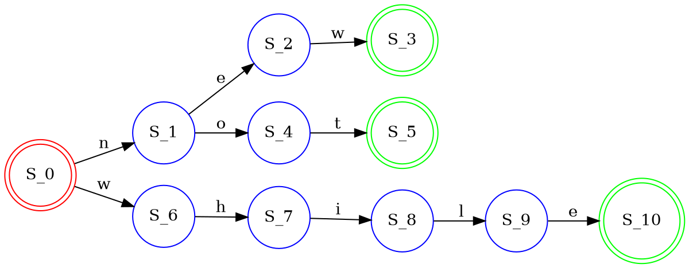
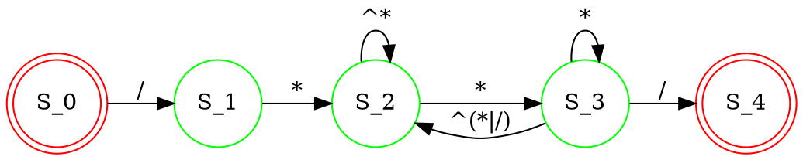

# </center>**中科大《编译原理》视频学习**</center>
<center>视频作者 华保健</center>

## **词法分析**

### **字母表**
 $Alphabet$: A finite set of symbols  
 字母表即是一个非空有穷集合 字母表中的元素被称为该字母表的一个字母($letter$), 也可叫做符号($symbol$)或字符($character$)  
例如: $\{0,\,1\}$, $\{a,\,b,\,c,\cdots,z\}$, ASCII 码的全体符号集, Unicode 码的全体符号集合, 等等.  
字母表的性质:
- 整体性($monolith$), 也叫不可拆分性. 如 $\Sigma \,=\,\{aa, bb, a, ba\}$, 其中的aa, ba等字符是不能再拆分成a, b等符号的, 必须以整体同时出现.
- 可辨认性($distinguishable$), 也叫可区分性. 字母表中的任意两个字符是不相同的, 可以区分的. 如$\Sigma \,=\,\{a, bb, a, ba\}$, 这就不叫一个字母表, 因为其中出现了不可区分的元素$a$和$a$, 其实它也不是一个集合.

### **字母表的乘积**
设$\Sigma_1$和$\Sigma_2$是两个字母表, $\Sigma_1$与$\Sigma_2$的乘积($product$):  
$\Sigma_1 \Sigma_1\,=\,\{ab\,|\,a\in \Sigma_1,\,b\in \Sigma_2 \}$  
例如: $\{0,\,1\}\{a,\,b\}\,=\,\{0a,\,0b,\,1a,\,1b \}$

### **字符串**
$String$: A finite sequence of symbols from an alphabet  
字符串即是字母表上的字符的序列.  
例如: $abc$, $\alpha\beta\gamma$, $Stephen$ 等等. 

### **语言**
A set of strings over an alphabet
语言是字母表上字符串的集合.  
例如: $\Phi$ (空集), $\{ 1, 11, 111, 1111 \}$, 所有的英文单词组成的集合, 所有的中文字符串组成的集合等等.

### **语言的运算**

假设两个语言 $L = \{\epsilon, wo\}$, 和 $M = man,\,men$
- 连接($Concatenation$)运算: 一个字符串紧接着另一个字符串. 例如: $LM = \{man, men, woman, women\}$.
- 并($Union$)运算: 将两个语言的所有字符串做并运算. 例如: $L \cup M = \{\epsilon,\,wo,\,man,\,men\}$.
- 克林闭包(Kleene Closure)运算: $M^∗ = \{\epsilon,\,M,\,MM,\,MMM,\,\cdots\} =\{\epsilon,\,man,\,men,\,manman,\,manmen,\,menman,\,menmen,\,manmanman,\,manmanmen,\,manmenman,\,\cdots\}$
- 正闭包运算: $M^+\,=\,MM^*$, 即$M$至少出现一次
### **有限状态自动机**

以下内容摘抄自 《Engineering a compiler》  
有限状态自动机 $(Finite\,Automata)$ 是一个五元组:  $(S, \Sigma, \delta, s_0, S_A)$, 其中:  
- $S$: 有限的状态的集合, 包括一个错误状态 $s_e$.
- $\Sigma$: 字母表, 也就是做状态转移时读入的字符集.
- $\delta(s, c)$, $\delta :S\times \Sigma \rightarrow S$: 状态转移函数, 它将 $\forall s \in S$ 和 $\forall c \in \Sigma$ 映射为 $S$ 中的一个状态. 对于状态 $s_i$ 的输入 $c$, 有限状态自动机 $FA$ 做状态转移: $s_i \stackrel{c}{\rightarrow} \delta(s_i,c)$.
- $s_0$: $s_0 \in S$, 是一个指定的开始状态.
- $S_A$: $S_A \subseteq S$, 接受状态的集合. 在状态转移图中, $\forall s_a \in S_A$ 任意一个接受状态以双圆圈的形式出现.

例子:



上图是一个识别new($S_0 \stackrel{n}{\rightarrow} S_1, S_1 \stackrel{e}{\rightarrow} S_2, S_2 \stackrel{w}{\rightarrow} S_3$), not($S_0 \stackrel{n}{\rightarrow} S_1, S_1 \stackrel{o}{\rightarrow} S_4, S_4 \stackrel{t}{\rightarrow} S_5$), while($S_0 \stackrel{w}{\rightarrow} S_6, S_6 \stackrel{h}{\rightarrow} S_7, S_7 \stackrel{i}{\rightarrow} S_8, S_8 \stackrel{l}{\rightarrow} S_9, S_9 \stackrel{e}{\rightarrow} S_{10}$)三个单词的有限状态自动机, 
其中: 
- 字母表 $\Sigma = \{e,h,i,l,n,o,t,w\}$, 
- 状态集 $S = \{s_0, s_1, s_2, s_3, s_4, s_5, s_6, s_7, s_8, s_9, s_{10}, s_e\}$
- 状态转移函数集 $\delta = \begin{Bmatrix} s_0 \stackrel{n}{\rightarrow} s_1,\,&s_1 \stackrel{e}{\rightarrow} s_2,\,&s_2 \stackrel{w}{\rightarrow} s_3,\,&s_1 \stackrel{o}{\rightarrow} s_4,\,&s_4 \stackrel{t}{\rightarrow} s_5 \\ s_0 \stackrel{w}{\rightarrow} s_6,\,&s_6 \stackrel{h}{\rightarrow} s_7,\,&s_7 \stackrel{i}{\rightarrow} s_8,\,&s_8 \stackrel{l}{\rightarrow} s_9,\,&s_9 \stackrel{e}{\rightarrow} s_{10} \\ \end{Bmatrix}$
- 开始状态 $s_0$
- 接受状态集 $S_A = \{s_3, s_5, s_{10} \}$

### **正则表达式**

正则表达式($Regular Expression$, 简写为$RE$)是递归定义的:
1. 空字符串 $\epsilon$ 是$RE$, 用 $\{\epsilon\}$ 表示.
2. 一个字符 $c \in \Sigma$ 是 $RE$, 用 $\{c\}$ 表示.
3. 如果 $E_1$ 和 $E_2$ 都是 $RE$, 那么他们的连接也是 $RE$, 记为 $E_1E_2$.
4. 如果 $E_1$ 和 $E_2$ 都是 $RE$, 那么他们的选择也是 $RE$, 记为 $E_1|E_2$.
5. 如果 $E$是 $RE$, 那么他的闭包也是 $RE$, 记为 $(E)^*$.

例子, 假如有一个表达式 $a(b|c)^*$, 递归的使用上述定义来确定他是否是一个正则表达式:
- 首先 $a$ 是一个单独的字符串, 根据规则2, $a$ 是一个 $RE$, 同理 $b$ 和 $c$ 都是 $RE$;
- 由于 $b$ 和 $c$ 都是 $RE$, 那么根据规则4, 他们的选择 $(b|c)$ 也是 $RE$;
- 由于 $(b|c)$ 是 $RE$, 那么根据规则5, 他的闭包 $(b|c)^*$ 也是 $RE$;
- 由于 $a$ 和 $(b|c)^*$ 都是$RE$, 那么根据规则3, 他们的连接 $a(b|c)^*$ 也是 $RE$.  

由此可见, 递归的使用规则1~5, 可以判断一个表达式是否是正则表达式.  

>注: 为了方便, 通常对于一个字母表中的连续且有序的字符, 用中括号+开始字符+"..."+结束字符+中括号做为选择运算的简记: 比如$[0\dots 9]$, 与正则表达式 $(0|1|2|3|4|5|6|7|8|9)$等同; $[a\dots z]$, 与正则表达式$(a\,|\, b\,|\, c\,|\, d\,|\, e\,|\, f\,|\, g\,|\, h\,|\, i\,|\, j\,|\, k\,|\, l\,|\, m\,|\, n\,|\, o\,|\, p\,|\, q\,|\, r\,|\, s\,|\, t\,|\, u\,|\, v\,|\, w\,|\, x\,|\, y\,|\, z\,|\, )$等同.  

> 补集记号: 设$\Sigma$是一个字母表, 字符$c\in \Sigma$, 那么字符$c$的补集($Complement$)就记为^$c$. 例如:$\Sigma\,=\,\{a,\,b,\,c \}$, 那么^$c\,=\,\{ a,\,b \}$

一些常用的正则表达式:  
- C语言的标识符: $([A\dots Z]\,|\,[a\dots z]\,|\, \_)\,([A\dots Z]\,|\,[a\dots z]\,|\,[0\dots 9])^∗$
- 无符号整数: $0\,|\,[1\dots9]\,[0\dots9]^∗$
- 无符号小数: $(0\,|\, [1\dots 9] [0\dots 9]^∗) (\epsilon\,|\,  .[0\dots 9]^+)$
- 科学计数法: $(0\,|\, [1\dots 9] [0\dots 9]^∗) (\epsilon\,|\,  .[0\dots 9]^+)E(\epsilon\,|\,+\,|\,-)(0\,|\,[1\dots9]\,[0\dots9]^∗)$
- C语言的字符串:  $"($^$(" |\backslash n) )^∗"$, 即双引号(")之内不允许出现另一个双引号(")或者换行符(用\n表示), 其他的字符均可出现.
- C语言的注释:  
  1. 双斜杠形式的注释,  $//($ˆ$\backslash n)^∗$;  
  2. `/**/` 形式的注释, $/*($^$*|*^+$^$/)^**/$  
这个RE用如下的FA表示:



### **DFA**
确定性有限状态自动机, Deterministic Finite Automaton  
A DFA is an FA where the transition function is single-valued. DFAs do not allow $\epsilon$-transitions.  
即, 确定性有限状态机, 不允许出现$\epsilon$转移, 或者对于同一状态和同一字符, 有唯一的状态转移.

### **NFA**
非确定性有限状态自动机, Nondeterministic Finite Automaton  
An FA that allows transitions on the empty string,
$\epsilon$,and states that have multiple transitions on the same character  
即, 允许空字符串($\epsilon$)做状态转移, 或者允许同一个状态对于同一个字符, 做不同的状态转移的有限状态自动机, 称为非确定性有限状态自动机.

### **正则表达式转化为NFA - Thompson 算法**

$Thompson$ 算法的思想很简单：
递归定义：

1. 对于$\epsilon$, 在开始状态和终结状态(可接受状态)之间, 添加一条$\epsilon$边即可.
   ```graphviz
    digraph epsilon {
  rankdir = LR;
  size = "8,5"

  node [shape = doublecircle, color = red]
  S_0 S_1;

  node [shape = circle, color = green];

  S_1 S_2 S_3;

  S_0 -> S_1 [ label = "epsilon" ];
}
   ```
2. 对于单独的字符$c$, 在开始状态和终结状态(可接受状态)之间, 添加一条$c$边即可


### **NFA转化为DFA - 子集构造算法(Powerset Construction Algorithm)**

### **DFA的最小化-Hopcroft算法**