> 
>
> **技术中心软件编程强制性规范**

**(2021.1.1 - 1.1版)**

<table>
<colgroup>
<col style="width: 34%" />
<col style="width: 65%" />
</colgroup>
<tbody>
<tr class="odd">
<td><blockquote>

类 属

</blockquote></td>
<td></td>
</tr>
<tr class="even">
<td><blockquote>

编 号

</blockquote></td>
<td></td>
</tr>
<tr class="odd">
<td><blockquote>

版 本 号

</blockquote></td>
<td><blockquote>

1.1

</blockquote></td>
</tr>
<tr class="even">
<td><blockquote>

拟 制

</blockquote></td>
<td></td>
</tr>
<tr class="odd">
<td><blockquote>

审 核

</blockquote></td>
<td></td>
</tr>
<tr class="even">
<td><blockquote>

批 准

</blockquote></td>
<td></td>
</tr>
<tr class="odd">
<td><blockquote>

密 级

</blockquote></td>
<td></td>
</tr>
<tr class="even">
<td><blockquote>

生 效 日 期

</blockquote></td>
<td><blockquote>

2021.1.1

</blockquote></td>
</tr>
</tbody>
</table>

**目录**

[1. 目的 [4](#目的)](#目的)

[2. 范围 [4](#范围)](#范围)

[3. 职责 [4](#职责)](#职责)

[4. 规范 [4](#规范)](#规范)

> [4.1 文件结构 [4](#文件结构)](#文件结构)
>
> [4.1.1 【强制】文件夹、文件名命名 [4](#强制文件夹文件名命名)](#强制文件夹文件名命名)
>
> [4.1.2 目录结构 [5](#目录结构)](#目录结构)
>
> [4.1.3 程序文件内容 [11](#程序文件内容)](#程序文件内容)
>
> [4.2 【建议】程序排版规范 [12](#建议程序排版规范)](#建议程序排版规范)
>
> [4.2.1 括号“(”、“)” [12](#括号)](#括号)
>
> [4.2.2 空格的使用规定 [12](#空格的使用规定)](#空格的使用规定)
>
> [4.2.3 缩进规则 [12](#缩进规则)](#缩进规则)
>
> [4.2.4 空行的使用 [13](#空行的使用)](#空行的使用)
>
> [4.3 注释 [13](#注释)](#注释)
>
> [4.3.1【强制】说明性文件注释 [14](#强制说明性文件注释)](#强制说明性文件注释)
>
> [4.3.2【强制】源文件头部的注释 [14](#强制源文件头部的注释)](#强制源文件头部的注释)
>
> [4.3.3【强制】数据结构的注释规定 [14](#强制数据结构的注释规定)](#强制数据结构的注释规定)
>
> [4.3.4【强制】函数注释 [15](#强制函数注释)](#强制函数注释)
>
> [4.3.5 变量注释 – 对于全局变量是强制的 [15](#变量注释-对于全局变量是强制的)](#变量注释-对于全局变量是强制的)
>
> [4.3.6 语句注释 [15](#语句注释)](#语句注释)
>
> [4.3.7 程序块注释 [15](#程序块注释)](#程序块注释)
>
> [4.3.8【建议】注释的排版 [15](#建议注释的排版)](#建议注释的排版)
>
> [4.4 命名规则 [16](#命名规则)](#命名规则)
>
> [4.4.1 【强制】通则 [16](#强制通则)](#强制通则)
>
> [4.4.2 【强制】Java/JavaScript [19](#强制javajavascript)](#强制javajavascript)
>
> [4.5 变量、结构 [20](#变量结构)](#变量结构)
>
> [4.5.1 变量定义 [20](#变量定义)](#变量定义)
>
> [4.5.2 【强制】变量使用 [20](#强制变量使用)](#强制变量使用)
>
> [4.6 【强制】宏/常量 [22](#强制宏常量)](#强制宏常量)
>
> [4.6.1用宏定义表达式时，要使用完备的括号 [22](#用宏定义表达式时要使用完备的括号)](#用宏定义表达式时要使用完备的括号)
>
> [4.6.2将宏所定义的多条表达式放在大括号中 [22](#将宏所定义的多条表达式放在大括号中)](#将宏所定义的多条表达式放在大括号中)
>
> [4.6.3使用宏时，不允许参数发生变化 [23](#使用宏时不允许参数发生变化)](#使用宏时不允许参数发生变化)
>
> [4.7 函数、过程【C/C++】 [23](#函数过程cc)](#函数过程cc)
>
> [4.7.1【强制】编写可重入函数时，应注意局部变量的使用 [23](#强制编写可重入函数时应注意局部变量的使用)](#强制编写可重入函数时应注意局部变量的使用)
>
> [4.7.2【强制】编写可重入函数时注意全局变量的保护 [23](#强制编写可重入函数时注意全局变量的保护)](#强制编写可重入函数时注意全局变量的保护)
>
> [4.7.3【强制】防止将函数的参数作为工作变量 [24](#强制防止将函数的参数作为工作变量)](#强制防止将函数的参数作为工作变量)
>
> [4.7.4【强制】对函数的返回值必须进行有效性检查再使用 [25](#强制对函数的返回值必须进行有效性检查再使用)](#强制对函数的返回值必须进行有效性检查再使用)
>
> [4.7.5 函数编写要点 [25](#函数编写要点)](#函数编写要点)
>
> [4.8 【强制】配置文件的使用 [27](#强制配置文件的使用)](#强制配置文件的使用)
>
> [4.9 【强制】数据库表修改 [27](#强制数据库表修改)](#强制数据库表修改)
>
> [4.10 代码编写【C/C++】 [27](#代码编写cc)](#代码编写cc)
>
> [4.10.1 总则 [27](#总则)](#总则)
>
> [4.10.2 【强制】大量的数据应通过指针的方式传递 [27](#强制大量的数据应通过指针的方式传递)](#强制大量的数据应通过指针的方式传递)
>
> [4.10.3 【强制】不能向缓冲区中拷入过大（字节）的数据 [28](#强制不能向缓冲区中拷入过大字节的数据)](#强制不能向缓冲区中拷入过大字节的数据)
>
> [4.10.4 【强制】对参数有效性进行检查 [28](#强制对参数有效性进行检查)](#强制对参数有效性进行检查)
>
> [4.10.5 【强制】变量的合法性判断 [29](#强制变量的合法性判断)](#强制变量的合法性判断)
>
> [4.10.6 【强制】正确使用 delete [29](#强制正确使用-delete)](#强制正确使用-delete)
>
> [4.10.7 【强制】不能用 delete 删除一个 void 指针 [30](#强制不能用-delete-删除一个-void-指针)](#强制不能用-delete-删除一个-void-指针)
>
> [4.10.8 【强制】表达式的操作顺序应非常明确 [30](#强制表达式的操作顺序应非常明确)](#强制表达式的操作顺序应非常明确)
>
> [4.10.10【强制】不能将负整数用于数组的下标变量 [31](#强制不能将负整数用于数组的下标变量)](#强制不能将负整数用于数组的下标变量)
>
> [4.10.11【强制】字符串数据必须有结束符 [31](#强制字符串数据必须有结束符)](#强制字符串数据必须有结束符)
>
> [4.10.12【强制】文件操作前应作安全性检查 [32](#强制文件操作前应作安全性检查)](#强制文件操作前应作安全性检查)
>
> [4.10.13【强制】避免出现差 1 错误 [32](#强制避免出现差-1-错误)](#强制避免出现差-1-错误)
>
> [4.10.14【强制】默认值的处理 [32](#强制默认值的处理)](#强制默认值的处理)
>
> [4.10.16【强制】编程时尽量不要在程序中直接使用数值常数 [32](#强制编程时尽量不要在程序中直接使用数值常数)](#强制编程时尽量不要在程序中直接使用数值常数)
>
> [4.10.19【强制】时间处理 [33](#强制时间处理)](#强制时间处理)
>
> [4.10.20【强制】大小写错误 [33](#强制大小写错误)](#强制大小写错误)
>
> [4.10.21【强制】数据运算与数字处理 [33](#强制数据运算与数字处理)](#强制数据运算与数字处理)
>
> [4.10.22 其它要点 [33](#其它要点)](#其它要点)
>
> [4.10.23 【强制】新增要点 [34](#强制新增要点)](#强制新增要点)
>
> [4.11 代码编写【JavaScript】 [35](#代码编写javascript)](#代码编写javascript)
>
> [4.11.1 使用命名空间 [35](#使用命名空间)](#使用命名空间)
>
> [4.11.2 单独存放JavaScript代码 [36](#单独存放javascript代码)](#单独存放javascript代码)
>
> [4.11.3 推荐采用构造函数和原型混合模式定义类 [36](#推荐采用构造函数和原型混合模式定义类)](#推荐采用构造函数和原型混合模式定义类)
>
> [4.11.4 其他约定 [36](#其他约定)](#其他约定)
>
> [4.12 控制代码复杂度 [37](#控制代码复杂度)](#控制代码复杂度)
>
> [4.12.1提取函数 [37](#提取函数)](#提取函数)
>
> [4.12.2 卫语句 [37](#卫语句)](#卫语句)
>
> [4.13 程序的可维护性【强制】 [38](#程序的可维护性强制)](#程序的可维护性强制)
>
> [4.13.1文件的大小 [38](#文件的大小)](#文件的大小)
>
> [4.13.2 类源码的编写 [38](#类源码的编写)](#类源码的编写)

[5. 附录一：代码走查多发问题汇总【C/C++】 [38](#附录一代码走查多发问题汇总cc)](#附录一代码走查多发问题汇总cc)

> [5.1 内存、资源泄漏问题 [38](#内存资源泄漏问题)](#内存资源泄漏问题)
>
> [5.2 参数和临时变量的有效性检验。 [38](#参数和临时变量的有效性检验)](#参数和临时变量的有效性检验)
>
> [5.3 其它途径引入函数的变量的有效性检验。 [38](#其它途径引入函数的变量的有效性检验)](#其它途径引入函数的变量的有效性检验)
>
> [5.4 程序的运行效率问题。 [39](#程序的运行效率问题)](#程序的运行效率问题)
>
> [5.5 资源浪费或者人为的设置系统的容量 [41](#资源浪费或者人为的设置系统的容量)](#资源浪费或者人为的设置系统的容量)
>
> [5.6 变量的初始化问题。 [41](#变量的初始化问题)](#变量的初始化问题)
>
> [5.7 常量数字 [42](#常量数字)](#常量数字)
>
> [5.8 公因子的问题。 [42](#公因子的问题)](#公因子的问题)
>
> [5.9 其它注意问题 [42](#其它注意问题)](#其它注意问题)

[6. 附录二：良好的编程习惯【C/C++】 [43](#附录二良好的编程习惯cc)](#附录二良好的编程习惯cc)

> [6.1 用好指针才是一个真正的C++程序员 [43](#用好指针才是一个真正的c程序员)](#用好指针才是一个真正的c程序员)
>
> [6.1.1 指针使用四法则： [43](#指针使用四法则)](#指针使用四法则)
>
> [6.1.2 指针使用常见问题： [43](#指针使用常见问题)](#指针使用常见问题)
>
> [6.2 养成良好的编程习惯 [45](#养成良好的编程习惯)](#养成良好的编程习惯)

# 目的

> 良好的编程风格是提高程序可靠性非常重要的手段，也是在大的软件项目中多人合作开发的基础。为了提高技术中心源程序的质量和可维护性，通过本规范的定义来规避不好的编程风格，增强代码的可读性与可维护性，以便于自己和他人阅读，同时提升研发人员的编码水平和技术中心软件开发的质量。

技术中心程序编码规范是在质量部的软件编程规范和原系统部软件编程规范基础上，融合、裁剪而成，剔除了一些意义不大的部分，添加了一些代码走查发现的容易出现的问题，使之更适合技术中心的编码需求。本设计规范书指出了在新产品开发项目、二次开发项目、程序的日常维护工作和工程项目中软件开发编程过程中应该注意的一些事项，以形成合乎规范的软件编码程序。

# 范围

本规范书适用于技术中心所有的软件开发、维护等的程序编写，凡是以程序文件为成果物的产品，都必须遵循该规范。

# 职责

编码人员：遵照本编码规范进行代码编写。

代码走查人员：遵照本编码规范进行代码走查，确认实际代码与编码规范的符合性。

# 规范

以下规范里，凡是标注【强制】的，这些内容是属于必须执行的；未标注的是属于建议性的，研发人员可根据自己的情况酌情选择使用。

标识【C/C++】的，该项只对C/C++编程有效；标识【Java/JavaScript】的，该项只对Java/JavaScript编程有效；标识【Java】的，该项只对Java编程有效；标识【JavaScript】的，该项只对JavaScript编程有效；未特意标注的，对所有编程都有效。

规范的最后有两个附录章节，不是编码规范的一部分，放到这里，是为了给编程人员一个参考。附录里的问题是通过对代码走查工作进行阶段总结后，而归纳的大家在编程中最容易出问题的地方，在这里列出，希望引起大家的重视。

## 文件结构

### 4.1.1 【强制】文件夹、文件名命名

> 文件名由基本名和后缀名构成，基本名由**不大于64个的字母和数字**组成，仅允许用小写字母且以字母开头，基本名应是有意义的名字，应与程序功能相一致，如果基本名由多个单词组成，每个单词之间加“\_”。后缀名由不超过5个字符组成，常见后缀要求如下：
>
> name.h C ++header file
>
> name.cpp C++ source file
>
> name.inc Include file
>
> name.def Definition (Declaration) file
>
> name.cfg Compile declaration file
>
> 源文件与对应的头文件，文件基本名相同。
>
> 注意：

- 严禁使用中文命名文件名。

- Java和JavaScript的类定义文件除外（参见4.4.2节）

- 开发工具自动生成的文件夹/文件名、第三方软件不受该规则约束

### 4.1.2 目录结构

#### 4.1.2.1 目录结构【C/C++】

- 应该根据软件需要/功能/研发人员进行划分，将源文件保存在不同的路径下，如下图所示。

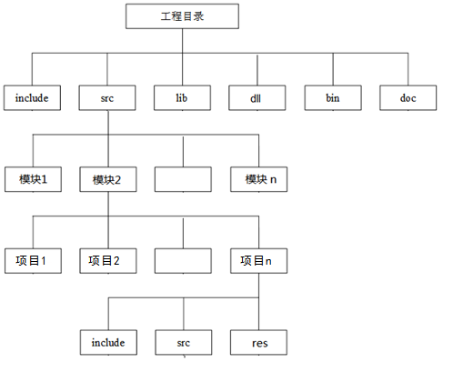

- 【强制】系统共用头文件保存在工程目录下的include目录，模块自用的头文件保存在项目内的include目录下；所有的源文件从工程目录下的src目录往下根据”软件需要/功能/研发人员”划分、保存。每个模块的根目录内只有该模块的工程文件(对应VS里的解决方案)和readme文件，模块目录内又根据需要分为多个项目目录，项目目录内只有项目文件、readme文件和makefile文件，与该项目相关的头文件保存到该目录下的include目录，源文件保存到该目录下的src目录，资源文件保存到该目录下的res目录。可根据需要在该目录下生成不同的归类目录，例如ui目录等等。原则上除了工程文件所有的其它文件不得保存在该工程根目录内。

- 工程目录的各级子目录可以根据某种标准细分为各类子目录，每个子目录都应该包含一个readme文件。readme文件应该列举目录中包含的子文件及其主要作用说明。

- 如果有需要，可以增加其他目录，例如存储编译输出文件的tmp目录等等，但建议基本结构不变。

#### 4.1.2.2 【强制】目录结构【Java/JavaScript】

以下以E8800为例进行说明，其它的Java/JavaScript开发，可参考该例的目录结构。

E8800电力生产运营平台独立维护，并保持严格的独立性及向前兼容性，以保证各应用系统能够单独对平台进行持续平滑升级。

基于该平台开发的产品，需严格按照后续章节约定的目录组织和开发规范进行开发，保证业务代码与平台之间耦合松散，代码组织有序且易于辨认、查找及理解。

此外，规范的目录组织，也便于今后系统定制、生成增量更新程序包、平台或基础应用模块的独立升级、国际化等工作的开展。

##### 总体目录组织

产品线所有的源码与文档全部存放在SVN服务器中。SVN服务器的根目录划分如下：

> 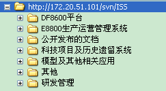
>
> SVN中的目录暂时划分为7个目录：

- DF8600平台：存放与DF8600平台相关的源码及文档，内部包括三个子目录，分别为广州佛山使用的旧版本、通用WEB与通用配用电调度技术支持系统使用的标准版本、特殊用户的专用程序

- E8800生产运营管理系统：存放E8800电力生产运营平台及基于该平台开发的所有应用系统的源码及文档，该目录在《E8800电力生产运营平台开发者手册.doc》中有详细描述。

- 公开发布的文档：存放需要开放给工程人员、市场营销、技术支持人员、客户的公开文档。该目录下的技术说明书、使用说明书、宣传材料等文档将从“DF8600平台”、“E8800生产运营管理系统”、“模型及其他相关应用”等目录下抽取发布。

- 科技项目及历史遗留系统：存放产品线历史遗留的系统及科技项目

- 模型及其他相关应用：存放与模型、图形、数据交换相关的源码及文档

- 其他：需要存放在SVN中的其他资源

- 研发管理：存放与研发管理相关的文档，如研发计划等

E8800电力生产运营平台及基于平台开发的应用系统均存放于“E8800生产运营管理系统”目录中，需按如下目录组织进行维护：

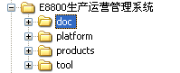

其中，“E8800生产运营管理系统“为顶级目录，其下分为四个一级子目录。其中，

- **doc** 保存系统性文档，可根据需要在该文件夹下创建相应分类

- **platform** 保存平台的源码、文档、数据模型等；

- **products** 保存基于平台开发的所有产品（应用系统）；

- **tool** 保存平台或产品依赖的工具、框架、类库等。

##### 目录组织详解

> 后续章节，将详细介绍各级目录及其子目录的用途。

###### 一级目录doc

一级子目录“doc”，用于保存与E8800生产运营管理系统相关的系统性文档，可根据需要在该文件夹下创建相应分类，如管理文档、技术文档、用户交流文档、规范标准等等。

###### 一级目录platform

一级子目录“platform”，用于存放E8800电力生产运营平台。考虑到组织管理、日志管理、文档管理等基础应用，用户需求差异少，相对较稳定，由基础平台统一维护，也放在该目录下。platform的内部目录组织如下：

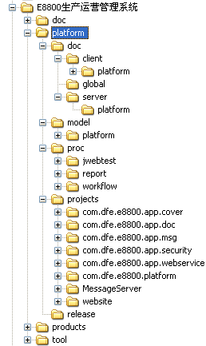

platfrom内部包含四个二级子目录

- **doc** 保存平台相关文档

- **model** 保存平台数据模型

- **proc** 保存平台的后台进程、维护工具等；

- **projects** 保存平台的Java工程及动态WEB工程

####### 二级目录platform/doc

该目录用于存放于平台相关的文档。其下又分client、server、global三个子文件夹，每个子文件夹下均包含一个platform子文件夹，而platform的子文件夹则与实际代码的组织形式保持一致。如此划分目录，出于如下考虑：

- 前台的JavaScript文档和后台的Java文档，由不同的方式生成，因此划分client和server子文件夹，分别用于保存前台的JavaScript程序文档和后台的Java文档，而global文档则用于保存相应模块的整体描述文档。

- client、server、global下细分出platform子文件夹，是为了将平台的文档与基础应用模块和业务模块区分开来，便于文档的更新、合并等操作。

####### 二级目录platform/model

该目录用于存放于平台相关的数据模型，其下包含一个platform子文件夹，用于在将来的文档更新、合并操作中将平台与各业务模块区分开来。

####### 二级目录platform/proc

该目录用于存放于平台的后台服务进程及独立的工具软件，这些进程及工具软件，有的是自主开发，有的是第三方软件（开源软件），其内部的目录组织结构这里不做约定。

####### 二级目录platform/projects

该目录用于存放于平台的Java工程及动态WEB工程。

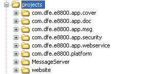

1.  **Java工程**

自主开发的Java工程，全部以com.dfe.e8800为前缀，com.dfe.e8800.platform工程为平台的核心Java工程；带com.dfe.e8800.platform.app前缀的为基础应用模块的Java工程。标准配置的Java工程，包含src和test两个子文件夹，分别保存源程序代码和测试代码，这两个子文件夹内部目录组织保持一致。部分特殊的Java工程可能还包含其他的子文件夹。

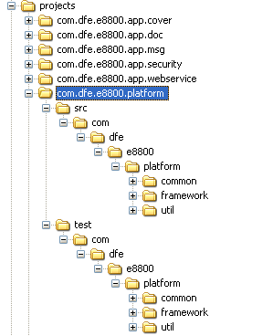

2.  **动态WEB工程**

> 只包含一个名称为website的动态WEB工程，其中的WebContent文件夹包含了支撑平台运行所需的所有应用框架、配置文件、.jar包以及前台的JavaScript脚本、html文件、图片、样式等。
>
> 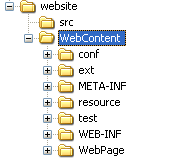

1)  conf：用于保存与用户现场相关的控制**前台**行为的配置文件，其内部分为platform和app两个子文件夹，用于区分平台配置、基础应用模块配置。platform和app内部的目录组织形式与前台代码的组织形式保持一致。将这些配置文件与源代码分离的好处是便于配置的现场修改、方便现场升级。

> 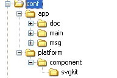

2)  ext：精简版的ExtJS框架，将平台用不到的内容全部剔除，以降低平台代码的规模，而保留下来的内容则与ExtJS原始版本完全一致。。

3)  resource：用于保存前台将会用到样式、网页模板等资源。目前只包含一个theme文件夹，其内部包含了平台提供的所有主题样式。基于平台开发的业务模块，应首先引入theme/**inuse**/platform.css中定义的样式，以保证业务模块与平台在主题样式上的一致性。图片样式资源单独统一存放，一方面可以最大限度地在模块间复用，另一方面也便于现场代码的更新，减少更新代码的规模。

> 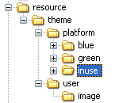

4)  test：保存前台的测试代码或示例代码，其内部包含platform和app两个子文件夹，用于区分平台配置、基础应用模块配置。platform和app内部的目录组织形式与前台代码的组织形式保持一致。

5)  WEB-INF：动态WEB工程标配的文件夹，内部包含了平台用到的.xml或.properties配置文件，以及用于存放平台.jar包的lib子文件夹。

6)  WebPage：动态WEB工程标配的文件夹，内部包含platform和app两个子文件夹，分别用于保存平台、基础应用模块的前台代码。platform和app下以模块或功能分类为单位各自组织。

> 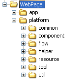

####### 二级目录platform/release

> 该目录用于保存已发布的平台版本。

###### 一级目录products

products目录保存了基于E8800平台开发的所有产品。目前，包括DDC（Dispatching Data Center，调度数据中心）、OMS（Operation management system，运行管理系统）、GWS（General WEB System，通用WEB系统）、GIS（WEBGIS）。

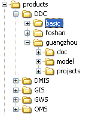

每一类产品对应一个二级目录，包含了基础系统，及若干具体的用户个性化产品。由于用户现场情况千差万别，同一产品在几乎不可能再不同用户间直接复用。为了实现功能的最大限度复用，应将本类产品可复用部分提取到basic中，以实现在basic基础上添加用户个性化需求快速生成用户产品。

用户产品目录（如DDC/guangzhou）的目录结构与一级目录platform类似，包括doc（用户产品相关文档）、model（用户产品数据模型）、projects（Java工程及动态WEB工程）。

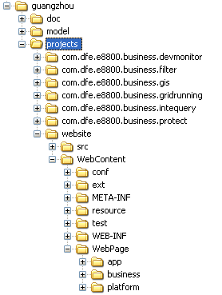

与平台的区别在于，用户产品目录中的projects只保存了以com.dfe.e8800.business为前缀的业务模块所需的Java工程；动态WEB工程中，各级目录下除了包含从平台带过来的app、platform子目录外，还包含business子目录，用于保存用户产品所需的业务模块。

###### 一级目录setup

该目录保存了部署系统运行环境所需安装程序包。其下包含一个或几个二级子目录，分别用于不同的操作系统环境。

###### 一级目录tool

该目录用于保存系统开发所需的工具软件，如ExtJS3.4完整版、数据库管理工具PowerDesigner等。

### 4.1.3 程序文件内容

#### 4.1.3.1 【强制】源程序文件内容

> 【C/C++】统一使用GBK编码，【Java/JavaScript】统一使用UTF-8编码。完整的程序文件由若干部分内容构成，各部分内容及一般顺序如下：

1.  **文件头部注释**

说明该文件模块的功能和内容（函数、外部数据说明等）。详见“注释”里的规定。

**b) 需要引入的头文件**

> \#include中不能包括全路径，必须采用相对路径。

2.  **各种定义及类型定义**

其顺序为（如果有的话）：常量（defines）、typedefs、 enums、函数声明

> 如果一组defines仅应用于某一特定的全局数据块（如标志字），则该defines应紧跟在此数据说明之后，或嵌入到结构说明之中。

3)  **全局（外部）数据说明**

Global (external) data declarations , 其顺序为：

externs

non-static globals

static globals

4.  **函数模块**

> 功能类似的函数应尽量放在一起，每一函数之前应有函数头部注释，主要提供函数的接口说明，内容包括函数基本功能描述、出入口参数、调用关系，必要时也应包括实现算法。
>
> 函数体中，根据需要可有代码块注释，它可对某个代码块的功能、编程技巧及临时变量进行说明。

#### 4.1.3.2 【强制】头文件内容

头文件中一般允许放下列内容：

- 宏定义

- 各种数据结构说明

- typedefs说明

- 外部函数说明

- 全局变量说明

<!-- -->

- 头文件（\*.h文件）的开始代码部分，一定要加上ifndef/define/ endif等预编译判断条件，防止头文件被重复包含。

- 用 \#include \<filename.h\> 格式来引用标准库的头文件（编译器将从标准库目录开始搜索）。

- 用 \#include “filename.h” 格式来引用自定义/非标准库的头文件（编译器将从用户的工作目录或者指定的路径开始搜索）。

- 头文件名不应与标准函数库名相同。

- 头文件中只应包括多个文件都需要的内容。对于功能不同的内容应放在不同的头文件中。

- 在头文件中只存放“声明”而不存放“定义”。

## 【建议】程序排版规范

● 软件工程师按软件功能对源文件进行文件划分，原则上一个文件长度不超过 **3 000** 行，一个函数 长度不超过 400 行；

> ●每行代码的长度推荐为 80 列以内，最长不得超过 120 列，太长的语句则分行编写；但这一设置也可以灵活调整,在任何情况下,超长的语句应该在一个逗号或者一个操作符后折行

● 循环嵌套不允许超过 4 层，否则需要重新审核详细设计，或者增加模块；

### 4.2.1 括号“(”、“)” 

左括号和后一个字符之间不应该出现空格, 同样, 右括号和前一个字符之间也不应该出现空格。左括号和前一个字符之间使用一个空格。下面的例子说明括号和空格的错误及正确使用:  

CallProc(  Aparameter  ); // 错误 

CallProc (AParameter); // 正确 

不要在语句中使用无意义的括号. 括号只应该为达到某种目的而出现在源代码中。下面的例子说明错误和正确的用法: 

if ((I) == 42) { // 错误 - 括号毫无意义 

if ((I == 42) \|\| (J == 42))  // 正确 - 的确需要括号 

### 4.2.2 空格的使用规定

采用加空格的松散方式编写代码的目的是使代码更加清晰，便于阅读；

1） 在所有两目、三目运算符的两边都必须有空格：比较操作符“\>”、“\>=”、“\<”、“\<=”、“!=”、 “==”，赋值操作符“=”、 “+=”，算术操作符“+”、“-”、“\*”、“\\、“%”，逻辑操作符“&&”、 “\|\|”，位域操作符“\<\<”、“\>\>”、“\|”、“&”、“^”等双目操作符的前后加空格，空格数量为1，不得大于1；

2） if、for、do、while、switch、case 关键字之后要添加**一个**空格；

### 4.2.3 缩进规则

缩进位置包括函数体定义、结构定义、枚举定义以及 if、for、do、while、switch、case 语句 等。以缩进风格编制程序时，除了条件语句（if 后紧随 return），if、for、do、while、case、 switch、default 等语句独自占一行。实际上我们目前使用的代码编写工具都有默认的缩进规则，一般情况下使用编辑器默认的空格和缩进规则就可以。

### 4.2.4 空行的使用

> 灵活的使用空行可增加程序的可读性。空行一般使用在下面几个地方：

- 两个函数之间

- 一个函数内部，不同的程序代码块之间

- 一个函数内部，集中定义的变量与代码块之间

- 原则上不得使用连续的2行以上（包括两行）的空行

## 注释

● 一般情况下，源程序有效注释量必须在 20％以上；

● 注释的原则是有助于对程序的阅读理解，注释语言必须准确、易懂、简洁；

● 注释方式分为两种：

- /\*\* 注释内容 \*/：凡是希望自动文档生成工具能够自动识别、提取的注释都使用该注释方式

- //注释内容：简便注释方式，不需要自动文档生成工具自动识别、提取的注释全部使用该方式

● 说明性文件、源文件头部、函数注释的格式采用/\*\* 注释内容 \*/，以便自动文档生成工具能够自动识别、提取

● 数据结构内的域、局部变量、类变量、函数内部注释的格式采用 //注释内容；

● 【Java/JavaScript】推荐在文档注释中使用HTML标记，以使文档生成工具自动生成的文档具有更好的可读性。

● 注释文字全部使用简体中文

● 程序、函数作者必须使用真实的中文名

● 一些注释是通过工具提取出来的，因此注释的格式不一定严格按照下面的格式书写。格式可以随意，但是内容不能缺少，下面要求的几部分内容在你的注释里，只能多，不能少。

### 4.3.1【强制】说明性文件注释 

说明性文件（如头文件.h 文件、.inc 文件、.def 文件、编译说明文件.cfg 等）头部应进行 注释，注释必须列出：版本号、生成日期、作者、内容、功能、与其它文件的关系、修改日志等，头文件的注释中还应有函数功能简要说明。

\[正确示例\]

/\*\*\*\*\*\*\*\*\*\*\*\*\*\*\*\*\*\*\*\*\*\*\*\*\*\*\*\*\*\*\*\*\*\*\*\*\*\*\*\*\*\*\*\*\*\*\*\*\*\*\*\*\*\*\*\*\*\*\*\*\*\*\*\*\*\*\*\*

作者: \*\*\* **(必须使用真实的中文名)**

版本号:1.0

生成日期:2010.4.11

概述: 本文件主要定义了冒烟测试中用到的宏和数据结构的定义；

修改日志：为发送功能完善对 t_smktst_host 结构进行了扩充 2010.4.10 \*\*\*

\*\*\*\*\*\*\*\*\*\*\*\*\*\*\*\*\*\*\*\*\*\*\*\*\*\*\*\*\*\*\*\*\*\*\*\*\*\*\*\*\*\*\*\*\*\*\*\*\*\*\*\*\*\*\*\*\*\*\*\*\*\*\*\*\*\*\*\*\*/

### 4.3.2【强制】源文件头部的注释 

　　源文件头部应进行注释，列出：版本号、生成日期、作者、模块目的/功能、主要函数及其功能、修改日志等

### 4.3.3【强制】数据结构的注释规定

　　　对数据结构(包括数组、结构、类、枚举等)的注释应放在其上方相邻位置，不可放在下面；对结构中的每个域的注释放在此域的右方或其上方，并对特定取值范围的域注释其取值范围。数据结构的每个域（类变量，类函数等等）都必须有注释。

### 4.3.4【强制】函数注释

函数的注释风格规定

1）对函数的功能、入口参数、出口参数、返回值及其它补充信息进行描述。

2）对于公共接口函数，声明部分应该是详细注释，定义部分可以简单注释。内部函数注释可以填 写简单注释。

3\) 对于无参数的类构造函数和析构函数可不做注释。但是对于有参数的构造函数必须有注释。

### 4.3.5 变量注释 – 对于全局变量是强制的

局部变量的注释应放在右方。采用“//”简便注释的方式

　　常量、宏、全局变量的注释应放在其上方相邻位置，采用 /\*\*注释\*/的方式。对于全局变量要有较详细的注释，包括对其功能、取值范围、哪些函数或过程存取它以及存取时注意事项等的说明。

\[正确示例\]

/\*\*\*\*\*\*\*\*\*\*\*\*\*\*\*\*\*\*\*\*\*\*\*\*\*\*\*\*\*\*\*\*\*\*\*\*\*\*\*\*\*\*\*\*\*\*\*\*\*\*\*\*\*\*\*\*\*\*\*\*\*\*\*\*\*\*\*\*\*\*

测试系统状态取值范围：0-测试成功 1-测试失败 2-测试进行中

函数 Check_System_Status()设置其值，函数 Get_System_Status()可以访问其值

\*\*\*\*\*\*\*\*\*\*\*\*\*\*\*\*\*\*\*\*\*\*\*\*\*\*\*\*\*\*\*\*\*\*\*\*\*\*\*\*\*\*\*\*\*\*\*\*\*\*\*\*\*\*\*\*\*\*\*\*\*\*\*\*\*\*\*\*\*\*\*/

int g_SystemStatus=0;

### 4.3.6 语句注释

　　对于你觉得重要的语句进行注释，注释应放在其上方相邻位置或右方。采用“//”方式

### 4.3.7 程序块注释

　　对于你觉得重要的函数内的程序块进行注释，注释应放在该程序块上方相邻位置。采用“//”方式

### 4.3.8【建议】注释的排版

注释与所描述内容进行同样的缩排 注释与所描述内容进行同样的缩排，可使程序排版整齐，并方便注释的阅读与理解。

## 命名规则

标识符的命名要清晰、明了;自己特有的命名风格，要自始至终保持一致，不可来回变化;

### 4.4.1 【强制】通则

- 使用完整的单词或大家基本可以理解的缩写，避免使人产生误解：较短的单词可通过去掉“元音”形成缩写；较长的单词可取单词的头几个字母形成缩写；一些单词有大家公认的缩写，在实际项目中也可以定义项目组自己的变量词典。

- 标识符必须使用让人容易理解的命名，不得使用一些莫名其妙的定义或者是随便给出几个字符，可望文知意，不必进行“解码”。

- 标识符在达到清晰辨识的前提下，尽量简短，不宜过长。命名长度大致为8~30个字符，可使用恰当的缩写。

- 程序中不要出现仅靠大小写区分的相似的标识符。

- 程序中不要出现标识符完全相同的局部变量和全局变量，尽管两者的作用域不同而不会发生语法错误，但会使人误解。

- 尽量避免名字中出现数字编号(标号除外)，如Value1,Value2等，除非逻辑上的确需要编号。

- 标识符最好采用英文单词或其组合，便于记忆和阅读。切忌使用汉语拼音来命名。程序中的英文单词一般不会太复杂，用词应当准确。例如不要把CurrentValue写成NowValue。

- 关于命名缩写，只有一个限制：如果缩写导致该名字的意义不明确，就不要使用它。

- 不要使用计算机及本专业领域中未被普遍接受的缩写。

- 对于由一个或者两个字母组成的缩写标识符，标识符中的所有字母都大写。例如：System.IO，System.Web.UI

- 用全部的大写字母加下划线来命名预处理的宏。

- 所有单词大写，多个单词之间用 "\_" 隔开。例如：string PAGE_TITLE = "Welcome";

- 函数名要体现出函数的功能，不得随意起无意义的名子。原则上按照下面两条规则命名。

- 非类函数名遵循模块-动词-名词的规则，首先是模块名前缀，然后是该函数要使用的动作，最后是该函数要处理的东西或对象的名字。例如：

> FooFindObj foo – find - object
>
> TaskAddSwitchHook task – add - switch hook

- 类函数名遵循动词-名词的规则，首先是该函数要使用的动作，最后是该函数要处理的东西或对象的名字。

- 尽量在函数开始的地方或者功能块开始的地方声明变量。无论类变量还是函数变量或者是全局变量，尽量集中到一个地方定义，不要过于分散。

- 自己特有的命名风格，要自始至终保持一致，不可来回变化。个人的命名风格，在符合所在项目组或产品组的命名规则的前提下，才可使用。(即命名规则中没有规定到的地方才可有个人命名风格)。

- 变量前缀

  - 全局变量时应在变量名称前加前缀 “g\_”

  - 静态全局变量时加前缀“s\_”

  - 类变量加前缀“m\_”

  - 定义局部变量时，无需加前缀。

- 使用变量前缀

  - 1.整型前缀  
    　　int iId;　 　　     　　 //int前缀：i  
    　　short int nId; 　　    　　//short前缀：n  
    　　unsigned int uiId 　　　  // unsigned int 前缀：ui  
    　　unsigned short int unId 　　// unsigned short int 前缀：un  
    　　long lId; 　　　　　　　　 //long前缀：l　　

  - 2.浮点型前缀  
    　　float fValue;　　　　　　 //float前缀：f  
    　　double dValue; 　　　　  //double前缀：d

  - 3.字符型前缀  
    　　char chChar;　　　　　　 //char前缀：ch

> 　　unsigned char ucChar;　 //unsigned char前缀：uc

- 4.字符串前缀  
  　　char szPath\[\]; 　　　　  //char字符串前缀：sz  
  　　string strPath; 　　　　  //string字符串前缀：str  
  　　CString strPath; 　　　  //MFC CString类前缀：str

- 5.布尔型前缀  
  　　bool bIsOK; 　　　　 　  //bool类型前缀：b  
  　　BOOL bIsOK; 　　　　    //MFC BOOL前缀：b

- 6、 指针型前缀

> 一重指针变量的基本原则为：“p”+变量类型前缀+命名
>
> float\* pfStat // 指针前缀 pf
>
> 　　char\* pszPath; 　 　　  //指针前缀：p
>
> 二重指针变量的基本规则为：“pp”+变量类型前缀+命名。
>
> 三重指针变量的基本规则为：“ppp”+变量类型前缀+命名。

- 7.数组前缀  
  　　int arriNum\[\]; 　　　　   //数组前缀：arr  
  　　CString arrstrName\[\]; 　 //数组前缀+类型前缀+名称  
  char arrszName\[\]\[\];

- 8.结构体前缀  
  　　STUDENT tXiaoZhang;   //结构体前缀：t

- 9.枚举前缀  
  　　enum emWeek; 　　      //枚举前缀：em

- 10.字节的前缀  
  　　BYTE byIP; 　　　　　　 //字节前缀：by

- 11.字的前缀  
  　　DWORD dwMsgID; 　　  //双字前缀：dw  
  　　WORD wMsgID; 　　     //单字前缀：w

- 12.字符指针前缀  
  　　LPCTSTR ptszName;     //TCHAR类型为ptsz  
  　　LPCSTR pszName;        //pcsz  
  　　LPSTR pszName; 　　   //psz

<!-- -->

- 13.const 变量:要求在变量的命名规则前加入c\_。即：c\_+变量命名规则

> 例如：const char\* c_pszFileName;

- …

<!-- -->

- 变量的命名规则:所有变量的命名采用匈牙利法则  
  即开头字母用变量的类型，其余部分用变量的英文意思、英文的缩写、中文全拼或中文全拼的缩写,要求单词的第一个字母应大写。  
  即： 变量名=变量类型+变量的英文意思(或英文缩写、中文全拼、中文全拼缩写)  
  例如：

> 局部变量：bool 型变量 bFlag， int型变量 iCount， short int 型变量 nStepCount
>
> 类变量： bool 型变量 m_bFlag，int型变量 m_iCount，short int 型变量 m_nStepCount

- for 循环中的i,j,k等等除外，例如下列写法是符合规范的

> for (int i=0; i\<; i++)
>
> int i;
>
> for (i=0; i\<; i++)

- 类名命名规则：所有类的命名采用C+帕斯卡命名法

> 例如：class CMyListCtrl;

- 模板命名规则： 所有模板的命名采用T+帕斯卡命名法

> 例如：template \<class T\> class TMyListCtrl;

- struct、union命名规则：采用S、U前缀，其内部变量的命名规则与变量命名规则一致。  
  结构用S开头，如：  
  struct SPoint {  
  int iX;//点的X位置  
  int iY; //点的Y位置  
  };  
    
  联合体用U开头，如:  
  union UPoint {  
  LONG lX;  
  LONG lY;  
  }

- 函数命名规则：所有函数的命名采用帕斯卡命名法

> 例如　void MyFunc ()

- 常量、宏，要求全部字符使用大写，常量名用英文表达其意思。当需要由多个单词表示时，单词与单词之间必须采用连字符“\_”连接。  
  例如：#define CM_FILE_NOT_FOUND CMMAKEHR(0X20B)

### 4.4.2 【强制】Java/JavaScript

#### 4.4.2.1 Java包名

- 以产品名称或者项目名称相关的字符为前缀，例如对于8800产品，以com.dfe.E8800做前缀

- 全部使用小写英文单词，例如：com.dfe.E8800.platform.framework.log

#### 4.4.2.2 类名

- 一个或多个单词的组合，大驼峰法命名，单词首字母大写

- 某些特殊的Java类，应带后缀以标识类的类型/用途，如Bean、Service、Util、Exception、Test

> 例如：ClassName

#### 4.4.2.3 方法名

- 小驼峰法命名，第一个单词全部小写，其他单词首字母大写其他字母小写

- 常用操作类方法动词约定：

  - 新建：create

  - 添加：add

  - 更新/修改：update

  - 删除：delete

  - 保存：save

  - 维护/管理：manage

  - 初始化：init

  - 设置：set

  - 获取单记录：get

  - 获取多记录：query

  - 检查满足条件的一个对象是否已经存在：find

> 例如：setName

#### 4.4.2.4 数据库表命名 

- 表名及字段名全部使用英文大写及下划线命名

- 表名长度应控制在30个字符以内

- 表名前使用前缀标识表的用途或者标识产品的归属，例如8800产品的前缀由“E8800\_{模块名}\_”组成。

- 字段名需避开常用关键字，如DATE、TIME、ORDER、DESC… …

> 例如：E8800_SCADA_AOPINFO

#### 4.4.2.5 页面组件id命名

- 由模块前缀、组件用途、组件类型后缀等多个英文单词组成。模块前缀小写，其他单词首字母大写，其余字母小写

- 常用组件类型后缀规定如下：

  - \*\*Button：按钮

  - \*\*Label：文本标签

  - \*\*Model：数据模型

  - \*\*Store：数据集

  - \*\*Grid：各种表格

  - \*\*Tree：各种树

  - \*\*Panel：各种面板

  - \*\*Slider：进度条

  - \*\*Menu：菜单

  - \*\*List：列表

  - \*\*Radio：radio按钮

  - \*\*Combo：下拉列表

  - \*\*Check：选择框

  - \*\*Field：编辑框

  - \*\*Form：表单

  - \*\*DatePicker：日历控件

  - \*\*Chart：图表

> 例如：systemSaveButton、systemUserNameLabel

#### 4.4.2.6 JavaBean 配置id命名 

- 除首字母小写外，与对应的Java类名保持一致

- 鉴于Spring加载时会对Bean进行有效性检查，所以暂不考虑命名的重复问题

> 例如：userBean

#### 4.4.2.7 DWR的Service命名

- 由模块前缀、一个或几个英文单词组成的服务名以及Service后缀组成。

- 首单词小写，其他单词首字母大写，其余字母小写

> 例如：scadaService

## 变量、结构

变量的命名遵从标识符的命名规则；变量命名规则统一； 所有变量在使用前均要求正确初始化；

### 4.5.1 变量定义

- 【强制】全局变量时应在变量名称前加前缀 “g\_”，

- 【强制】静态全局变量时加前缀“s\_”；

- 【强制】类变量加前缀“m\_”；

- 【强制】定义局部变量时，无需加前缀。

- 尽量在函数开始的地方或者功能块开始的地方声明变量。无论类变量还是函数变量或者是全局变量，尽量集中到一个地方定义，不要过于分散。

### 4.5.2 【强制】变量使用

#### 4.5.2.1 循环变量的使用规范

在局部变量定义中，可以使用几个通用变量：i，j，k，m，n 等，主要用于循环变量，尽量不要 使用 l，同数字 1 不容易区分；其它变量避免使用单个字符命名。

#### 4.5.2.2 不要使用与具体硬件或软件环境关系密切的变量

使用严格形式定义的、可移植的数据类型，尽量不要使用与具体硬件或软件环境关系密切的变量；

使用标准的数据类型，有利于程序的移植。特别是int的使用，对于函数里的普通的变量，一般没什么问题，但如果作为不同的操作系统之间进行数据交互的数据包的域的话，就不能直接使用int型，必须将其转换为由明确长度的类型，因为C/C++编程语言中，在不同编译环境有不同的大小，不同编译运行环境大小也不同。

#### 4.5.2.3 使用变量时要注意其边界值的情况 

每一种数据类型都有其边界值，在使用过程中应注意数据边界值和实际相符。

#### 4.5.2.4 其它注意事项

- 仔细定义并明确公共变量的含义、作用、取值范围及公共变量间的关系。明确公共变量与操作此公共变量的函数或过程的关系（如访问、修改及创建等）。

- 防止局部变量与公共变量同名。防止多个不同模块或函数都可以修改、创建同一公共变量的现象。

- 当向公共变量传递数据时，要十分小心，防止赋与不合理的值或越界等现象发生。对公共变量赋值时，若有必要应进行合法性检查，以提高代码的可靠性、稳定性。

- 结构的设计要尽量考虑向前兼容和以后的版本升级，并为某些未来可能的应用保留余地（如预留一些空间等）。

- 合理地设计数据并使用自定义数据类型，避免数据间进行不必要的类型转换。

## 【强制】宏/常量

● 采用全大写加下划线方案；

● 除非必要,不要使用数字或较奇怪的字符定义宏；

● 除了编译开关/头文件等特殊应用，应避免使用_EXAMPLE_TEST_之类以下划线开始和结尾的 宏定义。

●公共常量由平台统一规划、定义，不能多处定义。

●凡是系统或者平台里已经有对应的已定义的宏，程序不得自己再定义或者使用数字常量。这个问题多发生在字符串长度的定义上。

### 4.6.1用宏定义表达式时，要使用完备的括号 

> 　　由于宏是全字符代替，如果括号不完整，会出现结合 出错的情况。

### 4.6.2将宏所定义的多条表达式放在大括号中

### 4.6.3使用宏时，不允许参数发生变化

## 函数、过程【C/C++】

● 对所调用函数的错误返回码要仔细、全面地处理；

● 明确函数功能，精确（而不是近似）地实现函数设计；

- 函数的命名要遵从标识符的命名规则

### 4.7.1【强制】编写可重入函数时，应注意局部变量的使用

编写可重入函数时，应注意局部变量的使用（如编写 C/C++语言的可重入函数时，应 使用 auto 即缺省态局部变量或寄存器变量）。编写 C/C++语言的可重入函数时，不应使用 static 局部变量，否则必须经过特殊处理，才能使函数具有可重入性。

### 4.7.2【强制】编写可重入函数时注意全局变量的保护

编写可重入函数时若使用全局变量，则应通过关中断、信号量（即 P、V 操作）等手段对其加以 保护。

说明：若对所使用的全局变量不加以保护，则此函数就不具有可重入性，即当多个进程调用此 函数时，很有可能使有关全局变量变为不可知状态；

> 

### 4.7.3【强制】防止将函数的参数作为工作变量

将函数的参数作为工作变量，有可能错误地改变参数内容，所以很危险。对必须改变的参 数，最好先用局部变量代之，最后再将该局部变量的内容赋给该参数。

### 4.7.4【强制】对函数的返回值必须进行有效性检查再使用

对函数的返回值必须进行有效性检查再使用，例如判断返回的内存指针是否为空，数据 是否在合理范围等。

\[示例\]

**错误示例**

> char \*path = getenv("RUNHOME");
>
> char fileName\[256\];
>
> snprintf(fileName,256,"%s/uif/resource/statusIndex.ini",path);
>
> 上述程序没有判断 getenv 返回值是否有效就使用，可能会引起程序保护错误。

**正确示例**

char \*path = getenv("RUNHOME");

char fileName\[256\];

if( path != NULL )

{

snprintf(fileName,256,"%s/uif/resource/statusIndex.ini",path);

}

### 4.7.5 函数编写要点

- 【强制】函数的规模尽量控制在400行之内（不包括空行和注释）。

- 【强制】一个函数只完成一项功能。

- 【强制】参数的书写要完整，不要贪图省事只写参数的类型而省略参数名字。

- 【强制】如果参数是指针，且仅作输入用，则应在类型前加const，以防止该指针在函数体内被意外修改。

- 【强制】不要省略返回值的类型。如果没有返回值，应该声明为void类型。

- 【强制】在函数的“入口处”，需要检查参数的有效性。

- 【强制】检查通过其它途径进入函数的变量的有效性，如：全局变量、类变量等,特别是指针变量。

- 【强制】函数参数尽量使用C++的const机制保证数据安全性；尽量不要使用类型和数目不确定的参数，如C语言的printf函数是采用不确定类型和参数数目的典型代表，提倡使用C++的I/O机制，因其是类型安全的。

- 【强制】不要引用未经赋值的指针，因为这样常常会引起系统的崩溃。

- 【强制】return语句不可返回指向“栈内存”的“指针”或“引用”，因为该内存在函数体结束时被自动销毁。

- 【强制】一个函数中不能声明另外一个函数。

- 【强制】用于出错处理的返回值一定要清楚，让使用者不容易忽视或误解错误情况。

- 【强制】不要将正常值和错误标志混在一起返回。正常值用输出参数获得，而错误标志用return语句返回。

- 【强制】作为调用者传递给子函数作为子函数输出的参数，必须在子函数起始位置给该参数赋初值，防止子函数非成功返回时，因为该参数未赋值，而出现不可预知的结果，特别是指针，很容易出现野指针！

以下几条为建议：

- 尽量避免函数的参数过多，参数个数最好不超过5个。如果参数太多，使用时容易将相同数据类型的参数顺序用错。可以给一些参数提供适当默认值减轻用户的调用负担。

- 使用灵活的、动态分配的数据，不要使用固定大小的数组。

## 【强制】配置文件的使用 

配置文件对整个系统的运行非常重要，配置文件以及配置项的设置应进行如下管理：

- 凡是修改后会影响其它功能或用户体验（包括界面显示、需要用户配置的等待）的，以及配置文件的修改需要全网同步更新的，应该严格按照如下规定的流程进行评审

- 只影响模块本身功能、并且对系统和该模块的已有功能影响不大的，可以由开发人员仔细考虑后进行修改

a\) 配置文件以及配置项的设置应在整个系统层面统筹考虑，不应由某个研发人员或者某个模块负责人来进行考虑；

b\) 当某个研发人员或者某个模块负责人需要新增或者修改配置项时应首先提出申请，然后邀请相关的人员进行评审，评审时应重点关注该配置项是否有必要、能否合并到其他配置项 中、设置该配置项是否影响到其他模块、配置项存储到配置文件中还是数据库中、配置项 的作用时间，是立即起作用还是系统重新启动再起作用等，变更申请获得通过以后再指定 责任人进行变更，所有受影响模块必须同步变更；

同时所有的配置文件的使用要遵从如下的规则：

a\) 配置文件在程序里的访问必须使用相对路径或者是获取平台目录环境变量后组合的文件路径，不得使用绝对路径。

b\) 存储配置文件的目录要进行预先设计，最好分门别类规整到不同的目录，但所有的目录必须位于平台的根目录内，不得任意存储。

c\) 配置文件和配置项必须有详细的文档说明，而且说明文档和配置文件同步更新。

## 【强制】数据库表修改

无论是平台还是应用，只要修改了数据库表，那么它涉及到的就不只是你自己的那部分代码，它至少要涉及到数据库脚本的改动等等的修改，因此数据库表的修改必须要遵循如下规则，不能由研发人员私自修改：

● 数据库表修改不应由某个研发人员或者某个模块负责人来进行，必须严格按照变更流程来进行， 变更前要组织评审，仔细考虑变更影响，变更时所有受影响模块必须同步变更；

● 数据库表有独立的版本号，即使一个微小的变更，版本号也要更新，数据库的版本号和系统版

本号要有对应关系，产品线、项目组应维护这种对应关系；

● 禁止直接修改数据库，应先修改数据库脚本，然后通过执行脚本来修改数据库；

● 数据库字典应准确详细，和数据库同步更新。

## 代码编写【C/C++】

### 4.10.1 总则

● 对于浮点数，只能比较大小、不能比较是否相等；

● 防止内存操作越界；

● 系统运行之初，要对加载到系统中的数据进行一致性检查；

● 系统要有错误日志或者错误提示；

### 4.10.2 【强制】大量的数据应通过指针的方式传递

当传递的数据缓冲区长度超过 512 字节时，应该采用指针的方式来传递数据，而不能采用直接拷贝的方式传递数据，这样会影响程序执行效率。

### 4.10.3 【强制】不能向缓冲区中拷入过大（字节）的数据

向缓冲区中拷贝的数据字节数不能超过它的最大字节数。

### 4.10.4 【强制】对参数有效性进行检查

在函数的入口处检查所有参数的有效性，例如指针变量是否有效，数据是否在合法的范围(缓冲区索引参数)等。

一个函数必须保证自己的健壮性，你不能假设调用者已经保证了参数的合法性，因此在函数的开始处，对参数进行有效性检查是必要的也是必须的，虽然看起来影响了程序的运行效率，增加了书写的代码量，但这些牺牲是值得的。

注意：有人喜欢使用assert来检查参数的合法性，但是assert只对程序的debug版本有效，在release版本里是无效的，因此这种做法并不能保证参数在release版本的合法性。

### 4.10.5 【强制】变量的合法性判断

如果一个指针的声明、申请、使用、释放是在同一个函数的内部，那么申请后不需要判断，否则必须判断，特别是类指针或者是通过函数返回指针的情况下。

\[示例\]

**错误示例**

> *char \* str = (char \*)malloc( sizeof(char)\*256 );*
>
> *strcpy( str, “test information” );*
>
> **正确示例**
>
> char \* str = (char \*)malloc( sizeof(char)\*256 );
>
> if ( str == NULL )
>
> 　　return;
>
> strcpy( str, “test information” );

有人说，很多时候，即使判断出malloc失败，也没有办法处理：如果必须要这块数据/内存怎么办？再次申请？还是程序直接退出？处理malloc失败会增加逻辑处理的复杂性。大多数情况下没必要判断，仅在分配较大内存时进行判断即可。

此处还是强调，指针分配后必须增加判断处理，如果申请失败的话，你可以让程序返回甚至退出（退出以前必须给用户一个信息提示）；可以给用户一个信息提示（非界面程序不建议这么做），也可以把错误信息写到日志文件里，以利于后续的错误排查。这样做至少不至于你的程序非正常崩溃，而程序频繁死机、崩溃对用户来说是最严重的一类程序缺陷。

### 4.10.6 【强制】正确使用 delete

应确保 delete 删除了 new 的对象。

\[示例\]

**错误示例**

> *int \* index = new int\[MAXCURVENUM\];*
>
> *…*
>
> *delete index;*

**正确方法：**

int \* index = new int\[MAXCURVENUM\];

…

delete \[\]index;

### 4.10.7 【强制】不能用 delete 删除一个 void 指针

用 delete 删除一个 void 指针会产生不可预知的行为。

\[示例\]

**错误示例**

> *Class CPrimList {*
>
> *void \*getNth (int i)*

*…*

> *}*
>
> *CPrimList \* primList;*
>
> *delete primList-\>getNth(i);*

### 4.10.8 【强制】表达式的操作顺序应非常明确

表达式的操作顺序必须非常明确，不能有含糊的地方。

\[示例\]

**错误示例**

> tmpfirstchar = getHanziFirstPy( up\[i\], up\[++i\] );
>
> 上述函数的两个参数 up\[i\]和 up\[++i\] 在实际执行过程中无法准确的预知那一个先执行。
>
> **正确示例：**
>
> tmpfirstchar = getHanziFirstPy( up\[i\], up\[i+1\] );
>
> i++;

\[示例\]

**错误示例**

switch (gNo)

> {
>
> case 40:
>
> lineWidth = atof(strr1);
>
> case 42:
>
> lineWidth1 = atof(strr1);
>
> case 43:
>
> lineWidth2 = atof(strr1);
>
> break;
>
> }

**正确示例：**

switch (gNo)

{

> case 40:
>
> lineWidth = atof(strr1); lineWidth1 = atof(strr1); lineWidth2 = atof(strr1);
>
> break;
>
> case 42:
>
> lineWidth1 = atof(strr1);
>
> lineWidth2 = atof(strr1);
>
> break;
>
> case 43:
>
> lineWidth2 = atof(strr1); break;
>
> default：
>
> break；

}

### 4.10.10【强制】不能将负整数用于数组的下标变量 

> 数组的下标变量必须是大于等于 0 的整数，不能出现负整数。这种情况多出现于调用子函数，但在子函数里没用进行参数的合法性检查。
>
> \[示例\]

**错误示例**

> int find( char \* title )
>
> {
>
> …
>
> Return -1;
>
> }
>
> int index = find(parentTile);
>
> int id = IDs\[index\];
>
> **正确示例：**

int index = find(parentTile);

if ( index \< 0 )

return;

int id = IDs\[index\];

### 4.10.11【强制】字符串数据必须有结束符

字符串数据应有结束符，否则在进行字符串拷贝时会因为没有结束符而拷贝过长的 字符个数，造成数组越界。特别是通过内存拷贝进行的字符串操作，很容易的把字符串最后的结束符给干掉，这种情况下要特别注意。

\[示例\]

**错误示例**

> char str\[16\];
>
> char code\[20\];
>
> …
>
> fread(str, 1, 16, fp);
>
> strcpy( code, str ); // 因为 str 没有结束符，从而在向 code 中拷贝数据时很有可能拷贝过多的字符。
>
> **正确示例**
>
> char str\[16\];
>
> char code\[20\];
>
> …
>
> fread(str, 1, 16, fp);
>
> str\[15\] = ‘\0’;
>
> strcpy( code, str );

### 4.10.12【强制】文件操作前应作安全性检查

在进行文件操作前应先检查文件的状态，例如文件是否在指定的目录，是否已经被打开等。同时禁止带”./””../”路径的文件操作。

\[示例\]

**错误示例**

> *FILE\* fp = fopen(filename,"w+t"); fputs(str,fp);*

**正确示例**

> FILE\* fp = fopen(filename,"w+t");
>
> if ( fp == NULL )
>
> Return; fputs(str,fp);

### 4.10.13【强制】避免出现差 1 错误

编程时比较容易出现差 1 的问题，例如，在循环语句中多循环一次或者少循环一次，访问数组时超过数组的最大长度等。

\[示例\]

**错误示例**

> int powerPointId\[3\];
>
> …
>
> if (order \>= 0 && order \<= 3) powerPointId\[order\] = id1;
>
> 上述语句中数组的下标变量比数组的最大长度多 1 个。

**正确示例**

> int powerPointId\[3\];
>
> …
>
> if (order \>= 0 && order \< 3) powerPointId\[order\] = id1;

### 4.10.14【强制】默认值的处理

程序中用到的可人工设置的参数必须有默认值，当相关参数没有设置值时应使用默认值， 而且应合理选择默认值，一般来说默认值都是最常用的设置值。

### 4.10.16【强制】编程时尽量不要在程序中直接使用数值常数 

> 在编程时尽量不要在程序中直接使用数值常数，如果该常数被用到 2 个以上的地方， 应该通过宏定义等间接方式来使用常数。特别是多个模块公用的常数,要在平台上定义统一的宏。
>
> 凡是平台里已有的定义的宏(例如参数库域长度)，应用程序不得使用数值常量或者自己定义宏，必须使用对应的宏定义。

### 4.10.19【强制】时间处理

当在程序中计算日期时应注意以下问题：

a\) 避免跨天、跨月、跨年以及闰年等错误；

b\) 避免时间、日期差一的问题，在进行数据查询和日期比较时应注意\>,\>=,\<,\<=的区别。

3)  随着产品向国际上的推广，时区的处理越来越多。涉及时区的处理不能采用固定的方式，例如

> timeValue = startDate.toTime_t()+8\*3600;

以上语句是把数据库的存储时间转换为北京时间。对于这种处理方式，时区变化后，处理就很麻烦。应该根据数据库时间直接获取当地时间即可，系统本身也有现成的函数。

### 4.10.20【强制】大小写错误

当进行字符串比较或者搜索字符串时，应仔细分辨大小写敏感问题，有时需要大小 写敏感，有时不需要，另外，要对搜索结果进行判断，特别应注意处理没有搜索到所需字 符串的情况。

### 4.10.21【强制】数据运算与数字处理

1、数据运算的合法性判断

- 分母非零判断

- 开平方等等的非负数判断

- 其它表达式的数值合法性判断

2、数字的无穷大、无穷小处理

3、变量数值的边界处理

### 4.10.22 其它要点

- 【强制】不要编写太复杂的复合表达式。

- 【强制】在混合精度的表达式中应该使用同一精度的数据类型进行计算。

- 【强制】不可将布尔变量直接与TRUE、FALSE 或者1、0 进行比较。

<table>
<colgroup>
<col style="width: 100%" />
</colgroup>
<tbody>
<tr class="odd">
<td>
【示例】

布尔测试

int x = 1;

if (x == 0) //写法正确

if (!x) //写法错误

BOOL b = TRUE;

if (b == 0) //写法错误

if (!b) //写法正确
</td>
</tr>
</tbody>
</table>

- 【强制】应当将整型变量用“==”或“！=”直接与0 比较。

- 【强制】不可将浮点变量用“==”或“！=”与任何数字比较。

- 【强制】应当将指针变量用“==”或“！=”与NULL 比较。

- 【强制】不可在for 循环体内修改循环变量，防止for 循环失去控制。

- 【强制】循环、分支层次一般不要超过五层。

- if (1 == variableA)之类的写法虽然可以避免犯一些错误，但不符合人的阅读习惯，不推荐使用。

- 避免使用 register关键字声明变量，否则该代码的移植性会有问题。

- 少用三元操作符。

- 尽量使用含义直观的常量来表示那些将在程序中多次出现的数字或字符串。

### 4.10.23 【强制】新增要点

- 要特别注意函数的每个return，看看在返回以前，你是否释放了所有应该释放的资源？

- 程序编码不得使用strcpy()，sprintf()，strcat()，这些函数存在安全隐患， 其对应的安全版为：strncpy() snprintf() strncat()

- strncpy(char \*dest,char \*src,int size_t n) 函数的使用，最安全的方法是：n=Lenth(dest)-1;src和dest所指内存区域不可以重叠

- strncat(char \*dest,char \*src,int size_t n)函数的使用：n=MemLength(dest)- strlen(dest)-1，src和dest所指内存区域不可以重叠

- snprintf(char \*str, size_t size, const char \*format, ...),如果后面包含字符串，那么这些字符串不能与str的内存区域重叠。另外安全的长度计算方法为：size=Length(str)。另外如果str的长度使用宏定义，那么size也必须使用对应的宏定义，不能直接使用数字。

- 计算以上Length的时候要注意sizeof的使用

> 在一个函数内部，凡是以char Str\[\]定义的字符串，sizeof(Str)返回的是字符串的长度，但是如果把该字符串以指针的方式传递给子函数，在子函数内部使用sizeof(Str)，那么它返回的长度在32位编译器下是4,64位编译器下是8，而不是字符串的长度。同时以char\*Str=""方式定义的字符串，sizeof也是返回4或者8
>
> 例如：
>
> char str\[\]="abcdefghijklmn"; sizeof(str) = 14 + 1 =15 (字符串长度 + ‘\0’)
>
> char \*p="abcdefghijklmn"; sizeof(p) = 8 (返回指针所占空间，32位地址是占4个字节，64位地址占8个字节)
>
> void Func (char \*Str)
>
> {
>
> sizeof(Str) = 4或者8
>
> }

- 程序编码尽量不要使用gets，所有程序要替换为gets_s，除非编译器低于C11

- 凡是涉及字符串输入的操作，必须对输入的字符串长度进行限制，防止字符串溢出。例如fscanf("%s")要改写为fscanf("%ns"),n为字符串最大输入长度

- 凡是涉及字符串的操作，必须确保所涉及的所有字符串必须以0结束，例如strcmp

- 涉及内存操作的，必须保证在内存有效长度内，防止访问溢出。例如memset,memcpy等等函数。因此原来只返回内存指针，没有返回内存长度的子函数要进行改写，以方便后续编程进行有效性判断。

- 所有的类变量在构造函数里必须进行初始化，不能遗漏

- 一个函数里，对于指针的有效性判断，所有的有效运行流程里，只判断一次就可以，后续不需要都判断，但是必须保证每个分支都进行了一次判断。

- 凡是涉及文件操作的地方，必须保证文件名限定在我们应用目录内，不得溢出到别的目录，特别是系统目录。要特别注意函数的每个return，看看在返回以前，你是否释放了所有应该释放的资源？

- 文件操作禁止带”./””../”路径的文件操作。

- 不能人为设置系统的处理容量。例如应该根据数据库记录数量动态申请记录数据库记录的内存，而不是写死一个变量数组，读取记录的时候如果超出你设置的数组个数，后面的就不处理了，这个问题在使用共享内存的时候尽量避免，使用动态申请内存必须避免。

- 禁止在代码中使用明文口令和密钥。包括不能使用password关键字。 禁止在程序的日志信息中显示口令和密钥等敏感信息, 若因为特殊原因必须要打印日志，则用“\*”代替。

- 避免有符号类型到无符号类型的转换，引起的整数溢出和缓冲区溢出。

> 依赖在带符号和不带符号的数字之间进行隐式转换是很危险的，因为转换的结果可能是一个超出预料的值。
>
> 下例中，如果 accessmainframe() 的返回值为 -1，则 readdata() 的返回值在一个 32 位整型系统上将为 4,294,967,295。
>
> unsigned int readdata () {
>
> int amount = 0;
>
> ...
>
> amount = accessmainframe();
>
> ...
>
> return amount;

}

- 避免参数个数不匹配，导致的内存问题，例如：

> snprintf(msg,n,"Invalid capacitor bank object redefinition", sts);//无格式化串
>
> snprintf(msg,n,"data=%d");//无变量

- 避免参数类型不匹配，导致的内存问题，例如：

> int iNumber；
>
> snprintf(msg,n,"Invalid capacitor bank object：%ld", iNumber);//类型不匹配

## 代码编写【JavaScript】

进行JavaScript开发，首先应遵循4.4节的命名规范，并采用类似于Java的编码规范来组织代码，以使代码组织良好，具有较好的可读性和可维护性。

### 4.11.1 使用命名空间

ExtJS提供了Ext.namespace（别名Ext.ns）以定义命名空间，实现了类似java中package的功能。使用命名空间，可有效避免标识符之间的冲突。

理论上，一个JavaScript文件中只应定义一个类，类文件的保存路径与其所属的命名空间一致，也即是说，把命名空间中公司前缀去掉，并把“.”转换为“/”，即为类文件相对于WebPage文件夹的实际路径。如：通过Ext.ns("com.dfe.E8800.platform.component.chart")定义了命名空间com.dfe.E8800.platform.component.chart，在该命名空间下定义了类Curve，则Curve类的文件名应为Curve.js，存放路径为WebContent/WebPage/platform/component/chart/Curve.js。

尽可能地避免使用全局函数、全局变量。如果不得不使用全局函数（如消息响应）和全局变量时，应通过在变量和函数名前添加模块前缀的方式将本模块的全局函数和全局变量与其他模块区分开来。因为在某些情况（同一页面的多个选项卡）下，全局函数、全局变量冲突的可能性是存在的。

### 4.11.2 单独存放JavaScript代码

所有的JavaScript 代码均应存放于.js文件中，并在.html中通过\<script src="filename.js"\> 引入。禁止在.html中出现JavaScript代码。

### 4.11.3 推荐采用构造函数和原型混合模式定义类

> 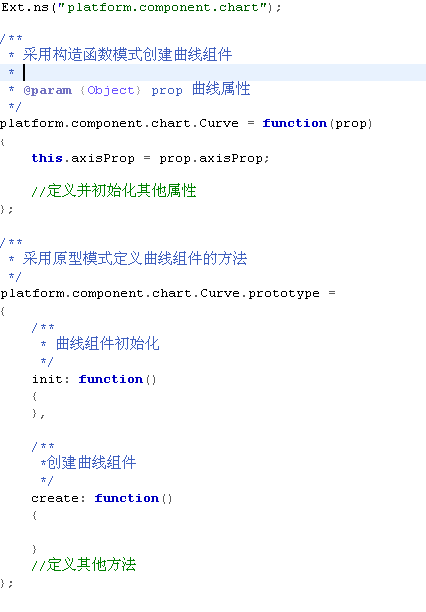

### 4.11.4 其他约定

- 语句必须使用“;”结束

- 控制语句必须使用{}包围，即使只有一条语句

- 变量定义

<!-- -->

- 变量应先定义再使用，定义的同时进行初始化

- 在{}标记的代码块首部定义变量

<!-- -->

- 使用空行将逻辑代码块分割，在如下位置应留空行：

<!-- -->

- 在方法之间

- 在方法中局部变量声明和方法中第一条语句之间

- 在一个块注释或单行注释的前部

- 在方法内代码的逻辑块之间

## 控制代码复杂度

### 4.12.1提取函数

提取函数是能够控制复杂度的最重要的方法，提取依据有这么几种：

- 提取独立功能的代码段 把一段功能相对独立的代码提取为一个函数，进行能够望文生义的命名，以后阅读一段 代码变成阅读一行代码。

- 提取复杂的逻辑表达式

> if(((Year%4==0) && (Year%100!=0)) \|\| (Year%400==0))
>
> 提取为
>
> If(isLeapYear(Year))

- c、 提取重复的代码

- d、 封装此次变化:把本次的变化都放到一个新函数里，无论是增加，还是修改所涉及的那一段。

### 4.12.2 卫语句

卫语句可以用来降低嵌套深度，并且使得检查前置，代码可读性增强，方法是在函数或者循环 最开始的时候，如果检查条件不满足就先 return 或者 break 或者 continue，剩下的代码就是确确 实实需要处理的。强烈建议研发人员养成使用卫语句的习惯。

##  程序的可维护性【强制】

### 4.13.1文件的大小

从程序维护的角度考虑，一个文件的总行数不得超过3000行，最好控制在2000行以内，否则需要对其进行拆分。JS，Java程序原则上遵从此条，有特殊原因经过本部门主管确认后可以例外。

### 4.13.2 类源码的编写

原则上，一个类的所有函数，都应该在一个文件内，除非特别大的类。对于源码超出3000行的类，要根据类函数的分类，将类函数分割到几个文件里，每个文件原则上不超出3000行。

# 附录一：代码走查多发问题汇总【C/C++】

以下不是编码规范的组成部分，而是通过对代码走查工作进行阶段总结后，而归纳的大家在编程中最容易出问题的地方，这些问题在上面的编程规范里都有提到，在这里列出，希望引起大家的重视。

## 内存、资源泄漏问题

多发生在指针重新申请而未释放以前的申请或者程序退出前未释放已申请的内存，程序里申请的资源也必须在使用完毕后关闭或者释放。一个好的编程习惯是无论是内存还是资源，随用随申请，使用完马上释放或者关闭，除非特殊需要（例如生命周期是整个进程运行期间的对象），尽量不要程序启动的时候申请一次，程序退出的时候释放一次。

- 函数内多处return的情况下，要特别注意在每个返回前，是否释放了所有的资源？此类情况也包括打开的文件，申请的其它资源等情况

- 用new申请的指针，不能使用free释放

- new \[\]申请的指针，必须 delete\[\]释放，不能使用delete

- 特别注意你调用的子函数返回指针的情况。许多时候，子函数里申请的资源需要调用者来释放

- 一个指针在程序里有可能要多次赋值。在每次赋值以前，必须判断该指针是否为空，不为空，则先释放原来的资源。这种情况也是内存泄露最严重的情况。

- 打开文件，使用完后，必须关闭。除非特殊情况，随用随开，使用完尽早关闭，尽量不要程序启动时打开一次，程序退出时关闭一次。

- 类似的还有网络操作，数据库操作，实时库操作等等

## 参数和临时变量的有效性检验。

在进入子函数的时候，必须判断其参数的合法性。如果参数非法，则退出子函数。一个临时变量在赋值后，特别是使用子函数赋值的变量，在使用前也必须进行有效性检查。子函数的返回值，包括返回的指针等，必须要做合法性检查（例如数据库访问的返回值，返回的结果指针等）。虽然增加了程序量，并且有的时候似乎没必要，但这是一个良好的编程习惯。有可能正常情况下，没什么问题，但是总存在你没有考虑到的问题，一些莫名其妙的问题可能就是出现在这些地方。

## 其它途径引入函数的变量的有效性检验。

子函数内,许多情况下要引入非该函数定义的变量，例如全局变量、类变量等等。此类变量必须在使用前进行有效性检验，特别是指针变量。

## 程序的运行效率问题。

程序的运行效率必须得到重视，特别是基础平台和界面交互程序。有些人员编程时就不考虑运行效率问题。下面给出几个与运行效率相关的例子，都是在代码走查里出现的问题

1)  给一个内存赋初值，本来一个memset(buff,0,sizeof()\*Num)就可以解决问题，但是写成如下程序，效率就很是问题

WValue_T \*datas = new WValue_T\[100\*MAX_PID\]; // MAX_PID=20000

for(i=0; i\<100\*MAX_PID; i++) {

datas\[i\].pid = 0;

datas\[i\].flag = 0;

datas\[i\].time = 0;

datas\[i\].value = 0;

}

…

Delete datas;

一个语句完成的东西，需要20000\*100次循环，每个循环里还有4个赋值语句！

以上这个例子，存在三个问题：

- 定义了一个缓冲区最大值，这样就把系统的容量给限制死了

- 经历了200万次循环，才给一个缓冲区清零了，效率太低

- 存在内存泄露问题，应该是 delete \[\]datas,而不是 delete datas;

正确的写法应该是：

int RecNum = GetRecNum ();

WValue_T \*datas = new WValue_T\[100\*RecNum\];

memset (datas, 0, sizeof(Wvalue_T)\*100\*RecNum);

…

delete \[\]datas;

2)  两个相同结构的缓冲区赋值，一条 memcpy 语句就可以完成，也是使用100\*Num次循环。

for(i=0; i\<100\*MAX_PID; i++) {

datas\[i\].pid = datas1\[i\].pid;

datas\[i\].flag = datas1\[i\].flag;

datas\[i\].time = datas1\[i\].time;

datas\[i\].value =datas1\[i\].value;

}

3)  一些能合并的操作应该尽量合并，一次函数调用比十几次的效率要高很多。例如下面表格里的两个例子

<table>
<colgroup>
<col style="width: 48%" />
<col style="width: 51%" />
</colgroup>
<tbody>
<tr class="odd">
<td>原代码</td>
<td>改写后代码</td>
</tr>
<tr class="even">
<td>
int CIME_Import::Load_Model_To_SHM()

{

<blockquote>

int ret_sts = 0;

ret_sts = Load_BaseVol_To_SHM();

ret_sts = Load_Area_To_SHM();

ret_sts = Load_SubStation_To_SHM();

ret_sts = Load_VolLevel_To_SHM();

ret_sts = Load_Switch_To_SHM();

ret_sts = Load_Busbar_To_SHM();

ret_sts = Load_Gen_To_SHM();

ret_sts = Load_ACLineSeg_To_SHM();

ret_sts = Load_Load_To_SHM();

ret_sts = Load_Tran_To_SHM();

ret_sts = Load_Winding_To_SHM();

ret_sts = Load_Tap_To_SHM();

ret_sts = Load_Capa_To_SHM();

ret_sts = Load_Dkq_To_SHM();

ret_sts = Load_Term_To_SHM();

ret_sts = Load_Cnct_To_SHM();

ret_sts = Load_Measure_To_SHM();

return ret_sts;

</blockquote>

}

int CIME_Import::Load_BaseVol_To_SHM()

{

<blockquote>

RdbTable rtdb;

ret_sts = rtdb.Login( "ems", "df_ems" );

...

rtdb.Logout();

return ret_sts;

</blockquote>

}

int CIME_Import::Load_Area_To_SHM()

{

<blockquote>

RdbTable rtdb;

int ret_sts = 0;

ret_sts = rtdb.Login( "ems", "df_ems" );

...

rtdb.Logout();

return ret_sts;

</blockquote>

}

…
</td>
<td>
int CIME_Import::Load_Model_To_SHM()

{

int ret_sts = 0;

// 在调用子函数以前，登录实时库，不需要再每个子函数里都登录一遍

<strong>RdbTable rtdb;</strong>

<strong>ret_sts = rtdb.Login( "ems", "df_ems" );</strong>

ret_sts = Load_BaseVol_To_SHM(&amp;rtdb);

ret_sts = Load_Area_To_SHM(&amp;rtdb);

ret_sts = Load_SubStation_To_SHM(&amp;rtdb);

ret_sts = Load_VolLevel_To_SHM(&amp;rtdb);

ret_sts = Load_Switch_To_SHM(&amp;rtdb);

ret_sts = Load_Busbar_To_SHM(&amp;rtdb);

ret_sts = Load_Gen_To_SHM(&amp;rtdb);

ret_sts = Load_ACLineSeg_To_SHM(&amp;rtdb);

ret_sts = Load_Load_To_SHM(&amp;rtdb);

ret_sts = Load_Tran_To_SHM(&amp;rtdb);

ret_sts = Load_Winding_To_SHM(&amp;rtdb);

ret_sts = Load_Tap_To_SHM(&amp;rtdb);

ret_sts = Load_Capa_To_SHM(&amp;rtdb);

ret_sts = Load_Dkq_To_SHM(&amp;rtdb);

ret_sts = Load_Term_To_SHM(&amp;rtdb);

ret_sts = Load_Cnct_To_SHM(&amp;rtdb);

ret_sts = Load_Measure_To_SHM(&amp;rtdb);

<strong>rtdb.Logout();</strong>

return ret_sts;

}

int CIME_Import::Load_BaseVol_To_SHM(RdbTable*rtdb)

{

…

}

int CIME_Import::Load_Area_To_SHM(RdbTable*rtdb)

{

…

}

…
</td>
</tr>
<tr class="odd">
<td>
for (int i=0; i&lt; nowms-w_max_sec*1000;i++)

{

}
</td>
<td>
// 定义一个临时变量，避免每个循环都计算一次

int Tmp = nowms-w_max_sec*1000;

for (int i=0; i&lt;Tmp;i++)

{

}
</td>
</tr>
</tbody>
</table>

4)  库信息的读写优化。无论是数据库还是实时库，能批量读取的不要使用for循环的方式，单步读取，特别是数据库操作。

> for ( i=0; i\<4; i++) {
>
> for ( j=0; j\<3; j++ ) {
>
> DATA_LIST_STR::Iterator it;
>
> for (++it ){
>
> InsertDayDataToDb(it);
>
> }
>
> }
>
> }

对于以上代码，能否把数据组织好，然后一次性进行数据库存取？一次数据库操作比4\*3\*n次操作的程序运行效率不是一个数量级的！况且数据库本身就支持批操作。如果改写成如下代码,运行速度会提高很多

> void \* Buff = malloc ();
>
> int Num = 0;
>
> for ( i=0; i\<4; i++){
>
> for ( j=0; j\<3; j++ ) {
>
> DATA_LIST_STR::Iterator it;
>
> for (++it ){
>
> // 组织Buff缓冲区，将需要写入数据库的信息全部组织到Buff里
>
> Num++;
>
> }
>
> }
>
> }
>
> InsertDayDataToDb(Buff，Num);

free (Buff);

（5）一个实时系统，系统对界面的交互响应速度以及图形对实时数据刷新的速度对用户的体验很重要，在这方面怎么强调都不过分。库信息能预取一次的不要每次使用都获取，系统在鼠标、键盘的响应和数据刷新等的处理（响应）方面，应尽量简捷，没必要的处理尽量简化。

## 资源浪费或者人为的设置系统的容量

1)  无论是数据库还是实时库，应该只获取你需要的信息，而不是把整个记录按照结构的方式全部取过来，这样做，如果库改变了任意一个域的长度，而你的结构没变，则会产生不可预知的错误，影响程序的稳定性与可维护性，同时没有用到的域也取过来，不仅增加网络负荷，也增加了本机的内存损耗。文档的最后，提供了一个解决该问题的例子，请大家参考。

2)  有人喜欢使用宏定义，预先定义一个缓冲区的大小，导致系统的容量出现人为的限制。某些独立的情况下，没什么问题，但是牵扯到库（数据库、实时库）记录的操作，就不合适了。你完全可以根据数据库记录数量，申请缓冲区，而不是程序规定一个最大记录数量，自己把容量写死。目前的系统越来越庞大，规定多大的最大记录数量都是不合适的，小了缓冲区太小，与系统中的记录数量不匹配，造成超出的记录处理不了，大了，对系统资源造成浪费，而根据系统的记录数量，动态申请，是一个很好的做法。

3)  可以使用指针动态申请的尽量不要使用静态数组。在代码走查的过程中，曾经碰到这样一段程序。

程序以全局变量的形式定义了如下变量（其中YCNUMMAX=10000,\_MAX_ME_SAVE=10）

> V_Me_T V_MeTmp\[YCNUMMAX\]\[\_MAX_ME_SAVE\];
>
> V_Me_T \_me \[YCNUMMAX\];
>
> RDB_MIX_FIELD m_pFieldInfo_Yc\[YCNUMMAX\], m_pFieldInfo_Invalidf\[YCNUMMAX\], m_pFieldInfo_Rtuerror\[YCNUMMAX\], m_pFieldInfo_Oddstate\[YCNUMMAX\], m_pFieldInfo_Mansetf\[YCNUMMAX\];

这样编程，使用倒是方便了，不需要读取记录的数量，不需要申请内存，不需要释放内存，但是这种写死的方式，YCNUMMAX定义为10000，如果记录数量大于10000如何处理？如果小于10000，岂不浪费内存？系统容量恰恰就是类似的宏定义给限制住了。 程序开始运行就分配上G的静态内存,一般的机器还真受不了。

如果这些变量定义为指针，在需要的时候，先获取系统数据库里的记录数量，然后申请缓冲区，使用完后，立即释放资源，那么程序占用的系统资源将大大减少，至少对你自己的这个模块，也不存在系统容量的问题。

如果你觉得这么做，库记录数量变化后，会出现问题，那你必须考虑增加处理机制，使得在记录数量变化后，可以让程序自动的重新组织缓冲区，也不能采用这种大的静态数组的方式，这应该是开发过程中极力避免的方式。

## 变量的初始化问题。

一个变量使用前，必须初始化，无论是类变量还是函数变量。特别是在函数体内使用函数变量的情况下，调用者不一定对变量赋值，作为子函数，你就必须对该变量先进行处理后才能使用。当然子函数体内最好不要直接使用函数变量。

下面的例子返回值使用函数参数defValue，但是函数体内没有对defValue赋值啊！如果调用者也没有对其赋值，那么该函数的返回值就是一个不可预知的值！(该函数粗看上去本身似乎没问题，但是子函数不能假设调用者参数百分之百的合法，那就必须采取一定的手段进行规避，因此不提倡此例函数的写法。如果defValue使用常量，例如10，或者一个已经敷初值的变量，没问题。但是如果defValue是一个未敷初值的变量，肯定要出现问题，对于外用的接口函数，此类问题应该是尽量避免的。)

> int WConfig::getAsInt(const std::string& absPathName, int defValue)
>
> {
>
> std::vector\<std::string\> dataVector;
>
> separateLine(absPathName, "/", dataVector);
>
> if (dataVector.empty())
>
> return defValue;
>
> if (dataVector.size() \> 5) {
>
> printf("WConfig::getAsInt 配置过长，取默认值");
>
> return defValue;
>
> }
>
> return m_config-\>getAsInt(absPathName, defValue);
>
> }

改写为下面的样子，应该更合适。调用者通过判断子函数的返回值来确定defValue的缺省值，就可以规避上面的问题！

> BOOL WConfig::getAsInt(const std::string& absPathName)
>
> {
>
> std::vector\<std::string\> dataVector;
>
> separateLine(absPathName, "/", dataVector);
>
> if (dataVector.empty())
>
> return false;
>
> if (dataVector.size() \> 5) {
>
> printf("WConfig::getAsInt 配置过长，取默认值");
>
> return false;
>
> }
>
> return m_config-\>getAsInt(absPathName);
>
> }

## 常量数字

必须明确数据类型，例如浮点数后面加f，明确为float而不是double

例如 float Tmp = 1.2; 应该写成 float Tmp = 1.2f;

## 公因子的问题。

大家在开发过程中，会使用许多别人也要使用的东西，特别是项目组或者产品线内部，要把这些东西提取出来，作为公共库使用，不能一人维护一套，这样会增加系统维护的工作量和复杂度的。

## 其它注意问题

1.  一个函数的返回值应该有它特定的意义，调用者一般要根据子函数的返回值，来进行不同的操作，不能乱返回，也要根据子函数的返回值分别进行不同的处理。

2.  getenv("RUNHOME")在我们的程序里大量使用，在一个模块内，最好定义一个变量获取一次，后面的都使用该变量就可以，不要使用一次，获取一次，否则会影响程序效率

3.  线程里的退出机制。许多线程里采用死循环的方式，没有退出机制，导致只能杀死进程的方式退出程序而不能采用正常的关闭方式退出程序，这是一个很不好的编程习惯。

4.  牵扯到不止一个地方使用的常量，建议使用宏定义，不能直接使用数字，否则以后的维护很麻烦。

5.  界面程序，肯定存在根据用户权限而确定能否进行某些操作的情况。最佳处理是在菜单、按钮处理的时候判断是否有权限，如果没有的话，直接菜单、按钮变灰或者删除。而不能是等用户点击了菜单或者按钮后弹出提示框，提示用户没有相关权限。

6.  随着产品向国际上的推广，时区的处理越来越多。涉及时区的处理不能采用固定的方式，例如

> timeValue = startDate.toTime_t()+8\*3600;
>
> 以上语句是把数据库的存储时间转换为北京时间。对于这种处理方式，国际版怎么办？应该根据数据库时间直接获取当地时间即可，系统本身也有现成的函数。

# 附录二：良好的编程习惯【C/C++】

## 用好指针才是一个真正的C++程序员

指针在C++编程里使用最广泛，也是最容易出问题的地方，因此此处特意对指针的使用单独进行说明。

### 6.1.1 指针使用四法则： 

> 1、指针必须初始化-防止野指针
>
> 2、使用指针以前要判断指针的合法性
>
> 3、指针使用完毕必须释放并清零-杜绝内存泄漏。
>
> 4、注意指针的临界问题-程序莫名其妙错误的根源。

### 6.1.2 指针使用常见问题： 

> **1、所用的指针未初始化。**
>
> int main()
>
> {
>
>   static int \*pointer;
>
>   \*pointer = 0;
>
> }
>
> 尽管声明的是静态变量，从技术上讲已初始化为0，也就是NULL，但静态初始化并没有将指针初始化为有效的地址。因此，当程序运行时，变量pointer未包含有效的地址，程序就无法运行。下面为正确的程序：
>
> int main()
>
> {
>
>  static int i;
>
>  static int \*pointer=&i;
>
> \*pointer = 0;
>
> }
>
> ** 2、所用的指针含有非法值**
>
> 　　程序员使用指针的第二个毛病，就是给其赋了无效值。这里的“无效”意为并非内存中实际数据的地址。这可以看成是上个毛病的引申----倘若没有初始化，内存中的垃圾位只会给出无效地址。其效果是一样的。如果试图解析包含无效地址的指针，要么得到内存访问冲突异常，要么访问的是不可预知的地址。因此，解析指针变量时务必小心，确保对指针赋了有效地址值后使用之。
>
> **3、存储空间释放后仍试图继续使用之**
>
> int \*p ＝ malloc(sizeof(int));
>
> \*p=0;
>
> free(p);
>
> \*p=5;
>
> 　　指针悬空的最大麻烦是，有些时候我们还能用这些指针，所以不会立即意识到问题存在。只有系统没有将我们先前释放的存储空间用到别处，使用悬空的指针 还不会对程序有负面作用。然而随着malloc的每次调用，系统可能会重用一起free释放的内存单元。一旦重用这些单元，后续对悬空指针的解析就会导致 不可知的后果。问题可能包括从已被覆盖的单元读数据，覆盖掉新数据，更坏的情况是覆盖了系统的堆管理指针，这样导致程序崩溃！
>
> **4、程序用过某存储空间后却不释放**
>
> 　　在所有这些毛病中，不释放指针所占用的存储空间大概对程序的正常工作影响最小。下面的C语言代码展示出这类问题：
>
> ptr = malloc(256);
>
>    .
>
> ptr = malloc(512);
>
> 这个例子中，程序先分配256字节存储空间，以变量ptr指向之。后来，程序又分配了512字节存储空间，并改写变量ptr，使之指向新分配的内存 块。ptr先前保存的地址丢失。由于程序已经覆盖以前的ptr值，就无法将早先的256字节用free释放。于是，程序就无法再利用这256字节的存储空间。程序不能访问256字节的存储空间似乎没什么大不了的，但想想这段代码若在循环中执行，每次迭代都要丢失256字节。只要重复足够次数，程序就会耗光堆中的内存。这问题通常叫做“内存泄漏”，因为在程序执行过程中其效果如同内存不断从计算机流出一样。
>
> 　　比起指针悬空，内存流失还不算大问题。实际上，内存流失只有两个麻烦：

- 有耗光堆空间的危险，最终可能导致程序废止，不过这种现象很少见。

- 由于虚拟页交换而影响到程序的性能。

> 　　不管怎么样，应当养成分配存储空间后都要释放的习惯。
>
> 注意 ：程序退出后，操作系统就能利用所有的内存空间，包括内存流失的那部分。所以内存流失只是对程序而言，不会对整个系统有内存损失。
>
> ** 5、使用不当的数据类型访问间接数据**
>
> 　　最后一个毛病是没有类型安全地访问指针，这样容易意外使用错误的数据类型。
>
> char \*pc = malloc(sizeof(char));
>
>  \*((int\*)pc)=5000;
>
> 　　一般来说，如果试图将值5000赋给pc所指的数据，编译器不会报错。因为5000无法放入char型的存储空间，后者只有1字节。然而本例通过“强制类型转换”告知编译器，pc为int型指针而非char型指针，编译器就认定这种赋值是合法的。
>
> 然而，倘若pc并未实际指向整数数据，则这段代码的最后一句可能引起灾难。字符是1字节，而整数要长一些。既然整数长于1字节，该赋值语句将会覆盖更多字节，而不光是malloc分配的那个字节。这是否会造成问题要看内存中紧邻该字符的数据是什么。

**   6、操作时越过了内存的边界**

> 指针的使用一定要保证不能超出该指针所指的内存范围，该判断的地方必须要增加合法性判断。
>
> **7、全局指针变量和类指针变量**
>
> 这类指针变量在使用的时候一定要注意：

- 用free或delete释放内存之后，应立即将指针设置为NULL，防止产生野指针。

- 在使用前，必须进行合法性判断

- 为指针申请内存的地方，必须判断如果指针非空，则先释放之，并设置为NULL，然后再申请内存

##  养成良好的编程习惯

我们编程时要有良好的风格，源代码的逻辑简明清晰，易读易懂是好程序的重要标准。

1、  为了防止头文件被重复调用，应当用#ifndef/ \#define/ \#enddif结构产生预处理快。

2、  用#include\<filename.h\>引用标准库的头文件，编译器将从标准库开始搜索；用#include ”filename.h” 引用非标准库的头文件，编译器将从工作文件夹开始搜索。

3、  一般而言，头文件中只存放声明，不存放定义。

4、  不提倡使用全局变量。

5、  在每个类声明之后，每个函数定义结束，都应该空行。

6、  在一个函数体内，逻辑上密切相关的语句之间不加空行，无关语句间应加空行。

7、  一行代码只做一件事，如只定义一个变量或只写一条语句，这样代码更容易阅读，便于注释。

8、  if、for、while、do都要占一行，其后不要直接跟执行语句。无论执行语句有多少条，都要使用{}， 防止书写错误。

9、  尽可能的在定义变量的同时初始化变量。

10、 关键字之后要空格，否则无法识别关键字。if、while等后面先空格，再接括号“（”，以突出关键 字。

11、 函数名之后要紧跟“（”，以区别于关键字。

12、 “，”、“；”（不做换行时）后面要空格。

13、 一元操作符前后都不要空格，二元操作符前后都要空格。

14、 程序分界符“{”，“}”应当独占一行并都与引用他们的语句对齐。

15、 函数体内的代码在“{”之后重新起行，落后“{”数格对齐书写。

16、 代码行最大长度应控制在80个字符以内，过长时应考虑另起一行。

17、 长表达式要在低优先级运算符处拆分换行，新行要适当缩进，排版整齐，便于阅读。

18、 应当将“\*”，“&”紧邻变量名。如：int \*a; int &b;

19、 对程序函数内的功能段进行注释。

20、 边写代码边注释，注释应放在靠近对应语句的上边或者右边。

21、 程序中尽量不要出现仅靠大小写区别的标识符。

22、 常量全用大写字符表示，单词间用“-”连接。

23、 静态成员变量前加“s\_”，全局变量前加“g\_”，成员变量前加“m\_”，指针前加“p\_”。

24、 如果表达式中操作符过多，应用“（）”确定优先级顺序，避免使用默认优先级。

25、 浮点变量与零值比较。不能将浮点变量直接用“==”或“！=”与零值进行比较，因为浮点变量有精度影响，只能将其转换成“\<=”，“\>=”来进行比较。

          float epsinon = 0.000001;

          float a;

          if( a \<= -epsinon && a \>= epsinon )

          {

              … …

           }

26、  指针变量应使用“==”或“！=”与NULL进行比较。不能与0、1比较。

27、  在多重循环中，应将最长的循环放在最内层，最短的循环放在最外层，减少CPU跨切循环的次数。

28、  如果循环体内存在逻辑判断，当循环次数较多时，应先进行逻辑判断，再做循环，这有助于提高效率。

29、  不可在for循环体内修改循环变量，否则程序将不可控制。

30、 goto语句要慎用，特别是不允许从后往前goto。最常用的是跳出循环。

31、 需要对外公开的常量放在头文件中，不需要对外公开的常量放在定义文件的前部。

32、 函数的参数书写要完整，既要有参数类型，也要有参数名，如果没有参数，也要用void填充到括号里面。

33、 如果函数的参数是指针，且仅作输入用，则应在类型前加const，防止指针在函数体内被任意修改。

34、 不要省略返回值的类型，如果没有返回值，应该用void代替。

35、 程序一般分位debug版本和release版本，前者用于内部调试，后者由用户使用。

36、 assert（断言）仅在debug版本中起作用，在release版本中不起作用。

37、 return语句的使用

- return语句不能返回“栈内存”的指针或引用，因为该内存在程序结束的时候自动销毁。

- 必须搞清楚返回值是“值”、“指针”还是“引用”。

38、函数的功能要尽量单一，不要设计多用途的函数。只让方法作有限的、简单的事，切忌大而全

39、函数体的规模要尽量小，控制在400行以内。

40、检查入口参数的有效性之后，还应该检查其他途径进入函数的参数的有效性，例如全局变量、文件句柄等。

41、出错处理函数的返回值一定要清楚，不产生歧义的返回信息。

42、内存的分配方式有三种：

- 从静态存储区域分配，在编译之后就为其分配好需要的内存区域。这块内存存在于整个程序的运行周期中。这种方式要少用。

- 在执行函数时，函数内的局部变量的存储单元在栈上创建，函数执行完之后这块内存区域自动释放。

- 从堆上分配，也称为动态内存分配。程序在运行时用malloc或new申请任意大小的内存，程序员自己负责在何时何处释放内存。这是推荐的最佳方式。

43、始终让代码的各模块具有高内聚性，模块间具有低耦合性；一定要切断模块间的联系；

44、采用渐进式开发——设计一个功能，马上测试它，逐渐添加功能，边添边测，不要一股脑写完然后算总账；

45、假设使用者是白痴，千万不要想当然的认为他应该知道些什么！

46、若函数无参，要在形参表中加void；

47、不要命名以下划线为前导的标识符。
