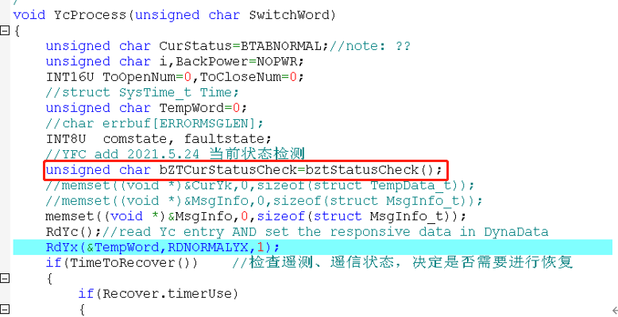
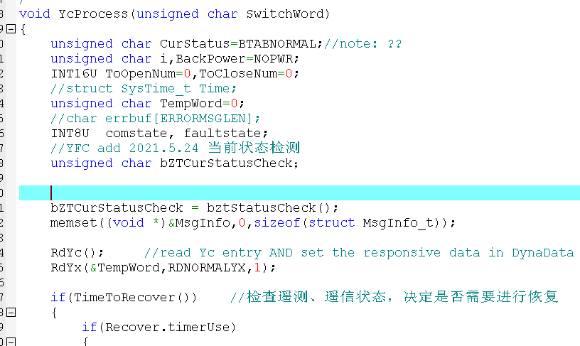
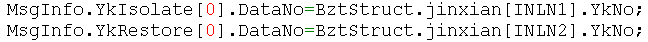
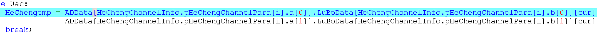
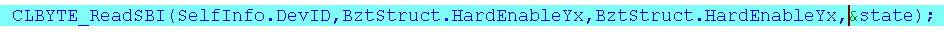
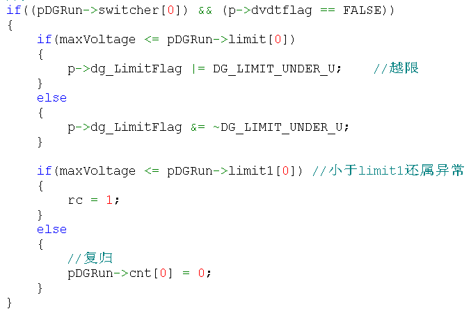

**配电部嵌入式软件强制要求规范-1**

##### 文件头注释。包括.c/.h等文件

> **注意：作者名字要用中文**
>
> \[正确示例\]
>
> /\*\*\*\*\*\*\*\*\*\*\*\*\*\*\*\*\*\*\*\*\*\*\*\*\*\*\*\*\*\*\*\*\*\*\*\*\*\*\*\*\*\*\*\*\*\*\*\*\*\*\*\*\*\*\*\*\*\*\*\*\*\*
>
> 文件名:\*\*\*.h
>
> 作者: \*\*\* (必须使用真实的中文名)
>
> 版本号:1.0
>
> 生成日期:2010.4.11
>
> 概述: 本文件主要定义了冒烟测试中用到的宏和数据结构的定义；
>
> 修改日志：为发送功能完善对 t_smktst_host 结构进行了扩充 2010.4.10
>
> \*\*\*\*\*\*\*\*\*\*\*\*\*\*\*\*\*\*\*\*\*\*\*\*\*\*\*\*\*\*\*\*\*\*\*\*\*\*\*\*\*\*\*\*\*\*\*\*\*\*\*\*\*\*\*\*\*\*\*\*\*/
>
> 特别说明：对于老文件，无法定位生成日期和作者，时间写成“2019.1.1以前”，作者写“未知”。文件头注释，格式要符合规范，不可缺少。可按照如下格式进行文件头注释。
>
> /\*\*\*\*\*\*\*\*\*\*\*\*\*\*\*\*\*\*\*\*\*\*\*\*\*\*\*\*\*\*\*\*\*\*\*\*\*\*\*\*\*\*\*\*\*\*\*\*\*\*\*\*\*\*\*\*\*\*\*\*\*\*
>
> 文件名:\*\*\*.h/c
>
> 作者: 未知
>
> 版本号:1.0
>
> 生成日期:2019.1.1以前
>
> 概述: 本文件主要定义了冒烟测试中用到的宏和数据结构的定义；
>
> 修改日志：为发送功能完善对 t_smktst_host 结构进行了扩充 2010.4.10
>
> \*\*\*\*\*\*\*\*\*\*\*\*\*\*\*\*\*\*\*\*\*\*\*\*\*\*\*\*\*\*\*\*\*\*\*\*\*\*\*\*\*\*\*\*\*\*\*\*\*\*\*\*\*\*\*\*\*\*\*\*\*/

##### 2、函数注释， 

对函数的功能、**入口参数、出口参数**、返回值及其它补充信息进行描述。

> \[正确示例\]
>
> /\*\*\*\*\*\*\*\*\*\*\*\*\*\*\*\*\*\*\*\*\*\*\*\*\*\*\*\*\*\*\*\*\*\*\*\*\*\*\*\*\*\*\*\*\*\*\*\*\*\*\*\*\*\*\*
>
> 函数名称: apiSimReport
>
> 功能描述: 模拟报告
>
> 输入参数: 参数描述、取值范围
>
> 输出参数：参数描述、取值范围
>
> 返回值: 成功返回 TRUE,否则返回 FALSE
>
> 补充信息(使用注意事项):
>
> 修改日志：为改善发送报告的格式修改了 SendReport 函数 2010.4.10 修改人
>
> \*\*\*\*\*\*\*\*\*\*\*\*\*\*\*\*\*\*\*\*\*\*\*\*\*\*\*\*\*\*\*\*\*\*\*\*\*\*\*\*\*\*\*\*\*\*\*\*\*\*\*\*\*\*\*/
>
> BOOL apiSimReport(int iINF, BOOL bState);

##### 3、变量、数据结构（数组、结构、类、枚举等)注释 

要求：所有结构体中数据变量要注释其意义，注释的目标是能理解该变量在功能中所起的作用及其他特别说明等等

\[正确示例\]

typedef struct \_t_smktst_process

{

> char proc_name\[MAX_PROC_NAME_LEN\]; //进程名称
>
> int process_id; //进程 ID
>
> long lasttst_time; //进程上次的测试时间
>
> int tst_time; //巡检次数；
>
> int change_flag; //进程 ID 改变标志 0： ID 没有改变过，1：ID 改变过，2：没有获取过 ID

}t_smktst_process;

##### 4、缩进

目的是增强可阅读性。缩进影响排版，与编辑器有关，不要求统一编辑器，但是要求排版一致。

缩进统一定为4字节，使用空格代替TAB键功能。

注释与所描述内容进行同样的缩排 注释与所描述内容进行同样的缩排，可使程序排版整齐，并方便注释的阅读与理解。

函数、数据结构的大括弧的缩进，如下

**错误示例:**

for (...) ｛

... // 程序代码

｝

if (...)

｛

... // 程序代码

｝

void ExampleFun( void )

｛

... //程序代码

｝

**正确示例**：

for (...)

{

// 程序代码

｝

if (...)

{

// 程序代码

｝

void ExampleFun(void)

{

// 程序代码

｝

##### 5、排版布局。空格、空行使用

空格空行的目的是为了方便阅读，快速找到主体，不清晰的布局和排版要改正。

建议：

1.  要求变量定义和函数实现要有空行分隔。

2.  函数体内不同功能意义之间要有空行，能加注释更好

3.  所有两目、三目运算符的两边都必须有空格（例如\>、\>=、==）

4.  函数的形参之间也要有空格

5.  变量定义和赋值最好能分开。

> 
>
> 没有空行分隔功能语义
>
> 
>
> 不建议的例子：
>
> 1）
>
> 2）
>
> 3）
>
> 建议对比：
>
> 

##### 6、文件名、函数、变量、宏等命名

1）命名要有意义，与其功能相一致，可以使用注释辅助表明所表达的意思。

2）不能只用一个单词作为变量名。

3）全局变量开头加 g\_

4）指针变量前面加 p。例如全局指针变量名 g_pDLxxx

5）建议变量加上功能的缩写。变量属于什么功能，该功能所有变量函数都可添加其特定缩写

6）变量名各单词或语义之间要能清晰分辨。例如用首字母大写，用下划线分隔等。

7）宏定义全部大写，变量及函数名严禁全大写

8）全局变量要加注释

9）变量名要简短清晰，

##### 7、对参数有效性、合法性进行检查

在函数的入口处检查所有参数的有效性和合法性，例如指针变量是否有效，数据是否在合法的范围(缓冲区索引参数)等。

有效性：参数值是否越界等

合法性：指针是否molloc成功等

##### 8、变量初始化

一个变量使用前，必须初始化，无论是类变量还是函数变量。特别是在函数体内使用函数变量的情况下，调用者不一定对变量赋值，作为子函数，必须对该变量先进行处理后才能使用。当然子函数体内最好不要直接使用函数变量。
