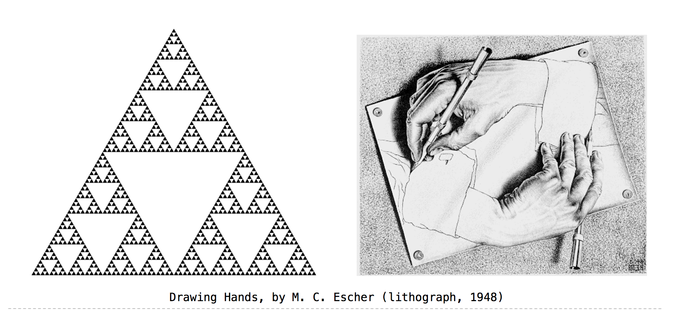

# <center>**递归函数**</center>

***

## **转载于云栖社区**

* [递归函数(一): 开篇](https://yq.aliyun.com/articles/72770?spm=a2c4e.11153940.blogcont72768.7.1ad39fc7Fyq0sf)
* [递归函数(二): 编写递归函数的思路和技巧](https://yq.aliyun.com/articles/72769?spm=a2c4e.11153940.blogcont72770.9.5e48b9ffUrhVeC)
* [递归函数(三): 归纳原理](https://yq.aliyun.com/articles/72768?spm=a2c4e.11153940.blogcont72770.10.5e48b9ffUrhVeC)
* [递归函数(四): 全函数与计算的可终止性](https://yq.aliyun.com/articles/72783?spm=a2c4e.11153940.blogcont72770.11.5e48b9ffUrhVeC)
* [递归函数(五): 递归集与递归可枚举集](https://yq.aliyun.com/articles/72757?spm=a2c4e.11153940.blogcont72770.12.5e48b9ffUrhVeC)
* [递归函数(六): 最多有多少个程序](https://yq.aliyun.com/articles/72782?spm=a2c4e.11153940.blogcont72770.13.5e48b9ffUrhVeC)
* [递归函数(七): 不动点算子](https://yq.aliyun.com/articles/72781?spm=a2c4e.11153940.blogcont72770.14.5e48b9ffUrhVeC)
* [递归函数(八): 偏序结构](https://yq.aliyun.com/articles/72767?spm=a2c4e.11153940.blogcont72770.15.5e48b9ffUrhVeC)
* [递归函数(九): 最小不动点定理](https://yq.aliyun.com/articles/72771?spm=a2c4e.11153940.blogcont72770.16.5e48b9ffUrhVeC)

## **编写递归函数的思路和技巧**



递归，是一个熟悉而陌生的概念，说它熟悉，是因为人们经常提起它，
而说它陌生，指的是人们在实际编程中几乎不会主动使用它。

给定一个问题，如果本质上它能看做一个调用自身的规模较小的一个子问题来求解，
那么给出一个递归的算法解，就是很自然的。
然而，即使是这样，编制一个递归函数也是一件令人头疼的事情。

本系列文章的目的，可能并不局限于指出如何编写一个递归函数，
而是期望想从递归函数开始，了解它相关的科学知识，以达到对不同领域触类旁通的效果。

### **从一个简单的例子开始**

首先，我们来重温一下递归的概念，维基百科上是这样描述的:
> 递归（recursion），在数学与计算机科学中，是指在函数的定义中使用函数自身的方法。

我们来看一个简单的例子吧。(Haskell代码)

```haskell
    fact :: Int -> Int
    fact 1 = 1
    fact n = n * fact (n-1)
```

在这个例子中，
第一行`fact :: Int -> Int`表示了`fact`函数的类型，  
第二行和第三行定义了函数`fact`，  
我们看到第三行，在对`fact`函数定义的时候，等式右边又出现了`fact`，  
这样定义的函数fact是递归的。

我们调用一下fact，来看看结果:

```shell
    $fact 10
    3628800
```

嗯嗯，`fact`就是阶乘函数。

### **写递归函数的步骤**

那么，给定一个问题，我们编写一个递归函数，要如何开始呢？

#### **(1)递推式**

首先，我们要找到“递推式”。  
例如，在数学上阶乘的定义是，$f(n)=n!$，这样的表述形式，不具有递推性。我们先要想办法把$f(n)$用$f(n−1)$表示出来。  
经过思考之后，我们可以证明，$f(n)=n∗f(n−1)$，于是，我们就走出了关键的第一步，得到了“递推式”。

#### **(2)找出终止条件**

有了“递推式”还不行，我们还需要确定递推在什么时候终止。  
我们知道$f(1)=1, (f(2)=2f(1))$，$(f(3)=3f(2))$，等等，因此，我们只需要指定$f(1)=1$，那么递推就会在$f(n)$，当$n=1$的时候终止了。  
终止，就是不再调用规模更小的问题了。这时，终止条件是$f(1)=1$。

#### **(3)用数学归纳法证明解的正确性**

这一步是很重要的，有很多人都缺少证明递推式正确性的环节，但是，考虑到介绍数学归纳法及其扩展会占用不少篇幅，这里先略去，下一篇我们再回来讨论它。  
这里，我们先假定，根据“递推式”和“终止条件”，使用数学归纳法，我们已经证明了这样定义的$f(n)$就是$n!$。

#### **(4)根据递推式和终止条件，编写程序**

有了“递推式”和“终止条件”，再编写程序就水到渠成了。很多人一上来就开始编码，就会感觉毫无头绪。  
我们再来看下那段程序，

```haskell
    fact :: Int -> Int
    fact 1 = 1
    fact n = n * fact (n-1)
```

这不就是“递推式”和“终止条件”的忠实表示吗？
我们用`fact 1 = 1`表示了$f(1)=1$，用`fact n = n * fact (n-1)`表示了$f(n)=n∗f(n−1)$。

### **小技巧**

我们再看个复杂一点的例子。
在实际项目中，我们可能会遇到循环n次的场景，在循环过程中，我们会根据索引进行运算，然后将某些符合条件的运算放到最终的结果中。  
例如，我们选择10以内的所有偶数，

```haskell
    [x|x <- [0..9], x `mod` 2 == 0]
    [0,2,4,6,8]
```

使用以上列表解析（[list comprehension](https://wiki.haskell.org/List_comprehension?spm=a2c4e.11153940.blogcont72769.18.544e142bnqKkrX)）的方法，我们可以快速得到结果。
但是这里，我们想要拿它来举例，介绍一个编写递归函数常用的小技巧。为了通用性，我们考虑循环n次，将索引传入函数`fn`，根据`fn`的返回值，将结果放入一个列表中。

#### **(1)困境**

根据前文介绍的编写步骤，我们需要先找到“递推式”和“终止条件”。

“终止条件”怎么写呢？假如我们定义的递归函数称为`myLoop`，那么`myLoop(0,fn)`就是终止条件，它应该返回一个列表。  
但是这个列表在参数中没有，它随着递归调用的过程“积累”得到的。  
好吧，那我们看“递推式”:  
`myLoop(n,fn)`要用`myLoop(n−1,fn)`的结果计算出来，我们需要先用索引调用$fn$，然后再根据$fn$的返回值，放入结果列表，再继续调用`myLoop(n−1,fn)`。  
可是，索引从哪来呢？($n$不是索引，因为索引从$0$开始，而$n$是逐渐变小的)。  
这是两个典型的困难，  
其一，我们在递归的过程中“积累”了某些东西，  
其二，我们需要传递和递归过程相关的“索引”。

#### **(2)解法**

这时候，我们的小技巧就有用武之地了。
> 我们可以编写一个辅助的递归函数，通过增加参数的办法，提高灵活性。

例如，我们可以编写一个辅助函数myLoop'，然后用myLoop'来实现myLoop。

```haskell
    myLoop :: Int -> (Int -> Maybe a) -> [a]
    myLoop n fn = myLoop' n 0 fn []

    myLoop' :: Int -> Int -> (Int -> Maybe a) -> [a] -> [a]
    myLoop' 0 i fn lst = lst
    myLoop' n i fn lst = case fn i of
        Just x -> myLoop' (n-1) (i+1) fn (lst++[x])
        Nothing -> myLoop' (n-1) (i+1) fn lst
```

以上，我们为myLoop'增加了参数i和lst，分别表示“索引”和“积累”的列表。然后，myLoop就可以用myLoop'来实现了。  
别忘了测试一下最终的结果，

```haskell
    myLoop 10 (\x -> if x `mod` 2 == 0 then Just x else Nothing)
    [0,2,4,6,8]
```

#### **(3)其他考虑**

合理的利用递归函数的返回值，会减少附加参数的数量，例如:

```haskell
    myLoop :: Int -> (Int -> Maybe a) -> [a]
    myLoop n fn = myLoop' n 0 fn

    myLoop' :: Int -> Int -> (Int -> Maybe a) -> [a]
    myLoop' 0 i fn = []
    myLoop' n i fn = case fn i of
        Just x -> x:(myLoop' (n-1) (i+1) fn)
        Nothing -> myLoop' (n-1) (i+1) fn
```

但最终得到的递归函数就不是尾递归了，关于[尾递归](https://zh.wikipedia.org/wiki/%E5%B0%BE%E8%B0%83%E7%94%A8?spm=a2c4e.11153940.blogcont72769.19.544e142bnqKkrX)，我们将在后续文章中讨论它。

## **归纳原理**

### **自然数归纳**

&emsp;为证明对每一个自然数 $n$, 命题 $P(n)$ 为真, 只需要证明两件事:

1. 对于自然数 $1$, 命题 $P(1)$为真
2. 如果对于自然数 $m$, 命题 $P(m)$ 为真, 那么对于自然数 $m+1$, 命题 $P(m+1)$ 也为真

&emsp;其中, 第(1)条称为起始条件, 第(2)条称为递推条件, 或者称为归纳步骤.
第(2)条中, 为了证明 $P(m+1)$ 而假设的 $P(m)$, 称为归纳假设.

### **关系**

&emsp;直观的说, 集合$A$的元素和集合$B$的元素之间的关系是一个二元性质$R$, 使得对于每个$a\in A$和$b\in B$而言, $R(a,b)$ 要么为真, 要么为假.  
&emsp;关系通常表示为一个集合, 它是笛卡尔积的子集, 即, 集合$A$和集合$B$之间的关系$R$是它们笛卡尔积的一个子集 $R\subseteq A \times B$.  
&emsp;如果序对 $(a,b)\in R$, 则认为$a$与$b$之间的关系为真, 否则认为$a$与$b$之间的关系为假. 通常关系直接描述为$R(a,b)$, 或者$aRb$, 而不用 $(a,b)\in R$.  
&emsp;除了二元关系之外, 对任何正整数 $k$, 还可以定义$k$元关系. 如果$A_1,\cdots,A_k$为集合, 则在$A_1,\cdots,A_k$上的$k$元关系是笛卡尔积$A_1\times \cdots \times A_k$的一个子集.  
&emsp;某个集合上的二元关系有很多性质, 例如自反性, 对称性, 反对称性, 传递性.  

1. 一个关系$R\subset A\times A$是自反的, 如果 $R(a,a)$ 对于所有的 $a \in A$ 成立;
1. 是对称的, 如果 $R(a,b)$ 就有 $R(b,a)$, 对于所有的$a,bin A$都成立;
1. 是反对称的, 如果 $R(a,b)$ 且 $R(b,a)$, 则$a,b$是同一个元素, 对于所有的 $a,b\in A$ 都成立;
1. 是传递的, 如果 $R(a,b)$ 和 $R(b,c)$ 蕴含 $R(a,c)$, 对于所有的 $a,b,c \in A$都成立.

&emsp;(注意, 反对称性不是对称性的否定.
等价关系是同时具有自反性, 对称性和传递性的关系.)  
&emsp;偏序关系是具有自反性, 反对称性和传递性的关系.
&emsp;等价关系的一个例子就是相等性, 相等性关系 $R(a,b)$ 当且仅当 $a,b$ 是同一个元素.  
&emsp;偏序关系, 例如通常的序关系 $R\subseteq N\times N$, $R(a,b)$ 当且仅当$a\leqslant b$.

### **良基关系**

&emsp;集合 $A$ 上的良基关系$(well-founded$ $relation)$, 是 $A$ 上的一个二元关系 $\prec$,
如果不存在无限下降序列 $(infinite$ $descending$ $sequence)$ $(a0 \succ a1\succ a2\cdots)$.
&emsp;例如, 自然数上的关系<, 就是一个良基关系.
但是 $\leqslant$ 却不是, 因为存在一个无限下降序列 $(a0 \geqslant a1 \geqslant a2 \cdots)$.
&emsp;根据良基关系, 我们可以定义集合中的最小元, $a\in A$ 为最小元, 如果不存在 $a'\in A$, 使得$a'\prec a$.
&emsp;对于良基关系, 有一个等价的定义,
 $A$上的二元关系 $\prec$是良基的, 当且仅当 $A$的每一个非空子集B有最小元.

&emsp;我们可以证明一下这两种说法等价性.
要证当且仅当, 我们需要证明充分性和必要性,

1. 充分性:  
    往证: $A$上的二元关系 $\prec$是良基的, 则 $A$的每一个非空子集 $B$ 有最小元.  
    使用反证法, 如果 $B$ 没有最小元, 则对于每个 $a\in B$, 总可以找到 $a'\in B$, 使得 $a'\prec a$.  
    但是, 如果这样的话, 我们就可以对任何 $a\in B$, 以 $a_0$开始构造一个无限下降序列 $a_0 \succ a_1\succ a_2\cdots$,
    这与 $\prec$是一个良基关系矛盾.充分性证毕.

1. 必要性:  

    >往证: 如果 $A$的每一个非空子集 $B$ 都有最小元, 则 $A$上用于比较的二元关系 $\prec$是良基的.  
    >由于 $A$的每一个非空子集 $B$ 都有最小元, 则不可能存在无限下降序列  $a_0 \succ a_1\succ a_2\cdots$, 因此,  $\prec$是良基的.必要性证毕.

    &emsp;因此,  $A$上的二元关系 $\prec$是良基的, 当且仅当 $A$的每一个非空子集 $B$ 有最小元.  

### **良基归纳法**

&emsp;设 $\prec$ 为集合 $A$ 上的良基二元关系, 并且设 $P$ 为关于 $A$中元素的某个命题,  
&emsp;如果 $P(b)$ 对于所有的 $b \prec a$ 成立, 就必然有 $P(b)$ 成立,那么 $P(a)$ 就对所有的 $a\in A$ 成立.  
&emsp;我们看到 < 确实是自然数集上的良基关系, 因此自然数归纳法只是良基归纳法的一种特例.  
&emsp;现在我们有了足够的能力来证明自然数归纳法的正确性了, 只要我们证明了良基归纳法是正确的.

&emsp;还是用反证法:  
&emsp;我们期望证明,
&emsp;前提: 如果$P(b)$对于所有的$b≺a$成立, 必然有$P(a)$成立,
&emsp;结论: 那么对于所有的$a\in A$, $P(a)$都成立.

&emsp;如若不然, 假设存在 $x\in A$, 使得 $P(x)$ 不成立,
&emsp;则集合 $B=\{ a\in A | \neg P(a)\}$ 非空, 因此根据良基关系的等价定义, 集合 $B$ 必有最小元 $m\prec B\subseteq A$, 而且,  $\neg P(m)$ 成立.  
&emsp;则根据前提的逆否命题, 一定存在 $b\prec m$, 使得 $\neg P(b)$ 成立,  
所以, 我们有 $b\in B$, 且 $b\prec m$, 与 $m$ 是 $B$ 的最小元矛盾.  
&emsp;证毕.  
&emsp;由此, 我们证明了良基归纳法的正确性.  
&emsp;理解良基关系和偏序关系, 是理解递归和不动点算子的第一步.

## **全函数与计算的可终止性**

### **函数**

#### **部分函数**

&emsp;集合$A,B$上的关系, 是笛卡尔积$A\times B$的一个子集.  
&emsp;而函数$f:A\rightarrow B$, 则是集合$A,B$上的一种特殊关系, 它要求$A$中的每一个元素, 都有$B$中唯一确定的元素与之对应.  
其中, 集合$A$称为函数$f$的定义域, 集合$B$称为函数的值域.  
&emsp;函数是我们熟悉的概念, 这里只是提到了它本质上是集合上的一个关系.  
&emsp;如果$f$是从$A$到$B$的二元关系, 且$\forall a \in A$, $f(a)=\varnothing$或$\lbrace b\rbrace$, 则称$f$是从$A$到$B$的部分函数, 或$A$上的部分函数.  
&emsp;其中, 如果$f(a)=\lbrace b\rbrace$, 则称$f(a)$有定义, 记为$f(a)\downarrow$, 也称$b$为$f$在$a$点的函数值, 记为$f(a)=b$. 如果$f(a)=\varnothing$, 则称$f(a)$无定义, 记为$f(a)\uparrow$.  

#### 全函数$(total\ function)$

如果$\forall a\in A$都有$f(a)\downarrow$，则称$f$是$A$上的全函数，此时，可以记为$f:A\rightarrow B$。

>&emsp;可见，我们熟悉的函数，是指全函数. 值得注意的是，部分函数的定义已经包含了我们学过的“函数”的定义, 后文中，我们提到的“函数”如果不强调它的完全性的话，都泛指部分函数。

### 非终止性

&emsp;部分函数在计算机科学中是非常重要的，  
&emsp;因为对于$\forall a\in A$，一个算法可以表示为，计算出集合$B$中与之对应元素的过程，  
&emsp;这个算法可能对于某些值$a\in A$不会终止，而这种情况是很常见的。

例如：

```haskell
    f :: Int -> Int
    f 1 = 1
    f n = n + f(n-2)
```

&emsp;这样定义的函数$f$，对应了数学上的一个部分函数$f$，它只在某些情况下有意义，只有当$n$是奇数时，我们才能得到终止性的结果。  
&emsp;而当$n$是偶数时，算法会无限的递归下去，直到堆栈溢出。  
&emsp;因此，将`Int`解释为整数集$N$，将

```haskell
f :: Int -> Int
```

&emsp;解释为整数集上的函数，似乎是有问题的。  
&emsp;因为，$f(2)$并不是一个整数，它的计算不能终止。  
&emsp;为了描述非终止性，就需要对整数集进行扩充，我们给整数集加上一个特殊元素$\perp$，称为$bottom$，来表示非终止性，而将

```haskell
f :: Int -> Int
```

解释为集合$N\cup\lbrace\perp\rbrace$上一个的数学函数。  

像这种通过构造表达程序含义的数学对象，来对程序进行分析的方法，来自指称语义学。  

指称语义中，人们会区分函数的严格性，一个函数称为严格的$(strict$)，
如果接受一个非终止的输入表达式，函数的计算仍然不会终止，即，$f(\perp)=\perp$。否则，称函数为不严格的$(non-strict$)。