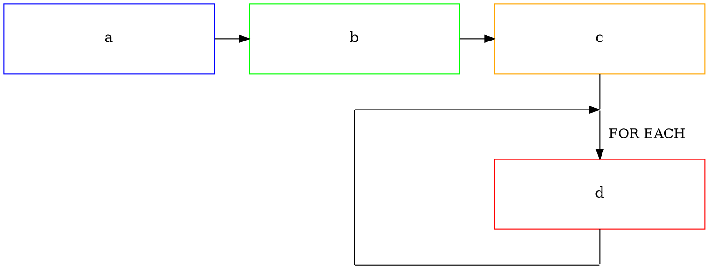
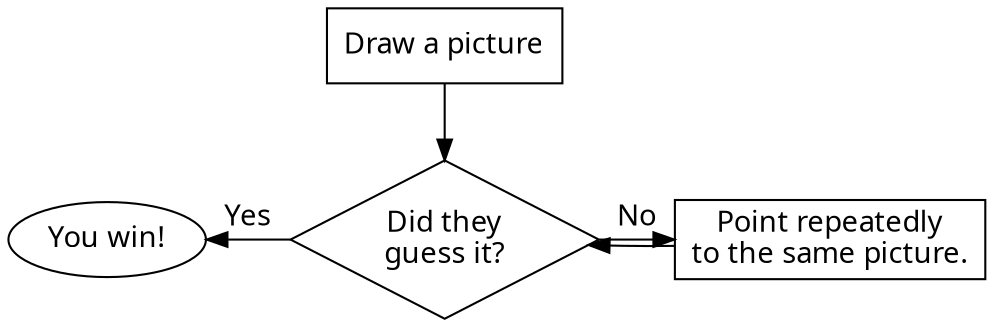
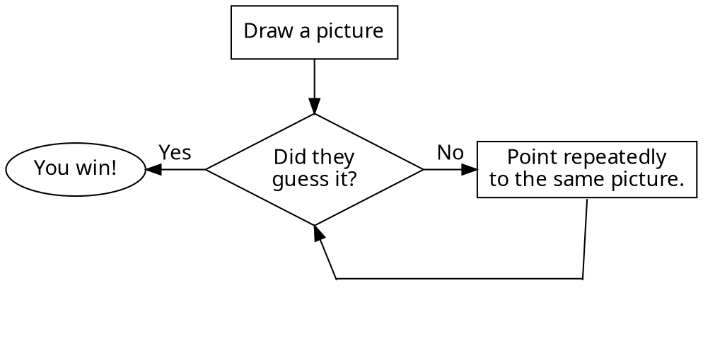

# flowchart using graphviz

```graphviz

digraph g1 {

  graph [splines=false];

  // invisible nodes
  node[fontsize=15, shape = box, width=3, height=0] ;
  i1 [ style="invis"];
  i2 [ style="invis"];
  i3 [ style="invis"];
  i4 [ style="invis"];

  node[fontsize=15, color = black, shape = box, width=3, height=1] ;
  a[color=blue, label="a"];
  b[color=green, label="b"];
  c[color=orange, label="c"]; 
  d[color=red, label="d"] ;       

  {rank=same; a -> b -> c};

  {rankdir = TB;    c -> i1[arrowhead=none];
        i1 -> d[label="  FOR EACH\n\n"]; 
        d -> i2[arrowhead=none];
  };

  {rank=same; i3 -> i2[arrowhead=none] };

  {rankdir = TB; 
    b -> i4[style="invis"];
    i4 -> i3[arrowhead=none];
  };

  {rank=same; i4 -> i1};

}

```






