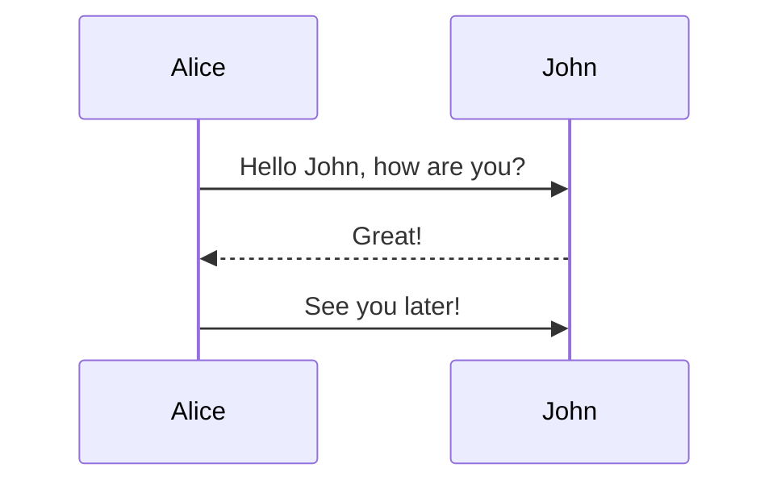
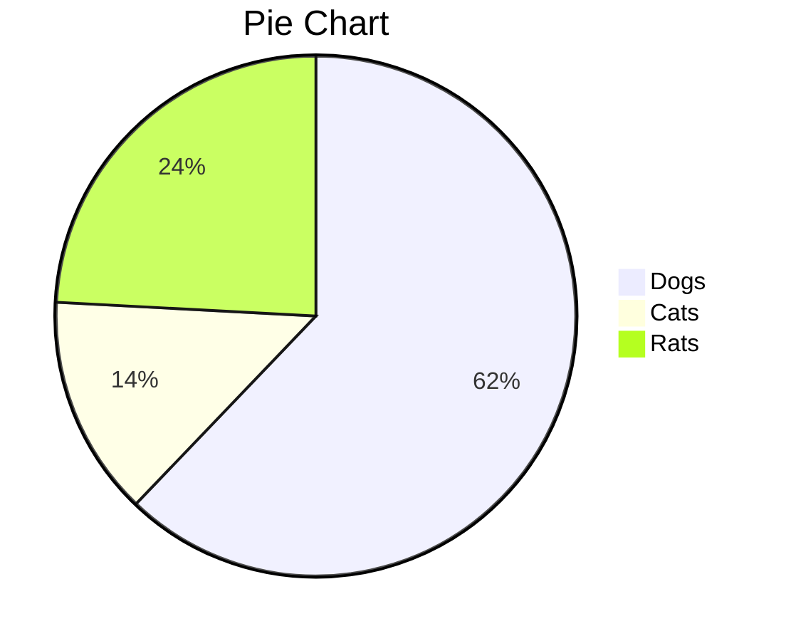
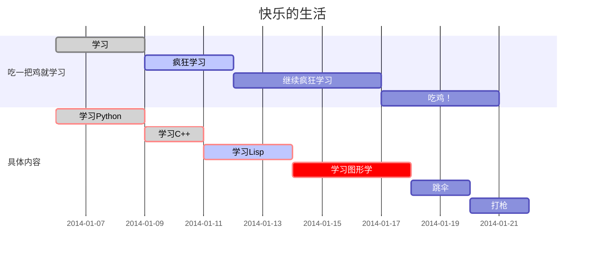
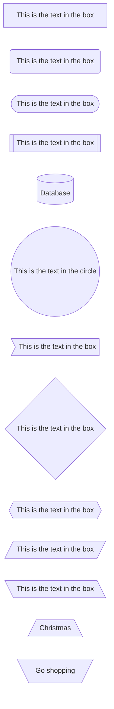
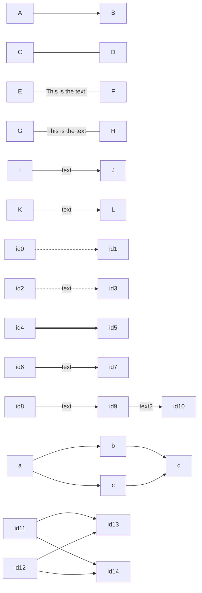
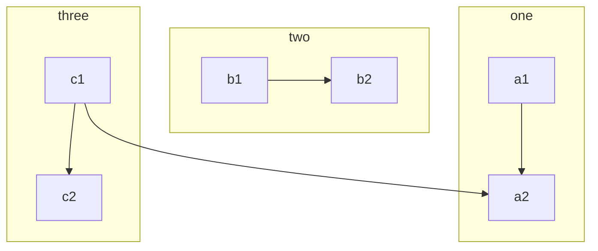
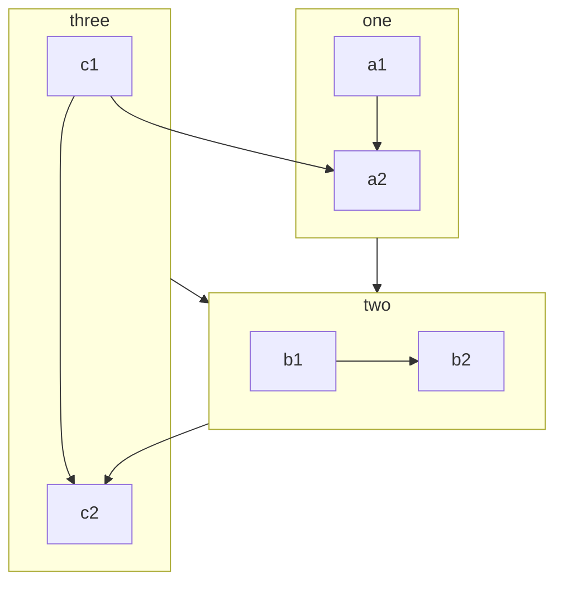
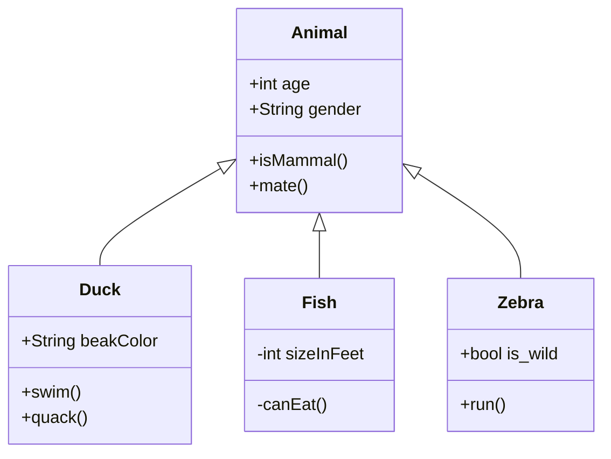
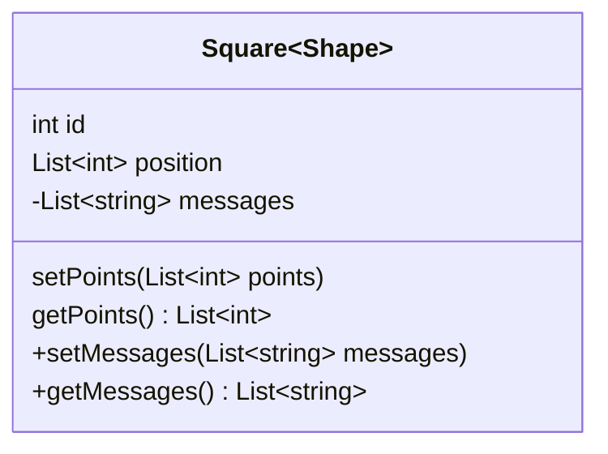
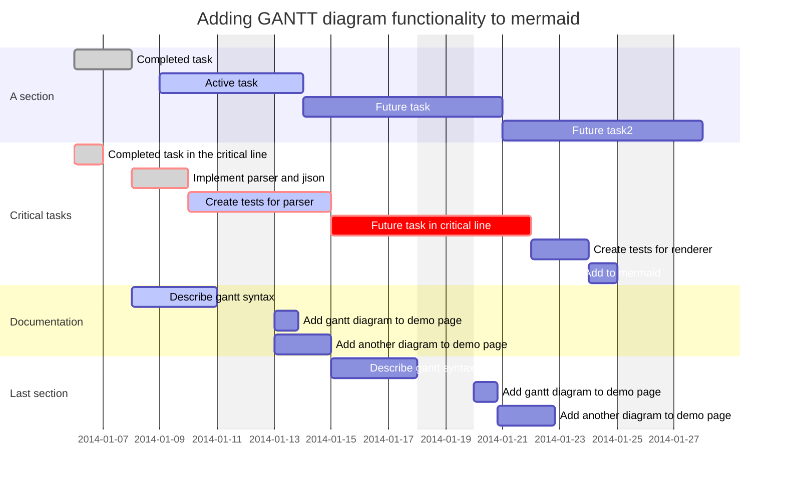

# flowchart using Mermaid

## 简单样例

```Mermaid
graph TD
    A[Start] --> B{Is it?};
    B -->|Yes| C[OK];
    C --> D[Rethink];
    D --> B;
    B ---->|No| E[End];
```

```Mermaid
stateDiagram
    [*] --> Still
    Still --> [*]

    Still --> Moving
    Moving --> Still
    Moving --> Crash
    Crash --> [*]
```








## 节点类型



## 线类型



## 子图





## 类图





## 甘特图



