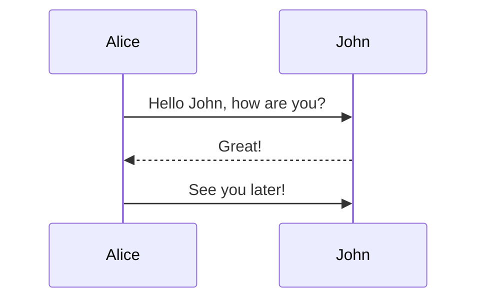

# flowchart using Mermaid

```Mermaid
graph TD
    A[Start] --> B{Is it?};
    B -->|Yes| C[OK];
    C --> D[Rethink];
    D --> B;
    B ---->|No| E[End];
```

```Mermaid
graph TD
    A[Start] --> B{Is it?};
    B -->|Yes| C[OK];
    C --> D[Rethink];
    D --> B;
    B ---->|No| E[End];
```


