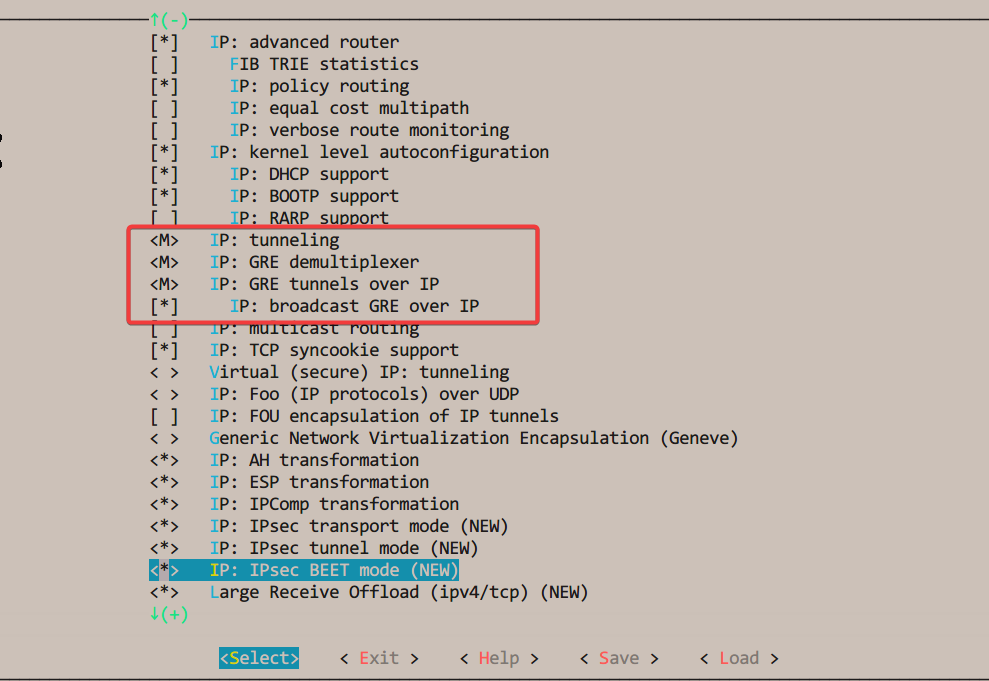

# `E9361-C0`配置`GRE`隧道

## `GRE`隧道

1. `GRE(Generic Routing Encapsulation)`是思科公司提出的一种基于IP的隧道技术. `GRE`本身不支持加密, 但可以通过与`IPSec`相结合进行加密. 通用路由封装(GRE) 是一种协议，用于将使用一个路由协议的数据包封装在另一协议的数据包中。**封装**是指将一个数据包包装在另一个数据包中，就像将一个盒子放在另一个盒子中一样。GRE 是在网络上建立直接点对点连接的一种方法，目的是简化单独网络之间的连接。它适用于各种网络层协议。

1. 应用场景:
   1. 与`PPTP`结合使用
   1. 与`IPSec`结合使用
   1. 在移动设备上使用
1. 参考链接
   1. [Generic Routing Encapsulation](https://en.wikipedia.org/wiki/Generic_Routing_Encapsulation)
   1. [21张图带你了解什么是VPN（虚拟专用网络）以及VPN的分类](https://zhuanlan.zhihu.com/p/466282975)

## 内核编译

1. 准备源代码

   将飞凌的源代码`linux-4.1.15.tar.bz2`放到虚拟机(虚拟机最好安装的是`Ubuntu 16.04`, 否则编译可能会报错)中, 新建一个文件夹(比如/opt/folinx/linux-4.1.15), 然后`tar xjvf linux-4.1.15.tar.bz2`解压.
1. 安装编译链`fsl-imx-x11-glibc-x86_64-meta-toolchain-qt5-cortexa7hf-neon-toolchain-4.1.15-2.0.0.sh`, 并执行`. /opt/fsl-imx-x11/4.1.15-2.0.0/environment-setup-cortexa7hf-neon-poky-linux-gnueabi`(假设编译链安装目录为`/opt/fsl-imx-x11`)以设置编译环境.
1. 内核选项
   1. 进入解压出来的源代码目录, 执行`make menuconfig`, 此间可能会报错, 需要安装`flex bison libncurses-dev`等依赖包.
   1. 进入`Networking support`->`Networking options`, 选中`IP: tunneling, IP: GRE demultiplexer, IP: GRE tunnels over IP, IP: broadcast GRE over IP`, 然后保存配置:
   
   
   
   
   
   1. 用`root`用户执行`make modules`, 在目录`net/ipv4/`下生成了内核模块`ip_gre.ko`和`gre.ko`两个文件, 将二者复制到`E9361-C0`.
   1. 执行`make zImage`, 在目录`arch/arm/boot/`下生成了内核文件`zImage`, 将其复制到`E9361-C0`.
1. 升级内核.

   刚才生成的模块是不能直接安装到`E9361-C0`中的, 因为安装内核模块时, 会进行一致性校验, 看看此内核模块和内核是否是同一套配置编译出来的. 所以要先升级刚才编译出来的内核.
   假设刚才编译出来的内核是放在`E9361-C0`中的`/home/root`目录下, 则执行命令`flash_erase /dev/mtd4 0 0`擦除现有内核, 再执行命令`nandwrite -p /dev/mtd4 /home/root/zImage`写入新的内核, 然后`reboot`重启.
1. 安装模块

   假设模块文件放在`/home/root`目录下, 执行`cp /home/root/gre.ko /home/root/ip_gre.ko /lib/modules/$(uname -r)/`, 将模块文件复制到系统目录下; 执行`depmod -a`建立内核依赖信息; 执行`echo gre >> /etc/modules`和`echo ip_gre >> /etc/modules`, 使终端重启后自动加载`gre.ko`和`ip_gre.ko`模块; 执行`reboot`重启.
1. 检查模块是否起效

   执行`ip link`, 看输出是否有`gre0@NONE:`等信息, 如果有, 则安装内核模块成功, 反之失败:
   

## 测试环境搭建

测试环境用到的设备: 四信模块1个, `E9361-C0`1个, 电脑2台(我的测试中1台*windows*, 1台*Linux*电脑), 各自网络参数如下:

1. 四信模块配置: 将四信模块的`Wan`口设置为`172.20.43.68`, `Lan`口设置为`192.168.2.1`. 并配置`GRE VPN`, 参数如下:
   
1. `E9361-C0`配置: `eth0`作为`Wan`口, `IP`地址设置为`172.20.43.183`, 并用网线与四信模块的`Wan`口连接. `eth1`作为`Lan`口, `IP`地址设置为`192.168.71.1`.
1. `Linux`主机配置: `IP`地址设置为`192.168.2.3`, 子网掩码`255.255.255.0`, 网关`192.168.2.1`, 并用网线与四信模块的`Lan`口连接.
1. `Windows`主机配置: `IP`地址设置为`192.168.71.3`, 子网掩码`255.255.255.0`, 网关`192.168.71.1`, 并用网线与`E9361-C0`的`eth1`口连接.

## 终端配置

1. 开启`E9361-C0`的转发: 执行命令`echo 1 > /proc/sys/net/ipv4/ip_forward`, 并`reboot`重启终端, 使终端自动开启网络包的转发
1. 新建名为`tunnel0`的虚拟网卡: 执行命令`ip tunnel add tunnel0 mode gre remote 172.20.43.68 local 172.20.43.183 ttl 255 dev eth0`, 可以用命令`ip a`查看是否新建成功:
   
1. 使能`tunnel0`: 执行命令`ip link set tunnel0 up`.
1. 添加虚拟网址: 执行命令`ip addr add 172.16.33.1/24 dev tunnel0`:
   
1. 添加路由转发: 执行命令`ip route add 192.168.2.0/24 dev tunnel0`, 添加到`192.168.2.0`网络的路由转发.

## 测试

1. 在*Windows*主机执行`ping -S 192.168.71.3 -t 192.168.2.3`, 可以`ping`通对方.
1. 在*Linux*主机执行`ping -I 192.168.2.3 -t 192.168.71.3`, 可以`ping`通对方.
